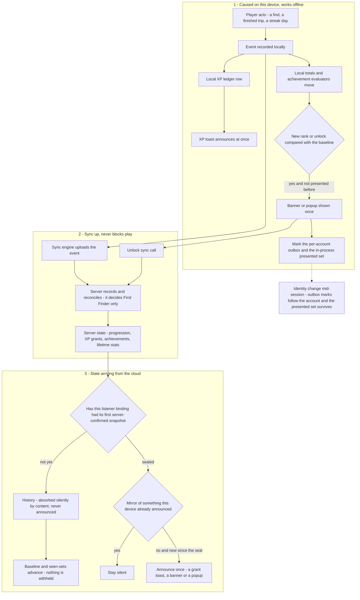

# RoadTrip Royale — COPPA Compliance SRS v3 (Remediation Program 2)

**Version:** 3.10 — 2026-08-15 (adds FR-74(d′) — unbound age answers expire on return to onboarding start, asymmetrically: permissive answers clear, protective ones persist. Owner-found in device testing; folded into F-30, which owns answer lifecycle. Prior: v3.9 — adds FR-86/F-43 — pending-request identification for the consenting guardian, owner-found in device testing; batched into F-14b. Legal basis recorded per the amended Rule's reliance-naming expectation. Prior: v3.8 — F-14b absorbs AGEOUT F-70/FR-110 age-out-marker capture — the marker cannot be computed without F-14b's birth month, and minimization discards the month, so a gap between them creates a permanently un-backfillable cohort; boundary symmetry with AGEOUT's detection rule verified and pinned. Prior: v3.7 — FR-55 amended to exact-boundary classification at 13 from birth month + year, per owner ruling relayed by the v4 session — supersedes the `< 14` rule; the birth-month cohort remains ambiguous without a day and is classified protectively. **This is rework of shipped code: F-14 already landed under `< 14`.**)
**Version:** 3.6 — 2026-08-15 (v4.3 vacated FR-84…FR-91 / F-40…F-46 and renumbered itself to FR-100+, so v3 **reclaims** FR-84 device transfer and FR-85 consented-child parity, F-41/F-42 — restoring contiguity from FR-83 and keeping the in-flight F-42 implementation's code comments correct as authored. Full allocation registry in §3.)
**Version:** 3.4 — 2026-08-14 (v3.4 adds §3.1 live implementation status + §3.2 implementation notes for handoff; specs F-42/FR-85 consented-child capability parity and F-41/FR-84 parent-initiated device transfer, both consequences of OD-2 the owner identified; records that OD-9 resolves the OD-8 provenance gap. **Handoff note: a separate session is authoring SRS v4 — v3.4 is the current, complete state of this program and should be folded in wholesale.**)
**Version:** 3.3 — 2026-08-14 (v3.3 records OD-2 *decided* — FR-60 rewritten to the owner's local-first model: no backend identity for unconsented children, provision-at-redemption with decline/expiry cleanup; FR-73/FR-77/OD-3 simplified accordingly — the D-25 retention tension largely dissolves. F-18 staffing amended: Opus implements, Fable adversarially verifies, per the owner's Fable-usage constraint.)
**Version:** 3.2 — 2026-08-14 (v3.2 records OD-1 *decided* — no third-party VPC vendor; adds FR-59.1 first-party providers with an explicit launch caveat; opens OD-7 as the cheaper alternative; corrects FR-81's DeviceID/ThirdPartyAdvertising disposition. Prior header follows.)
**Version:** 3.1 — 2026-08-14 (v3.0 authored 2026-08-13 against local HEAD `69c4501`; v3.1 folds the v2-session peer review of 2026-08-13/14 and rebases the program's target onto `origin/feature/MVPPush` through `5e0cddc` — the local branch must be fast-forwarded before Wave 1 starts. Where line anchors drifted across the three merged commits, symbol names govern.)
**Basis:** (1) the fresh code-only audit of 2026-08-13 (six parallel deep-dives + manual verification of all Critical evidence; 40 findings: CB-1…7, H-1…10, M-1…12, L-1…11); (2) `COPPA_SRS.md` v2.1 (the v2 program — all 14 features landed); (3) the v2-vs-fresh-audit reconciliation of 2026-08-13 (disposition review: what v2 missed, decided wrongly, or left unverified).
**Precedence:** `COPPA_SRS.md` v2.1 remains the base document — its FR-1…FR-54, definitions (§4), execution model (§2), decisions and standing constraints stay in force **except where this document explicitly amends or overturns them** (§5 register). Where the two conflict, v3 wins. FR numbering continues from the base: v3 defines FR-55…FR-83.
**Legal baseline change (load-bearing):** v2.1 was written against 16 CFR Part 312 as of 2013. This program is written against the **amended Rule (published 2025-04-22, compliance required 2025-06-23/2026-04-22 — fully in force today)**. Several v2.1 dispositions that were defensible under the old rule are not under the amended one; those are overturned in §5, not re-litigated per feature.
**App status:** still pre-release, no real users. The pre-release rule holds: delete, don't migrate; no compatibility shims; dev testers reinstall.

---

## §0 What changed and why (v3 changelog)

**Inputs merged.** The fresh audit confirmed the v2 enforcement architecture is largely sound (server-authoritative flag, search choke point, oracle-closed rejections, epoch age gate, deletion machinery) and found the remaining exposure concentrated in five places:

1. **Legal-judgment layer** — VPC method, child email pre-consent, parental review/deletion rights, retention, age-boundary math. All were *known or decided* in v2.1 and are re-dispositioned here (CB-1…CB-5, CB-3).
2. **The one un-deferred SDK** — Google Mobile Ads starts at launch untagged on clean installs (CB-6).
3. **Attacker-shaped holes** in the consent boundary and backend (CB-7, H-7, H-8) that v2's risk register reasoned around without walking the full chain.
4. **Spec-vs-ship gaps** where v2.1's own acceptance text is not what the code does (FR-33 location enforcement / H-4; FR-46 "no RevenueCat for any child posture" vs. ratcheted-starts-purchases / M-4).
5. **Never-swept surfaces** — code landed after the v2 audit's source material (`tripSessionCanonical.ts` / H-8), ops scripts (H-10), and standing-invariant maintenance (H-9).

**Frozen until further notice:** OQ-5 (TFCD ads for consented children), D-11 (parental child-location toggle), and §18 cross-family play / parent-reviewed friendships are **additionally blocked on FR-59 (real VPC) landing plus the counsel review in OD-1**. No feature that widens child-data surface ships on the current consent mechanism.

**v3.1 changelog (peer review by the v2 session, verified against the repo before adoption):** (1) rebased on the three origin commits v3.0 had not seen — `1867bc2` (FR-28h late-replay machinery: `SERVER_STAMPED_PAYLOAD_KEYS`, outcome freeze, lifetime-stats late-replay accounting), `e8f237e` (SRS: FR-28h + D-25 + tournaments follow-up), `5e0cddc` (roster-membership oracle closed in `sendTripInvite`) — FR-76 now extends the new sanitize loop instead of duplicating it, and FR-77 carries the D-25 interplay to OD-3 as an explicit owner decision plus a late-replay ledger constraint. (2) FR-58 gains the first-install-inert nuance (the live leak is relaunch-after-resolved-session; v2.1 FR-46's sticky-switch analysis governs — the peer's "already inert" claim holds only for first installs). (3) FR-74's cooldown marker is bound into the existing device-state stores, not a fourth ad-hoc key. (4) FR-60 gains a deploy-order constraint (throttle before registration-free redemption). (5) NP-2 is recognized as partly code (localized policy strings ×3). **Adjacent open items that remain on the v2 session's board, not in v3 scope:** deleted-account device-experience limbo, the F-14-lite device-state consolidation, RevenueCat API-key provisioning, ToS/Privacy publishing, UI-test-bundle rot.

**Model delegation:** per owner instruction, implementation is delegated down-tier where the task is mechanical. Assignments are in §3 and are prescriptive this time (v2.1 §3 made them historical): **Fable/xhigh** for consent/auth-core and anything that can strip a child's protections; **Opus/high** for design-heavy enforcement; **Sonnet** for mechanical, pattern-following rows; doc-only rows may run on **Haiku**. §2.4 adversarial verification (an agent other than the implementer, both failure directions) is mandatory for every row marked Critical, regardless of model tier.

---

## §1 Amended-rule deltas that drive v3 requirements

| Amended-rule change | v3 hook |
|---|---|
| **No indefinite retention**; retain only as long as reasonably necessary for the specific purpose; written, published retention policy | FR-77 (retention schedule + jobs); NP-3 (policy text) |
| **Separate verifiable consent for disclosures to third parties** not integral to the service | FR-65 (consent scope split); FR-59 (capture structure) |
| **New sanctioned VPC methods** — text-plus, knowledge-based authentication, facial-comparison-to-ID | FR-59 (method options) |
| **Written children's information-security program** with designated coordinator | FR-82 |
| PI definition adds **biometric identifiers and voice/audio** | FR-45(d) already keeps audio on-device (unchanged); FR-83 pins it with a test and strips transcript logging |
| Internal-operations exception tightened — **cannot be used to prompt/encourage use** (engagement nudges), and relied-on internal operations must be disclosed | FR-72 (analytics position), FR-73 (push posture), NP-2 (disclosure text) |
| Operators responsible for third parties' handling; **deletion must reach vendors** | FR-78 |
| Civil penalty $53,088/violation (2025 level, carried into 2026) | Risk framing only |

---

## §2 Execution model

Inherits v2.1 §2 unchanged: isolated worktrees, serialized landing, **deploy-to-dev + diff disclosure before "testable"** (D-24), coordinator-run rules suite (no CI exists — §15.3), owner commits, adversarial verification per §2.4 for Critical rows. Deploy order per feature stays `firestore:indexes → functions → rules → client` (v2.1 §15.2).

**Model policy (prescriptive).**
- **Fable / xhigh:** FR-59/60/62 (consent core, registration path, guardianship); **Fable / high:** FR-74 (age-gate deterrence). These touch auth identity flows — the v2 program's incident history (FR-27's four reworks) is the argument.
- **Opus / high:** posture-engine, rules, and Cloud Function enforcement design (see §3).
- **Sonnet:** mechanical rows — single-file fixes with a settled design, plist keys, UI gating that follows an existing pattern (`ChildPremiumInfoView`), test-pinning, hygiene. A Sonnet row that discovers design ambiguity escalates rather than deciding.
- **Haiku:** doc-only edits (L-6 rules doc, retention-policy drafting support) at implementer discretion.
- Every Critical row gets an independent adversarial verifier (Opus or better) even when the implementer is Sonnet (F-14 is one character; verification is where the assurance lives).

**Standing constraints carried forward (do not regress):** D-16 comply-don't-reposition (child-directed signals stay); D-23 EEA gate; the **OAuth restoration gate** (v2.1 §18 — F-18/FR-60 edits `SignInView.swift`; the commented block at `:365-394` — v2.1 cites `:363-394`, the block has drifted two lines — stays commented and the gate text survives the edit); FR-24 **two-way rejection indistinguishability** — every new child-reachable rejection added by v3 (share-code throttle FR-67, search short-circuit FR-71) reuses the byte-identical child-rejection shape, no `details`, child checks before budget consumption; §7.5 `invite_rate_limits` default-deny (no catch-all rules); `ChildFlagIngestPolicy` / server-explicit rules (v2.1 §4) apply to every new ingest v3 adds.

---

## §3 Feature roadmap

Risk = enforcement exposure if shipped unfixed. Gate: **L** = launch-blocking, **FF** = fast-follow. Depends refers to committed features.

### Wave 1 — decisions landed, one-file fixes (all independent; start immediately)

| ID | Feature | Covers | Risk | Model / effort | Depends | Gate |
|---|---|---|---|---|---|---|
| **F-14** | Age-boundary fix: ambiguous year classifies under-13 | CB-3 → FR-55 | Critical | Sonnet + adversarial verify | — | L |
| **F-15** | Ads SDK start deferral + fail-closed pre-start tag; purchases suppressed for all non-adult postures | CB-6, M-4, SDK-M-3 → FR-56, FR-57 | Critical | Opus / high + verify | — | L |
| **F-16** | Launch hold ordering: no analytics event before holds; Remote Config disposition | M-3 → FR-58 | Medium | Sonnet | — | L |
| **F-24** | Trip-owner claim checks stored creator | H-8 → FR-68 | High | Sonnet | — | L |
| **F-26** | Ops-script child-eligibility parity | H-10 → FR-70 | High | Sonnet | — | L |

### Wave 2 — consent core (the backbone; F-17/18/20 first, F-19/21 on top)

| ID | Feature | Covers | Risk | Model / effort | Depends | Gate |
|---|---|---|---|---|---|---|
| **F-17** | Verifiable parental consent method (real §312.5(b)) + direct notice at consent | CB-1 → FR-59; NP-1/NP-2 | Critical | **Fable / xhigh** + verify | OD-1 | L |
| **F-18** | Local-first child path: no backend account until share-code entry (provision-at-redemption) | CB-2 → FR-60 | Critical | Opus / high implementer + **Fable adversarial verify** | OD-2 ✓, FR-67 ✓ | L |
| **F-20** | Durable guardianship: review/deletion rights survive membership exit; resumable deletion | CB-5 → FR-62, FR-63 | Critical | **Fable / xhigh** + verify | F-17 design | L |
| **F-19** | Parental review: live data inventory + export | CB-4 → FR-61 | Critical | Opus / high + verify | F-20 | L |
| **F-21** | Consent record integrity + separated consent scopes | M-6, M-7 → FR-64, FR-65 | Medium (legally load-bearing) | Opus | F-17 | L |

### Wave 3 — consent-boundary and backend security (parallel with Wave 2 where files don't overlap)

| ID | Feature | Covers | Risk | Model / effort | Depends | Gate |
|---|---|---|---|---|---|---|
| **F-22** | Join-request lineage; attestation-free flag-clear closed; invite update constraints; share_codes write tighten | CB-7 (+v2.1 §18 residuals a/b) → FR-66 | Critical | Opus / high + verify | — | L |
| **F-23** | share_codes read scoping; redemption throttle + type check | H-7 → FR-67 | High | Opus | F-22 | L |
| **F-25** | Standing roster invariants (flag-set + membership-exit sweeps) | H-9 → FR-69 | High | Opus / high | — | L |
| **F-27** | Rate-limit extension; enumeration closure; child search short-circuit | M-8, M-9 → FR-71 | Medium | Sonnet | F-23 | L |

### Wave 4 — identifiers, SDK postures, location

| ID | Feature | Covers | Risk | Model / effort | Depends | Gate |
|---|---|---|---|---|---|---|
| **F-28** | Child analytics posture: hold until consent, minimal config, no raw uids, delete on deletion | H-1 → FR-72 | High | Opus / high | F-16, F-21 scopes | L |
| **F-29** | Push-token integrity (v2.1 FR-53 + bypass closure + marketing suppression) | H-2, FR-53 → FR-73 | High | Opus / high | — | L |
| **F-30** | Age-gate retry deterrence + guest resolution (cooldown hold; immediate rebirth re-ask; account-provenance epoch resolution) | H-3, OD-9, F-18-verify addendum → FR-74 | High | Opus / high implementer + **Fable adversarial verify** | F-18 ✓, OD-8 fix landed | L |
| **F-31** | Location enforcement completion (resolver, launch-sync, unresolved/ratcheted) | H-4 → FR-75 | High | Opus / high + verify | — | L |
| **F-32** | Server-side gameplay payload allowlist + child location strip | H-5 → FR-76 | High | Opus | — | L |

### Wave 5 — retention & lifecycle (amended rule)

| ID | Feature | Covers | Risk | Model / effort | Depends | Gate |
|---|---|---|---|---|---|---|
| **F-33** | Retention schedule + jobs; revocation-residue cleanup; expiry-job paging | H-6, L-7 → FR-77 | High | Opus / high | OD-3, F-20 | L |
| **F-34** | Third-party deletion propagation (RevenueCat, GA4) | M-5 → FR-78 | Medium (legally load-bearing) | Sonnet | — | L |

### Wave 6 — surfaces, declarations, hygiene

| ID | Feature | Covers | Risk | Model / effort | Depends | Gate |
|---|---|---|---|---|---|---|
| **F-42** | Consented-child capability parity (anonymous ≠ second-class) | OD-2 consequence → FR-85 | High | Opus / high + verify | F-18 ✓ | L |
| **F-41** | Parent-initiated device transfer for a consented child | OD-2 consequence → FR-84 | Medium | Opus / high | F-18 ✓, F-42 | FF |
| **F-35** | Child commercial/contact surface gating (Help&About, review prompt, upgrade teaser, share card) | M-1, M-11 → FR-79 | Medium | Sonnet | — | FF* |
| **F-36** | Username content policy, server-side + no IDFV fragment | M-2 → FR-80 | Medium | Sonnet | — | FF (recommended pre-launch) |
| **F-37** | Declarations truth pass: privacy manifest, phantom capabilities, Storage unlink, `userImageURL`, Maps removal | M-12, L-3, v2.1 FR-54 → FR-81 | Medium | Sonnet | F-15, F-28, OD-6 (for (e)) | L |
| **F-38** | Hygiene set: DEBUG-wrap QA flag, transcript log strip + on-device pin, log retention, stale docs, consent-version test | M-10, L-1, L-4, L-6, L-8, L-9 → FR-83 | Low | Sonnet (Haiku for doc rows) | — | FF |
| **F-39** | Written children's information-security program | amended §312.8 → FR-82 | High (doc) | Sonnet draft + owner | — | L |

\* F-35 is FF **only if** the M-11 operational commitment ships at launch instead: support email from child sessions handled under §312.5(c)(3) (respond once, delete). If the owner declines that process, F-35's mailto gating becomes L.

**Launch gate =** every row marked L — F-14…F-34, F-37, F-39, and F-42 — plus NP-1…NP-3 (notice-side, §9). Fast-follows: F-36, F-38, F-41, plus F-35 under its asterisk condition.

> **ID-SPACE REGISTRY (v3.6, settled with the v4 session 2026-08-15).** Allocation blocks, so async sessions never collide:
> - **v3 (this document, Program 2 — execution):** FR-1…FR-99 · F-1…F-56 · OD-1…OD-9 **plus forward block OD-30…OD-49**
> - **v4 (Program 3 — consent UX, egress boundary, share surface):** FR-100…FR-119 · F-60…F-79 · OD-10…OD-29
> - **AGEOUT (Program 4):** FR-110…FR-116 · F-70…F-73 · OD-50…OD-69 *(proposed; confirm with its owner)*
>
> History: v4 briefly reserved FR-84…FR-91 / F-40…F-46 and v3 yielded; v4.3 then vacated that range entirely and renumbered itself to FR-100+, so v3 **reclaimed** FR-84/FR-85 and F-41/F-42. Anything read between v3.5 and v3.6 may show those as FR-92/FR-93 and F-47/F-48 — the FR-84/85, F-41/42 forms are canonical.
>
> **Owner decisions are semantically GLOBAL even though allocation is blocked** — an OD raised in one program can constrain another (OD-2's local-first model constrains all three). Read every program's ODs, allocate only from your own block.

### §3.1 Implementation status — live, as of 2026-08-14 (READ THIS BEFORE PLANNING WORK)

**Landed in the working tree AND deployed to dev** (`roadtrip-royale-dev-d2652`; functions + `firestore.rules` both released):

| Feature | FR | Note |
|---|---|---|
| F-14 | FR-55 | age boundary — **F-14b LANDED 2026-08-27**: month+year capture, exact-13th-birthday classifier with the birthday-month protective tiebreak, and FR-110(a)'s `ageOutYearMonth` marker (persisted at answer, survives clearAnswer/correction; boundary symmetry pinned by test). Copy reworded truthfully ×3 ("We never ask for your full birthday" — the marker is reversibly month+year, so the old "not stored" claim had to go). FR-110(b)/(c) (marker required in consent + declaration rows) ride the §3.1.2 email_plus wave. |
| F-15 | FR-56, FR-57 | ads SDK behind the deferral; purchases suppressed for all non-adult postures |
| F-16 | FR-58 | launch hold ordering; `crash_reporting_configured` event deleted |
| F-18 | FR-60 | local-first child path + `provisionalChildAccounts.ts` + 7-day sweep |
| F-22 | FR-66 | join-request lineage, flag-clear parity + 72h seasoning, invite field guard, share-code write tighten |
| F-23 | FR-67 | share-code read scoping, `share_redeem` throttle, `expectedType` |
| F-24 | FR-68 | trip-owner claim checks stored creator |
| F-26 | FR-70 | ops-script child-eligibility parity |
| F-31 | FR-75 + OD-8 | location resolver AND-in, launch-sync apply, posture widening, trust-cache branch, neutral notice copy |
| F-32 | FR-76 | per-event payload allowlist on the `SERVER_STAMPED_PAYLOAD_KEYS` pass; shared `payloadKeys.ts` |
| F-34 | FR-78 | RevenueCat customer deletion (inert until the key is provisioned); GA4 documented-decision path |
| F-38 | FR-83 | hygiene set (DEBUG-wrapped QA flag, transcript logs, consent-version hash lock, stale doc deleted, test ad units) |
| F-42 | FR-85 | consented-child capability parity — **in progress at time of writing; confirm before relying on it** |

**Verification state at that point:** functions **673/673** Vitest; rules **90/90** emulator; Swift COPPA suites green across independent runs (47-case and 184-case). Two Swift failures — `UsernameProfanityFilterTests/blocksEnglishProfanity`, `DiscoveryOutcomeToXpMapperTests/mapsLateToFinalPhase` — are **pre-existing and unrelated**, confirmed identical across three runs with different DerivedData and simulators. A clean full-suite baseline is still owed.

> **Correction (2026-08-26).** The full-suite baseline is no longer owed — it ran 2026-08-19: **1502 tests / 238 suites, 18 pre-existing failures in 12 suites**, every one reproducing identically in isolation (so: real defects, not cross-test contamination) and none in a COPPA suite. "Unrelated" above is wrong for both named tests. `blocksEnglishProfanity` exposes a real gap: the leet map is single-valued (`"4"`→`"a"`), so `f4ck` normalizes to `fack` and passes the filter — a **known issue, deferred by FR-80's no-expansion decision (owner reaffirmed 2026-08-26, not MVP)**; a fix needs multi-candidate expansion, not a blocklist word. `mapsLateToFinalPhase` is a stale assertion (the engine recomputes to `baseDiscoveryXp` = 10; the test expects the fixture's discarded `finalXpAward` = 4). The full 18-test backlog with per-suite root causes is in `.claude/WORKLOG.md` (2026-08-19 entries); owner-deferred, fix only after review.

**Not started:** F-17, F-19, F-20, F-21 (Wave 2 consent core), F-25, F-27, F-28, F-29, F-30, F-33, F-35, F-36, F-37, F-39. *(F-41 removed from this list 2026-09-07 — BUILT server + rules + client, suites green, device pass pending; see the STATUS block under FR-84.)*

**Everything above is UNCOMMITTED working-tree state.** The branch is fast-forwarded to `0fc73bc`. A separate GitHub-Desktop stash holds unrelated Trip Travel Log work — do not pop it without resolving the three `Localizable.strings` files, which carry COPPA keys, the XP-fix keys, and the stash's collapsible-section keys.

### §3.1.1 Wave 8 close-out — status, open issues, repro steps (2026-08-26)

**Wave 8 (committed 2026-08-26, was 8 uncommitted files on `631c732`):** two fixes from the owner's 2026-08-17 device pass. **Bug A (FR-26 sticky-child readmission): DEVICE-VERIFIED FIXED 2026-08-26** — a previously-removed child redeemed the same share code repeatedly and a different code, all succeeded; repro is **encoded in tests** (`FR26StickyChildReadmissionTests`, 14 cases, incl. the total-function regression test `noChildSessionEverReachesADeadEndAtTheConsentExit`). **FR-86 identity stamp on pending rows: DEVICE-VERIFIED** — on accept, the child moved to Pending Approvals with username and avatar. **Bug B (approval stall): provisionally fixed — see the pre-release check below**, which is MANUAL because the wedge lives in an SDK XPC call (`DCDevice.generateToken`) that only exists with the DeviceCheck provider on physical hardware; the simulator's debug provider cannot reproduce it, so no unit test can encode it.

**Open issues (recorded 2026-08-26 so wave 8's handoff doc could be retired; fixes to the first two in progress):**

1. **Ghost "Pending User" row in Waiting for Response — FIXED, DEPLOYED (dev), DEVICE-VERIFIED 2026-08-26 (owner).** Root cause: `FamilyOutgoingInviteRow` had no FR-86 stamp plumbing — hardcoded `AvatarImageView(avatarId: nil)` + "Pending User", with its only name source a `users/{uid}` read FR-12 correctly denies for a non-family child. Fix mirrors FR-86 one-to-one: `redeemShareCode` (fresh **and** F-44 reuse-refresh paths) and `sendFamilyInvite` stamp the INVITEE's `userName`/`avatarId` onto `invites/{id}` via the pinned `buildPendingRequestIdentity` (§312.5(c)(1) pair, no contact fields — exhaustive-keys test); client projects it outside the frozen `Invite` @Model (`InviteRepository.inviteIdentityStamps`, no schema change); row renders stamp with "Pending User" fallback; localized a11y key `family.a11y.outgoing_invite_stamped` ×3. No rules change (clients still can't write stamp fields; account deletion already deletes invite docs).
   *Repro (simulator fine):* child enters a family share code, does **not** tap Accept → captain's "Waiting for response" shows "Pending User" + blank avatar. **Encoded in tests:** `SocialIdentityHydrationTests` (cold-store projection, fallback, per-invite keying) + vitest (`shareCodeRedemption.test.ts` FR-86 block, `familyInviteChildGates.test.ts`).
   *Device check:* **PASSED 2026-08-26 (owner)** — child re-entered the same share code (F-44 reuse path re-stamps the live invite); captain's row gained name + avatar.
2. **Red Family badge with no button to open it — FIXED, DEVICE-VERIFIED 2026-08-26 (owner).** **Mechanism correction (the 2026-08-26 entry above misdiagnosed this as a count divergence):** the counts agree; the *routing* was the hole. An unconsented child routes to `ChildAccountGateView` (`RegisteredAccountGate` → `.childGate(.unconsented)`), never to `FamilyDashboard` — and the gate had no invites surface, so the Settings-row badge (`SocialInboxBadgeCounts`, bound app-wide by `RootView`) pointed at nothing. Fix: the gate's pure `presentation(...)` gains `showsPendingInvitesButton` (invites > 0, both unconsented variants; never `.consented`, which reaches the dashboard's own envelope); the gate renders a "Pending Invites" button + `FamilyInvitesView` sheet (Accept path is the existing FR-60 second consent exit); `FamilyDashboardViewModel.pendingFamilyInvitesCount` now derives through `SocialInboxBadgeCounts` so every gate shares the badge's one filter. No analytics from the child surface (FR-21).
   *Repro (owner, 2026-08-26):* child scans the family QR, never taps Accept → red badge on Settings' Family row, no surface offering the invite. **Encoded in tests:** `ChildShareCodeEntryReachabilityTests` badge⇒entry-point parity block (the repro state, zero-count hiding, both-routes-reachable).
3. **Decline still creates cloud footprint for a child — FIXED 2026-08-26; self-decline inline deletion added 2026-08-27; DEVICE-VERIFIED 2026-08-27 (owner: works, account and Auth entry removed immediately on decline).** Ruling: only an ACCEPT pursues admission, so only an accept may run inside the consent-seeking window — §312.5(c)(1) covers identity collected *for the purpose of obtaining consent*, and a refusal pursues nothing. `FamilyInviteDetailViewModel` now switches on the pure policy `ChildConsentRedemptionPolicy.inviteResponseSeeksConsent(accept:)`: accept keeps `withConsentSeekingRedemption`, decline calls the server bare (no mint, no publish, no window).
   *Repro:* child session with no uid receives a family invite, taps Decline → no `users/{uid}` is created. *Test:* `FR26StickyChildReadmissionTests/aDeclineNeverEntersTheConsentSeekingWindow` pins the policy.
   *Verified alongside the fix (2026-08-26):* (a) any decline footprint wave 8 could have created was already bounded — the FR-77 **7-day backstop** (`provisionalChildAccounts.ts`) sweeps a never-consented declared child with no live join request, so the §312.5(c)(1) deletion condition was discharged even before this fix; (b) the server rejects any invite response whose caller uid ≠ `invite.toUserId`, so the old wrapper's re-mint recovery could never have answered an addressed invite anyway; (c) **the CAPTAIN's decline already does the right process on both sides** — the client path (`FamilyPendingApprovalsViewModel` → `respondToPendingRequest`) never opens the window, and the server's decline branch (`family.ts`, `approveFamilyJoinRequest_CaptainStep`) performs FR-60(c) inline deletion via `deleteProvisionalChildAccountIfNeverConsented`, correctly sparing adults, consented children, sticky post-revocation children (FR-28/OD-3), and children with a live request in another family, with the 7-day backstop behind it. No captain-side change needed.
4. **18 pre-existing failing tests** — see the 2026-08-26 correction under Verification state above. Owner-deferred backlog; per-suite root causes in `.claude/WORKLOG.md`. **Addendum 2026-08-27: +2 pre-existing UI-test failures, newly OBSERVED (not new).** A scheme-level run also executes the `LicensePlateAppUITests` target, where `testLegacyOnboardingShowsWelcome` and `testQuickSoloStartScreenWhenForced` fail (`LicensePlateAppUITests.swift:36/:43` — the expected "Get Started" / "Start Quick Solo Trip" buttons never appear). Never previously counted because every prior accounting read the unit target's own summary line (XCTest's UI-test output doesn't match the Swift Testing grep patterns). VERIFIED pre-existing 2026-08-27 by rebuilding the app at pre-session state (today's two new files removed) and running both alone: 2/2 fail identically. Probable cause, unconfirmed: the tests (authored 2025-11, "legacy onboarding" era) assert onboarding surfaces from before the age gate moved to session start (OD-9's immediate ask would intercept both flows). Same owner-deferred class as the 18 — fix the tests' launch paths or delete them, after review. *The known-set discipline is now: unit target = the same 18; UI target = these 2.* **Corrected 2026-09-18 (splash chip landed):** the UI target's known set is now EMPTY. `testLegacyOnboardingShowsWelcome` and `testQuickSoloStartScreenWhenForced` were never age-gate casualties: `AppCoordinator.transitionFromSplash` checks `hasSeenOnboarding` before `--legacyOnboarding` / `--quickSoloFirstSession`, so any simulator container a prior `--skipOnboarding` run had written to sent both variants to Home, and their 8 s wait could not outlast the real startup chain on this Mac. Fixed in the TEST target only (`UITestLaunchHelper.startupTimeout` = 180 s, a `-hasSeenOnboarding NO` argument-domain override when a fresh onboarding variant is requested); no app code changed. The "probable cause, unconfirmed" guess above (OD-9's immediate ask intercepting both flows) is struck — `AgeGateSessionStartPolicy.requiresImmediateAsk` is false whenever an answer exists.
5. **Reinstall amnesia: a Keychain-restored child identity gets login-timestamp writes before the child hold re-engages — FIXED 2026-08-27, owner-accepted.** The full repro is no longer constructible on device: item 3's self-decline inline deletion removes the lingering identity the repro needed. Owner observed the strongest available signal 2026-08-27: after delete-and-reinstall the deleted user is NOT reopened — no resurrection write, the account stays gone (the historical failure shape was precisely a launch merge recreating a deleted child's doc). Alternate future repro if ever needed: child redeems a code and stays PENDING (no decline — the live row spares the account), then delete app + reinstall; `users/{uid}` must not change on launch. App deletion wipes UserDefaults — the age declaration, the ratchet, and `ChildSignalCache` (the client's cached server child signal) — while Firebase Auth's anonymous session survives in the **Keychain**, which deletion does not clear. On next launch `initializeAuthState` → `loadUserFromFirebase` restores the uid and calls `updateLoginTracking()`, whose `UnconsentedChildCloudWritePolicy` hold reads `isRestrictedUnconsentedChild` from the now-cold caches → `false` → the merge write (`lastDateLoggedIn` + `lastUpdated`) lands on the unconsented child's `users/{uid}`. The eager FR-60(c) verification is ALSO skipped post-reinstall, because it gates on "a session this device DECLARED as a child" and the declaration record was in the wiped UserDefaults. The write is narrow (timestamps only; no profile fields, no location), but the CLASS is the hole: every client-side child hold keys off device-local state an uninstall erases, while the identity itself persists. The code's own comment states the requirement ("an unconsented child with nobody deciding about them writes nothing at all — a login timestamp is a server footprint like any other").
   *Repro (owner, verified 2026-08-26):* unconsented child with a uid (entered a code, declined or not) → delete the app → rebuild/reinstall → observe Auth "last signed in" and `users/{uid}.lastUpdated` change on launch, with no user action.
   *Fix (2026-08-27, two independent layers):* (1) **Ordering** — root cause was wider than reinstall: `RootView.task` ran `initializeAuthState` (which ends in the login-tracking write) BEFORE `ChildRestrictedModeService.shared.configure(...)`, so the hold answered through unconfigured default providers ("no uid, no server flag") on EVERY cold launch; intact device markers papered over it until a reinstall wiped them. The configure block now precedes `initializeAuthState` (closures evaluate at call time, and the hydrate ingests the server child flag before the tracking write runs, so a wired hold sees it). (2) **Fail-closed backstop** — `UnconsentedChildCloudWritePolicy.isUnresolvedAnonymousLaunchWriteHeld(isAnonymousSession:resolvedIsChildAccount:)`: an anonymous session whose server child flag is UNRESOLVED (nil) this process writes no launch bookkeeping — FR-19's "nil is never 'not child'" applied to the write side, closing the offline/failed-hydrate residue the ordering fix alone cannot. Tests: `FR60UnconsentedChildCloudFootprintTests` (`anUnresolvedAnonymousSessionWritesNoLaunchBookkeeping`, `aResolvedChildHandsOffToTheMainHoldWithNoGap`). Full target 1511 tests, failure set identical to the known pre-existing 18.
   *Device check:* superseded by the owner-accepted note above (repro no longer constructible; no-resurrection observed). The Auth console's "last signed in" date moving on reinstall remains expected — SDK token refresh, an auth-system internal operation, not an app data write.
   *Note — RESOLVED 2026-08-27 (owner ruling):* the child's own decline now deletes the never-consented provisional account **inline** — `respondToFamilyInvite`'s decline branch calls `deleteProvisionalChildAccountIfNeverConsented` after the batch commit, mirroring the captain path; the helper's guards (adult / consented / sticky FR-28 / live pending row anywhere) hold from this second site, and the FR-60(c) machinery deletes every invite naming the uid along with the account. Owner's words: "7 days of being able to see the child seem unneeded and a potential issue down the line." Tests: `familyJoinRequestDuplicates.test.ts` FR-60(c) self-decline block (deletes inline incl. Auth; adult / sticky / live-row-elsewhere all untouched); one pre-existing assertion updated (a re-accept after self-decline now meets `not-found` — the invite no longer exists — instead of "already responded to"). Functions 764/764; deployed to dev 2026-08-27. The FR-77 backstop remains as the safety net behind the inline path.

6. **Child's chosen avatar lost at share-code ACCEPT (owner device pass 2026-08-27) — KNOWN ISSUE, owner-deferred to post-MVP.** Observed: child chose an avatar, entered the family share code and accepted → avatar reset; after declining that invite and re-choosing, a second share-code accept kept it. **This class was commented before** — the loss mechanism most consistent with both observations and the prior record: the FR-60(a) restored-identity discard. `FirebaseAuthService.detachAnonymousIdentityLocally` deliberately randomizes username+avatar when the detach reason is `.restoredIdentityUnder13Answer` (comment "Device pass 2026-08-17 (bug 3): a RESTORED identity's profile is not this player's to keep" — the delete-and-reinstall case where the local row wears the PREVIOUS account's identity; reason lattice at `AgeGateStore.swift` `IdentityDetachReason`, where ONLY that reason discards). The gap: on a device that went through delete-and-reinstall (Keychain-restored stale uid — the owner's test device has), an avatar the player genuinely chose AFTER the restore sits on the same local row as the inherited identity, and when the detach fires at the next identity edge — the consent exit, i.e. share-code accept — the discard cannot tell the player's fresh choice from the inherited profile and throws out both. Second accept: no restored identity remains, clean mint, avatar survives. Alternative mechanism if the primary is refuted: post-mint hydration overwriting the local row's `avatarId` from the fresh (empty) `users/{uid}` doc. *Diagnostic for next occurrence (Debug build, Xcode console at the moment of loss):* the line `F-18: detached local identity <uid> (<reason>)` — reason `restoredIdentityUnder13Answer` confirms the primary; no F-18 line at all points to the hydration path. *Repro attempt (fresh state):* reinstall app → answer under-13 → choose avatar → redeem + accept a share code → avatar should survive; if it resets, capture the console line. Candidate fix when picked up (not now, owner ruling 2026-08-27 "ok pushing that to post MVP"): stamp locally-made profile choices (avatar/username picked on THIS install, post-restore) so the discard spares them, or discard at restore-detection time instead of at the consent-exit edge, before the player can invest in the row.

7. **[CORRECTED 2026-08-28 — see the correction block at the end of this item; the resurrection did NOT occur this time, but the limbo did]** **Remove-and-delete resurrection: a deleted child's device recreates `users/{uid}` and the doc is reaper-proof — the documented trap (code header), fix proposed, owner ruling on timing.** The trap was already documented in code (`FirebaseAuthService.verifyAnonymousChildIdentityIfNeeded` header): a captain's `requestChildDataDeletion` (FR-30 — the owner's NORMAL removal flow) produces NO signal on the child's device; the cached ID token is a stateless JWT that keeps authenticating for its remaining hour; and the window is SELF-SEALING — the first self-profile write (avatar edit → `saveUserDataToFirestore` `setData(merge:true)`) RECREATES the doc, after which every verification reads `.present`, the detach never fires, and relaunch cannot heal (owner-observed: child still shows "family account" after relaunch). *Log evidence 2026-08-28Z:* `requestChildDataDeletion` 00:46:48 (200) → Auth deleted 00:46:52 → **users-doc write 00:49:04** (the resurrection, visible as `onUserProfileSearchIndexSync`). **Compliance weight, beyond UX:** the resurrected doc lacks `childDeclaredAt` (FR-77 sweep blind), `activeFamilyId` (FR-64 reconcile blind), and likely `isChildAccount` — a parent-requested-deleted child's identity (username, avatar) re-persisted ORPHANED with no reaper, and the 00:49 index sync may have re-indexed the username for search (child accounts are search-excluded only via the flag the resurrection dropped). §312.6 defect class. **Immediate cleanup (owner, console):** delete `users/ngot0S1OH7Rb8Yrs2daQPPubEit2` — the doc-delete event runs the index sync's removal path, cleaning the search row too; confirm no subcollections linger under it. **Proposed fix, two layers:** (1) CLIENT (small, buildable now): before any self-profile write from an ANONYMOUS session, force a token refresh (`getIDTokenResult(forcingRefresh: true)`) — refresh consults the Auth server (unlike the stateless JWT), a deleted user fails it, the SDK force-signs-out, and the existing vanished-session detach runs instead of the write; deterministic seal, one rare round-trip. (2) SERVER RULES hardening (owner-gated, separate row): deny CREATE of `users/{uid}` from stale sessions (`request.auth.token.auth_time` older than a provisioning window) so no client resurrection class can exist — needs care for any legit deferred first-create; decide with counsel-adjacent eyes. Repro: consented child app foregrounded → captain runs remove-and-delete → child edits avatar within the token hour → doc recreated; relaunch does not detach. **CORRECTION (owner console check, 2026-08-28): `users/ngot…Eit2` does NOT exist in the cloud — the resurrection did NOT happen this time** (the child's avatar writes never landed; the 00:49:04 index-sync execution is an unattributed users-collection write, most plausibly the captain's own doc — the trigger log names no document, a lesson recorded). The resurrection remains a REAL documented trap (the code header describes it and the seal is still wanted), but **the limbo the owner observed has a different mechanism: the `.unknown` fail-safe eats the deleted-identity signal.** Once the child's ID token lapses, every self-doc read fails at TOKEN REFRESH (`auth/user-not-found` from the Auth server) — and `selfUserDocumentStatus` maps ALL read failures to `.unknown`, which the detach policy deliberately treats as unactionable (offline protection). So: valid-JWT window → doc-absent read WOULD detach; post-expiry → every check reads `.unknown` forever → PERMANENT limbo that relaunch and build-over reinstall (which preserves UserDefaults/SwiftData/Keychain) cannot heal, exactly as observed. Not App Check (those simulator warnings are a callable's debug-token issue; this path is Auth-death). **Fix (amended, supersedes the pre-write-only proposal): classify refresh failures in the existing launch/foreground verification** — a token refresh failing with `user-not-found`/`invalid-user-token` is a DEFINITIVE server verdict deliverable even to a dead identity, and must map to detach(.serverDeletedIdentity); network failures stay `.unknown`. Pre-write forced-refresh remains as the belt against the resurrection window. Both in the same file + a pure classification policy, testable. **Unstick the currently-wedged simulator: Simulator > Erase All Content and Settings** — mere app deletion preserves the Keychain identity that anchors the limbo. **FIX BUILT 2026-08-28 (owner go "build it"), client-only, awaiting device pass:** (1) `SelfDocumentStatus` gains `.deadIdentity` — the Auth server's own verdict, which `requiresDetach` honors WITHOUT the delivered-declaration corroboration (that gate exists to make doc-absence provable; the server's answer about the identity itself needs none); (2) `selfUserDocumentStatus`'s failure path now probes with a forced token refresh (`confirmedIdentityDeathBySelfProbe`) and classifies via the pure `IdentityRefreshVerdict` (userNotFound/userDisabled/userTokenExpired/invalidUserToken = terminal for an anonymous session; network-shaped stays `.unknown`) — so the existing launch/foreground verification ends the limbo instead of reading `.unknown` forever; (3) the resurrection seal: `saveUserDataToFirestore` probes before writing for declared-child anonymous sessions (the only population an out-of-band deletion can orphan — adult saves pay nothing) and routes a death verdict to the detach instead of recreating the doc. Tests: `theAuthServersDeathVerdictDetachesWithoutCorroboration` + `IdentityRefreshVerdictTests` (FR60LocalFirstChildTests.swift); full unit target 1518/240, failure set unchanged (the known 18 + the env-dependent mapper test). **HEALED ON THE REAL WEDGE — VERIFIED ON-DEVICE 2026-08-28 (Claude-driven simulator loop; awaiting owner confirmation).** The FULL root-cause chain, established by reading the simulator's actual container (sqlite + UserDefaults) between instrumented launches, because each earlier fix was necessary but not sufficient: (1) the original detach fired before `modelContext` existed — every row mutation a silent `try?` no-op, only the UserDefaults ratchet stuck, and the one-way ratchet then blocked retries → the **residue sweep** (`enforceDetachedIdentityResidueTeardownIfNeeded`, policy `requiresResidueTeardown`) re-runs the teardown whenever a ratcheted uid still shows residue, at a point where context exists; (2) the sweep's writes were then UNDONE every launch by the **Firestore client cache** — cache reads never re-check rules, so the deleted `users/{uid}` document lives on client-side: `loadUserDataFromFirestore` re-hydrated the row (gated at the bootstrap branch AND at function entry), `UserRepository.cacheUsers` re-attached `activeFamilyId` and re-filled the nil'd `firebaseUID` (per-user ratchet guard added), and the profile listener's `mergeRemoteUserDocument` did the same (entry guard added); (3) the purge needed **contexts wired into the social repositories** before any ViewModel had injected them (their `deleteAllLocal` silently degrades to published-state-only without one). Convergence proof on the owner's actual wedged sim: after install-over + launch, `users` row shows firebaseUID NULL + activeFamilyId NULL, family/member/pending tables 0/0/0, STABLE across relaunch, and the home screen renders the unconsented local-child posture ("Ask a parent to add you to their family") with username/avatar kept. **OWNER LIVE PASS 2026-08-28: the fresh remove-and-delete flow VERIFIED end to end** — new consent (no avatar reset this time), captain removal (`requestChildDataDeletion` 14:02:22Z, clean), and the child device converged **IN REAL TIME** (no backgrounding needed — the live teardown caught it; the foreground re-assert is the backstop). One environment note from the pass: the removal's FIRST attempt stalled client-side with a timeout and succeeded after app relaunch — the Bug B shape (see the pre-release App Check check below), SECOND ambiguous occurrence: the discriminating in-process retry was again not performed, so designed-single-stall vs process-wedge remains undistinguished; the pre-release check stands. **Adversarial collateral review (owner-requested subagent, 2026-08-28): SAFE for all non-target populations** — registered adults on/offline, anonymous adult guests, captains (peer caching, badge re-asserts idempotent), ACTIVE consented children (their uid cannot enter the ratchet while the account lives; no server-side token revocation exists anywhere in functions/src), reinstalls/fresh installs (empty ratchet ⇒ every gate inert), offline all classes (network failures structurally cannot classify as identity death). Ten ratchet-writer call sites enumerated with their guards. Recorded findings: **(LOW, rides a PRE-EXISTING defect)** launch user-resolution picks the device's AppUser row via unsorted `.first` (FirebaseAuthService ~:181) — a device that detached a child, later signed an adult IN (second row), then soft-signed out can already publish the stale child row at launch (old bug, wrong guest surface); the NEW marginal harm is the residue sweep then also wiping the adult's LOCAL social caches (transient; server untouched; re-hydrates at sign-in). Fix the `.first` ambiguity and scope the sweep's family-rows signal together, deferred. **(INFO)** a registered CHILD in the consent flow can reach the refresh probe once but can never be detached (non-anonymous guard, test-pinned); **(INFO)** active consented children pay one extra token-refresh round trip per profile save (rare). *Prior teardown-completion notes below stand as components of the above.* **TEARDOWN COMPLETION (2026-08-28, after the owner's build-over test showed the detach FIRING — `F-18 … (sessionLostBeforeRedemption)` in the launch log — while the UI stayed wedged):** the detach reset the row but left (a) the LOCAL family projection (SwiftData Family/member/pending rows render "part of the team" with zero server input) and (b) every uid-keyed cloud listener, which boot with `firebaseUID ?? id` — and the teardown deliberately keeps the retired uid on `id` for local-row resolution, so each launch re-bound dead channels (the owner's log: a wall of permission-denied listens). Completed with: `LocalUserDataPurgeService.purgeSocialStateForDetachedIdentity()` (the hard-sign-out freeze set + social-cache wipe — family/invites/friendships/trip-invites; gameplay rows KEPT per FR-28h) called from the detach teardown, and `DetachedIdentityDetectionPolicy.cloudChannelUserId` — the named tiebreak between the two uses of `firebaseUID ?? id` (local resolution allowed, cloud binding never) — gating RootView's listener bind block. Suite: 1519/240, failure set unchanged; policy test `aDetachedUidNeverKeysACloudChannel`. *Device check (order matters — owner's call 2026-08-28: test the REAL wedge first, don't erase):* **(1) Heal-in-place:** install the new build OVER the wedged child app (build-over, no delete/erase) → on launch/first foreground the dead identity detaches (family UI gone, unprovisioned local player, username/avatar KEPT by design; Xcode console: `F-18: detached local identity … (serverDeletedIdentity)`). Caveat: the verification gate arms off device-local declared-child markers, which survive build-over but die with a full app DELETE — if the app was fully deleted during the earlier poking, the gate can't arm, the limbo persists, and that is the post-delete variant finding (item-5 territory), not this fix failing; erase is then the reset. **(2) Fresh repro:** after a new consent, captain runs remove-and-delete → child app drops to local player on next foreground; an avatar edit during the token hour must NOT recreate `users/{uid}` in the console.*

**BUG B — NEW SERVER-SIDE EVIDENCE 2026-08-29 (03:04Z): the class is not only a client wedge — a request ARRIVED carrying a malformed App Check token.** `removeFamilyMember` rejected 401 with `FirebaseAppCheckError: Decoding App Check token failed` (auth VALID, app INVALID) — the JWT string itself would not parse, then no retry and no success (the owner's action simply failed). Same decode-failure signature seen on `reconcileXpGrantLedger` 2026-08-28 00:47/00:51Z, and consistent with the 2026-08-28 remove-and-delete stall-then-timeout (first attempt) the owner hit. Suspect: the limited-use token path (`FamilyCallable` `requireLimitedUseAppCheckTokens: true` → `GACAppCheck.limitedUseToken`, DeviceCheck provider on physical Debug hardware) emitting/transmitting a corrupt token string in some state — a DIFFERENT failure than the original never-settling XPC wedge the limited-use fix addressed. **DISCRIMINATOR ANSWERED LIVE 2026-08-29 03:04–03:07Z, server-pinned: BUG B RE-OPENED per this check's own fail criterion.** Attempt 1: malformed token → 401. In-process retry (03:06): the IDENTICAL malformed token → 401 — the client re-sends one stuck bad token. Attempt 3 (03:07, **relaunch CONFIRMED by the owner**): token VALID → 200, removal succeeded in 4.5s. **ESCALATION same night (03:07:47–03:10:08): `redeemShareCode` 401'd three times with the same malformed-token signature from the REJOINING member's device** — what the owner experienced as "not allowed to rejoin / server rejected the request" was Bug B, not consent logic (the redemption never ran; the sticky-rejoin flow itself remains UNTESTED behind the 401 wall and may hold its own trap — see the open follow-ups list). Two devices in one session ⇒ if the rejoiner was the simulator (debug provider), the bug is NOT DeviceCheck-specific and the prime suspect becomes the LIMITED-USE token path itself (`requireLimitedUseAppCheckTokens: true`) under any provider. Bug B is now BLOCKING flows, not intermittent noise — promoted to the active queue. **ROOT CAUSE IDENTIFIED + MITIGATION BUILT 2026-08-29 (uncommitted, verified suite-side; real-world verification = the next natural wedge):** when the LIMITED-USE token fetch fails on-device, the Firebase SDK sends a non-JWT PLACEHOLDER token (documented cross-platform behavior — "Error getting App Check token; using placeholder token instead"), the server logs exactly our "Decoding App Check token failed" and 401s, and the provider failure persists per-process — matching every observation (identical re-sent "token", both devices, healed only by relaunch). Mitigation: `FamilyCallable.call` now retries ONCE through the STANDARD token path on exactly the App Check-rejection shape (`FamilyCallableRetryPolicy`: FunctionsErrorDomain + unauthenticated, never our synthesized stall — retrying a HANG would re-enter the memoized-promise wedge the limited-use path avoids). The standard path serves the process's CACHED token, minted while the provider was healthy, so the wedge heals without relaunch; the historical stall risk costs at most one 25s-bounded attempt on a call that had already failed. Expected UX after this ships: the next would-have-401'd family action silently succeeds; if a failure still surfaces, the cache held no valid token either and relaunch remains the last resort (report that occurrence — it narrows the provider failure further). Deeper provider-level investigation (WHY the limited-use fetch fails repeatedly per-process; TestFlight/App Attest variant) remains open. Conclusion: the 2026-08-26 limited-use fix changed the failure mode (the never-settling process-lifetime stall became explicit fast 401s) but a stuck-undecodable-token state survives in the client's limited-use path and persists until process death. Investigation queued as its own session: `FamilyCallable`/`AppCheckConfigurator` limited-use token minting/transport on physical Debug hardware (DeviceCheck provider); consider logging token LENGTH server-side on decode failure (never the token) to distinguish truncation from garbage; TestFlight/App Attest variant still untested. **Pre-release device check (owner-requested 2026-08-26) — family-approval App Check stall (device pass wave 8, Bug B).** Fix shipped: `FamilyCallable.call` builds callables with `HTTPSCallableOptions(requireLimitedUseAppCheckTokens: true)`, routing to `GACAppCheck.limitedUseToken` and avoiding the SDK's memoized in-flight token promise (a never-settling `DCDevice.generateToken` XPC call used to pin it for the life of the process; `recoverTokensAfterStall` is deleted — a forced refresh joins the same stuck promise). Owner's 2026-08-26 device pass: **one** "took too long" stall on the first approval attempt on a wave-8 build, none since; recovery coincided with a rebuild, so the discriminating observation was missed. A single bounded stall is consistent with the fix working as designed (a wedged provider call now costs one attempt, not the process) — but it was never distinguished from the old wedge. **Before release, verify on a physical device:** perform repeated family approvals; if the stall popup appears, **retry WITHOUT relaunching the app**. Pass: the in-process retry succeeds. Fail: retries fail identically until relaunch — the process-lifetime wedge persists; re-open Bug B (see `.claude/HANDOFF.md` reasoning if still present, else `FamilyRepository.swift` doc comments). Provider differs by install channel (`AppCheckConfigurator`): Debug/local-Xcode devices use **DeviceCheck**, TestFlight/App Store use **App Attest** — run the check on a TestFlight build too, since the Debug pass never exercises App Attest. **MITIGATION'S FIRST LIVE EXERCISE 2026-08-29 19:01Z: FAILED — the flagged worst case observed.** Owner (removed adult account rejoining via share code, AFTER a close-and-reopen): `redeemShareCode` 401 "Decoding App Check token failed" at 19:01:06.8Z (170 ms) and again at 19:01:07.4Z (7 ms) — that pair IS the f2b367b original-plus-standard-path-retry, so the STANDARD (cached) token was ALSO a placeholder: the fallback the mitigation banks on held nothing valid either (the exact "report that occurrence" case named above). Client surfaced the mapper's exact string "The server rejected this request. Sign in and try again." (unauthenticated + registered account). The owner's FIRST attempt surfaced as a "Network error" with NO server line at all — consistent with the client-side stall/timeout shape the retry policy deliberately never retries. Same device class question OPEN: a `redeemShareCode` at 12:36Z the same day returned 200, so the wedge onset was between; and if the owner's close-and-reopen was a TRUE swipe-kill, relaunch no longer heals (NEW, worse than every prior observation — all earlier wedges died with the process); if it was an app-switcher resume, per-process persistence stands. Next discriminating observation: a definite swipe-kill (app switcher, swipe up) then one retry — heal ⇒ per-process as before; still 401 ⇒ the wedge has left the process (device-level provider state), which re-prioritizes the deep-cause session. Sticky-rejoin (queue item 4) remains UNTESTED — the redemption logic was never reached. **RESOLVED SAME DAY 2026-08-29 (~19:10Z), forensics on the device itself: today's survives-relaunch variant is NOT the Bug B process wedge — it is TWO STACKED ENVIRONMENTAL failures on the 16e simulator, both proven from its logs.** Owner confirmed the kill was a true swipe-kill; the rejoining device is the booted iPhone 16e sim (debug provider). Layer 1: the sim's `exchangeDebugToken` calls were TIMING OUT at the network layer ("The request timed out.", ~16 occurrences; final one 19:00:32Z, exactly 30s before the 19:01:06Z server 401) while the HOST reached the same endpoint in 0.19s — the classic long-uptime sim network wedge; a state-preserving `simctl` shutdown/boot cleared it (performed by Claude; app data untouched; the queued erase-16e re-baseline remains the thorough version). Layer 2, revealed once the network recovered: the exchange now completes and the App Check backend REJECTS it — **HTTP 403 on exchangeDebugToken for debug token `9B18725E-8900-48B2-B7FD-CA0A9ED3A34F`** ⇒ the sim's current debug token is NOT REGISTERED in the console (debug tokens live in the app's UserDefaults and ROTATE on full app delete — which this sim underwent during the identity-death testing; the console still holds the old token). Every provider fetch (limited-use AND standard — same exchange underneath) fails ⇒ placeholder ⇒ the identical server signature, durable across relaunches, and structurally beyond the f2b367b retry's reach (its cached-standard-path fallback shares the broken exchange). **Fix = owner console action (~30s, security setting — not performed by Claude): Firebase console → roadtrip-royale-dev-d2652 → App Check → Apps → iOS app → Manage debug tokens → register `9B18725E-8900-48B2-B7FD-CA0A9ED3A34F` (label: 16e sim); no rebuild needed.** Classification consequence for Bug B: the server signature "Decoding App Check token failed" is a SYMPTOM CLASS with three now-distinguished causes — (a) the per-process limited-use wedge (heals on relaunch; the original Bug B; f2b367b mitigates), (b) unregistered/rotated debug token (durable until console fix; sim/debug builds only — cannot hit TestFlight/App Store users), (c) sim network wedge (times out rather than 403s; sim reboot heals). The f2b367b mitigation is therefore NOT invalidated by today's failure — it was never exercisable (both paths shared the dead exchange); its real verification still awaits a genuine (a)-class wedge. DeviceCheck/App Attest on physical hardware remains the open real-user variant. **New (a)-class datapoint 2026-08-29 ~22:5xZ (captain phone, DeviceCheck, FIRST process after a fresh install):** the FR-61 review screen's first load failed with NO server trace at all — every call that DID arrive (22:57Z onward, post kill+reinstall) is app:VALID → 200 — i.e. the callables hung client-side in the first process and process death healed it. Consistent with the wedge being most likely on the first process after install (both prior physical-device wedges were early-process too). The f2b367b retry correctly did not fire (it never retries the hang shape, by design). Client-side softening shipped with FR-61: the review surface's unavailable state now offers in-place retry, so a wedged first process no longer dead-ends the parent into reinstalling. **DEEP-CAUSE SESSION 2026-08-30 (owner-directed, run while away): the first-process pattern is EXPLAINED and hardened.** Finding: the launch warm-up (`AppCheckReadiness.warmUp`, wired since Step 18 into `startPostConfigureFirebaseWork`) called `ensureCallablePrerequisites`, which THROWS on `Auth.auth().currentUser == nil` BEFORE ever touching App Check — and on the FIRST process after a fresh install the Keychain session has not restored yet (or doesn't exist), so App Check never warmed on exactly the process class where all three physical-device wedges occurred; the `try?` swallowed the throw silently. Consequence chain: cold DeviceCheck at first launch ⇒ the limited-use fetch fails ⇒ placeholder ⇒ 401; the f2b367b standard-path fallback then finds an EMPTY cache (nothing ever warmed it) ⇒ the SDK substitutes the placeholder again ⇒ the observed double-401. Later processes win the auth race, warm the cache, and the fallback works — matching every observation. **HARDENING BUILT (client-only): `warmUp` decoupled from Auth entirely** (App Check has no Auth dependency; the coupling was incidental) — a detached, never-awaited task warms the standard token directly with bounded retries ([0s, 10s, 60s], stop on first success; pinned by `AppCheckWarmupTests` with the fetch injected). The ten call-path users of `ensureCallablePrerequisites` are untouched, and the FamilyCallable comment now distinguishes the deleted IN-CALL-PATH pre-warm from this launch-time one. **Honest limits, recorded:** (i) the HANG class (a never-settling `DCDevice.generateToken` XPC) stays unrecoverable per-process by ANY client means — retries and forced refreshes join the SDK's pinned memoized promise (GACAppCheck TODO(#42)); the limited-use family path is unaffected by the pinned promise, and process death remains that class's only cure; (ii) server-side token-length instrumentation on decode failure is NOT feasible without weakening `enforceAppCheck` (the framework verifies and rejects BEFORE our handler runs) — recorded so it stops being proposed. **Verification is unforceable:** the next natural fresh-install first process on a physical device should either not wedge, or wedge once on the limited-use path and heal through the now-warmed fallback without relaunch; a surfaced failure after this ships would point at the hang class or App Attest. TestFlight/App Attest variant still untested; those are the only Bug B remnants. NOTE: until the token is registered, EVERY callable from the 16e sim 401s — register before the FR-63 both-entries re-test, or run that pass from the captain phone. **ADDENDUM ~19:45Z: the owner registered the token and STICKY-REJOIN IS NOW LIVE-VERIFIED (queue item 4 CLOSED for the adult case)** — 19:33:47–19:34:35Z, all `app: VALID` and 200: `redeemShareCode` → `respondToFamilyInvite_UserStep` → `approveFamilyJoinRequest_CaptainStep` → `removeFamilyMember`. The removed 13+ ex-member re-entered a share code, reached the real redemption logic for the first time, joined, was approved, and was removed again — no no-membership trap fired on this path. (The feared `setFamilyMemberChildStatus`-requires-membership correction trap remains a THEORETICAL gap for a removed STICKY-CHILD-FLAGGED account specifically — untested, tracked with the sticky-rejoin follow-ups.) HYGIENE RULE learned twice today: the App Check debug token lives in the app's UserDefaults and ROTATES ON EVERY FULL APP DELETE — after any delete+reinstall repro, grab the new token from the Xcode console ("App Check debug token: '…'") and re-register it, or every callable 401s and the client shows "The server rejected this request. Sign in and try again." **SUPERSEDED for the owner's sim workflow 2026-08-30: the owner pinned `AppCheckDebugToken` in the Xcode Run scheme** (console confirms "[App Check] Using pinned debug token from AppCheckDebugToken environment variable", token `01541EA3-…`, registered once) — the pin re-applies on every Xcode launch and the provider persists it to UserDefaults, so delete+reinstall no longer rotates the effective token and re-registration is no longer needed. Residual edge only: a full app delete followed by a NON-Xcode launch (bare `simctl launch` with no prior Xcode run) would mint a fresh random token again — launch once from Xcode after a delete and the pin restores.

8. **Post-delete reinstall identity mixing: restored Keychain identity bleeds into a new "guest" session, the age-gate child answer never persists, and relaunch degrades to a generated-name adult local account — OPEN, owner-deferred ("mark for later", 2026-08-29); owner plans to debug the fix himself.** This is the **anticipated post-delete variant** items 5 and 7 both named (item 5: "every client-side child hold keys off device-local state an uninstall erases, while the identity itself persists" in the Keychain; item 7's device-check caveat: the declared-child markers "die with a full app DELETE"). First concrete occurrence, owner repro 2026-08-29 (~15:37 local / 19:37Z, iPhone 16e sim, the previously-removed ADULT account's device): full app delete + reinstall → **(a)** launch showed the LAST SIGNED-IN user (Keychain session survived the delete); **(b)** owner answered the age gate as a CHILD and tapped "continue as guest", yet the app kept the OLD account's username on the new session; **(c)** joining a family was refused with a sign-in demand; **(d)** after swipe-kill + relaunch: a "Local Account" posture with a GENERATED username (`User85C31FFA8895` — the user+deviceID pattern), the username typed in session 1 gone, and ADULT posture — the child answer lost too. **Container + server forensics (Claude, same hour):** the reinstalled container's Preferences plist holds NO ageGate/declared-child keys at all (the child selection was never durably written, or was wiped); SwiftData holds exactly one fresh AppUser row — generated username, `ZFIREBASEUID` EMPTY, `ZISUSERNAMEMANUALLYCHANGED=0`, no family fields; server logs show `reconcileXpGrantLedger` fired from the device at 19:40:08Z and 19:42:50Z with **`auth: MISSING` → 401** (so by then the app held NO Firebase session — a hard sign-out happened between the two sessions — AND a local-account posture is still attempting cloud callables, a separate small hole: 401 noise from a session that should make no cloud calls). Part of (c) may also have been the rotated unregistered App Check debug token (see the Bug B hygiene rule) — the two failure classes were stacked and need separating in the debug. **Likely mechanisms already on record, to confirm or refute:** the under-13 answer on a RESTORED identity is exactly `IdentityDetachReason.restoredIdentityUnder13Answer` (item 6) — its detach deliberately RANDOMIZES username/avatar, which matches the generated name appearing and the typed name vanishing; and the age-gate/child markers being UserDefaults-resident matches the adult amnesia if the detach or the session-1 flow never re-persisted them. **Diagnostic for the debug session (recorded so it isn't re-derived):** Debug build, Xcode console — capture `F-18: detached local identity <uid> (<reason>)` and WHICH reason at the moment the name/child state is lost; check whether the ageGate keys exist in the plist immediately after the child selection (before any relaunch); and watch whether "continue as guest" signs the restored session out or adopts it. *Repro:* any full delete+reinstall on a device whose Keychain holds a prior session → answer under-13 → set a username → kill + relaunch. Fix direction is the owner's call; the class fix item 5 named (device-local child holds vs Keychain-persistent identity) is the deeper target.
   **ROOT-CAUSED AND FIXED 2026-09-07 (owner repro: online, reinstall → "Continue as Guest" over restored ChrisHamm → guest named ChrisHamm).** Two defects, one mechanism each: **(1) row-id collision** — cloud-backed `AppUser` rows carry `id == firebaseUID`; `resetLocalUserToGuest()` stripped the restored row IN PLACE, so the "fresh guest" stayed addressable by the old account's uid, and `UserRepository.cacheUsers` upserts by id — the next peer-profile refresh that included that account (the family roster, a trip's participants) rewrote the guest's username and avatar back into the declined account. This is why every earlier fix "didn't take": nothing about the reset was wrong except that the row kept its address. Fixed: the reset now assigns a fresh local id (as `createFreshLocalGuestUser` mints one and as `signInAnonymously` reassigns one when a uid lands) and a fresh avatar; pinned by `GuestResetSeversIdentityTests`. **(2) offline sign-out gap** — `signOut()` ran `auth.signOut()` only `if isOnline`, so offline (or before the network monitor settled after a reinstall) the restored session stayed signed in and the next hydrate re-adopted it. Firebase sign-out is local; the guard is removed. Not this repro's cause (owner was online) but the same symptom class. Both call sites (`OnboardingAccountCreationView.continueAsGuest` and `QuickSoloStartView.ensureGuestSessionForQuickSolo`) already route through these two methods, so no view changed. Remaining, by design and unchanged: a restored **anonymous** guest is kept by `GuestContinuationPolicy` (its cloud trips/XP would otherwise be orphaned forever), and the quick-start screen already labels that choice "Continue as <name>". Also this pass: `child_gate.location_unverified` copy now names the internet connection it needs ("Location is paused until your account is verified. That needs an internet connection.", ×3) — the old "until your session is verified" gave an offline adult no path.

9. **SERVER-SIDE resurrection of a deleted child's `users/{uid}` by the search-index trigger — item 7's trap realized, but the writer is OUR OWN TRIGGER, not the child device. ROOT-CAUSED 2026-08-29; fix proposed, owner go pending.** Owner console observation (device pass, FR-63 script step 5): after "Remove & delete their data" completed, the SAME uid reappeared under `users/` holding exactly one field — `userNameLower` — with a ghost/empty `private` section; after the child re-onboarded (new uid minted, correct), the orphan `users/{oldUid} = {userNameLower}` remained. **Mechanism (code + log-correlated):** `requestChildDataDeletionFlow`'s own users-doc writes (deletion-intent marker, membership-exit update) each fire `onUserProfileSearchIndexSync`; the trigger's CHILD branch calls `syncUsernameSearchIndex` with the userName present, and that helper stamps `batch.set(userRef, { userNameLower }, { merge: true })` (`userSearchIndex.ts` ~:63) — a CREATE-if-missing write. A trigger execution processing a stale pre-deletion event that lands after `executeAccountDeletionForUser` has deleted the doc recreates it. *Log proof 2026-08-29:* `requestChildDataDeletion` 19:48:02.8→19:48:06.6Z (3795 ms); `onUserProfileSearchIndexSync` executions at :04.125/:04.237/:06.381, one of which ran **3738 ms and finished 19:48:07.9Z — after the deletion** — followed by a 6 ms execution at :08.06 (the resurrection write re-triggering the sync; the residue doc has NO `isChildAccount`, so it doesn't even take the child branch). **Compliance weight:** a §312.6(a)(2) parent-requested deletion leaves the child's username derivative persisted server-side; the residue doc lacks `isChildAccount`/`childDeclaredAt`/`activeFamilyId` (FR-77 sweep and FR-64 reconcile blind — item 7's exact warning) and is matchable in principle by `searchByUsername`'s `.where("userNameLower", "==", q)` fallback and the prefix scan, whose query-time child filter cannot catch it because the child flag died with the original doc. **Proposed fix (server, small, testable):** (a) `syncUsernameSearchIndex` never stamps `userNameLower` for `isRegistered: false` callers — children and anonymous accounts must never be searchable, so the stamp has no purpose there (FR-11-consistent) and its absence kills this branch's create; (b) belt for EVERY deletion path incl. adults: stamp via `update()` (throws on missing doc; swallow not-found) instead of `set(merge:true)` so no late sync execution can ever recreate a deleted doc; (c) vitest pinning the race order (stale child-branch sync after doc delete → doc stays deleted); (d) one-time cleanup: owner deletes the residue `users/{oldUid}` in console (the doc-delete event then runs the trigger's index-cleanup path harmlessly). *Repro:* consented child with a username → captain runs remove-and-delete → watch `users/{uid}` in console: it reappears within seconds holding only `userNameLower`. **FIX BUILT + DEPLOYED (dev) 2026-08-29 (owner go: "commit and move onto the next fix"); AWAITING OWNER DEVICE PASS; NOT YET COMMITTED.** As proposed: `syncUsernameSearchIndex` stamps `userNameLower` ONLY for registered accounts (children/anonymous never — FR-11-consistent, and it removes the deletion flow's own trigger-feeding stamp write), and stamps via `update()` + swallow-missing-doc (`isMissingDocumentUpdateError`: gRPC code 5 / "No document to update" / the fake's message) so NO stale execution can recreate ANY deleted user doc — child or adult. Four race-order pins added to `userSearchChildEnforcement.test.ts` (stale child-branch and adult events against an absent doc leave it absent while still cleaning the FR-11 index rows; live child never stamped; live adult still stamped). Functions **813/813**; full functions deploy 52/52 to dev. **Regression note (why "this worked a few days ago"):** the set(merge) stamp was latent for months; FR-63(b) (`3c11ddc`, 2026-08-28/29) added the deletion-intent marker — a NEW `users/{uid}` write immediately before the account delete — putting an extra slow trigger execution (child branch does hint reads; 3.7 s observed) into the race window. *Owner pass:* delete the residue `users/{oldUid}` doc (console), run a fresh remove-and-delete on a test child, and watch `users/{uid}`: it must NOT reappear; then the commit call. **OWNER DEVICE-VERIFIED 2026-08-29 (same night): remove-and-delete now removes the WHOLE document — no resurrection; and on the child's rejoin the guardianship record superseded wholesale (FR-62 re-grant behavior, now owner-witnessed live). COMMITTED with this pass.** Residual non-blocking cruft noted: a stale ADULT event can still recreate `usernames/`+lookup rows pointing at a dead uid — inert in search (`loadUserHit` drops missing users; searchability checks read the live doc), cleaned by the next legitimate write, recorded here so it isn't rediscovered as a bug.
10. **"Location is paused until your account is verified" on a brand-new adult guest while ONLINE — OPEN, owner-deferred to PHASE 2 (2026-09-07: "let's make this location-is-paused and the steps to recreate a separate issue for phase 2").** *Repro (owner, physical phone, online):* fresh install or reinstall → quick start → "Continue as Guest" → answer 13+ → Profile shows "Local Account" with a "Sign in or Create Account" button (the guest was never provisioned — no uid) → Settings → Location Privacy shows the paused notice. It does NOT clear while the app stays open; close + reopen → the age gate asks again (FR-74(d′) clearing the unbound answer, as specified) → re-answering 13+ provisions instantly ("Anonymous Account") and location is available. *Root cause, established:* `signInAnonymously` / `completeDeferredGuestProvisioningIfNeeded` guard on `isOnline` (`isNetworkReachable`, fed by `NetworkMonitor.$isConnected`), which had not settled yet at the moment of the first answer, so provisioning DEFERRED — and the reachability-regained sink only schedules a gameplay-sync flush; nothing retries deferred guest provisioning. *Secondary question, unverified:* with OD-14 landed (d588ec3) an adult device answer should carry location even while unresolved, yet the notice persisted on the uid-less guest — check whether the FR-75(b) launch-time forced-off hold is released for a session with NO auth identity (`applyPostures` may skip the location step when `uid == nil`), i.e. whether `isLocationForcedOffForChildSession` follows `ChildLocationTrustPolicy` in that state. *Fix ready, parked:* `prov-retry.patch` (scratchpad; worktree `guest-provisioning-retry`, build green, full suite at the known set) adds the retry at reachability-regained — lands whenever the owner pulls this into a wave, together with the launch-hold check above. Not unit-testable through the private `NetworkMonitor`; device check = answer 13+ within the first seconds after launch (or around a Wi-Fi toggle) → header flips to "Anonymous Account" and the notice clears without a relaunch.
11. **A transferred child's session reads as "Signed In" on the client — NEXT ITEM (owner 2026-09-11: "probably should be the next item to fix").** FR-84 signs the child in with a CUSTOM token, and the server/rules half already treats `sign_in_provider == custom` as uncredentialed (DEVIATION 2). The CLIENT still equates "registered" with `!firebaseUser.isAnonymous`: `FirebaseAuthService.isTrulyAuthenticated`, `restoredUserInfo`, `wasPreviouslySignedIn`, and through them `AuthenticationStatusPolicy` (`isRegisteredSession`). Owner-observed consequences 2026-09-11: (a) Profile shows the child as **Signed In** with the registered-account controls — Sign Out, Delete Account and the new "Set up this device for a child" button — while the Family screen correctly shows them as a child; (b) after delete + reinstall the Firebase session survives in the keychain and onboarding offers the child's account as a **"saved user"** (`OnboardingAccountCreationView` ↔ `restoredUserInfo`), which no child rule anticipated — the owner declined it and went guest; the account must never be offered as an adult-style sign-in — the owner's suggestion is to offer the transfer-code entry there instead, which is also the F-18-conservative answer (a wiped device gets a child's account back only through the parent's code); (c) unverified but implied: `DetachedIdentityDetectionPolicy.requiresDetach(isAnonymousSession:)` and `lastObservedAnonymousUid` are anonymous-only, so a deleted TRANSFERRED child would not be detached the way a deleted anonymous child is. *Fix shape:* one client predicate for "credentialed session" — `!isAnonymous && !providerData.isEmpty` (the OD-14 coordinator already uses exactly this) — applied to the three properties above and to the anonymous-only guards, with tests pinning a custom-token session as uncredentialed. *Bundle into the same slice:* the Path-A "Move to this device" control shows no busy state while it works (owner 2026-09-11), and the 2–3 s window after the transfer sheet dismisses in which the profile still shows the previous user (likely the status classification flipping only when the child projection resolves — re-check after the predicate fix). **[STATUS 2026-09-12 — BUILT and suite-verified (build green; all seven targeted suites green incl. the 8 new tests; full suite = clean baseline on unit and UI, plus `FriendsFamilyCallableErrorsTests`, which reads the LIVE Auth session inside the test host and flips with the simulator's persisted guest — environmental, file untouched); NOT device-verified.]** `SessionCredentialPolicy.isCredentialed(isAnonymous:providerCount:)` (AccountState.swift) is the one client predicate — non-anonymous AND ≥1 provider, the rules' `isRegisteredAccount()` boundary. Applied through `FirebaseAuthService.isCredentialedSession/isUncredentialedSession` to `isTrulyAuthenticated`, `isAnonymousUser` (and so `wasPreviouslySignedIn` and every `AuthenticationStatusPolicy` input), `restoredUserInfo` (the onboarding saved-user offer), `lastObservedAnonymousUid` (a transferred child's revoked OLD device now settles like a vanished anonymous session instead of keeping a sessionless child row), all five `DetachedIdentityDetectionPolicy`/`RestoredIdentityAgeAnswerPolicy` `isAnonymousSession:` sites, `applyCloudProfile`, the email-nil branches, the unresolved-launch write hold, the pre-write self-probe, `isRegistered` on the user document (a child no longer writes `isRegistered: true`), `AccountState` (custom → `.firebaseAnonymous`, guest-like), and the posture coordinator's identity tuple. Deliberately still literal-anonymous: the three anonymous→registered `link(with:)` flows. Found and closed while building: `AccountState` making the custom-token session guest-like would have let "Continue as Guest" / quick start over a restored transferred child KEEP the child's account as the guest's — `GuestContinuationPolicy.shouldCreateFreshAnonymousSession(accountState:isCustomTokenSession:)` now forces the fresh session for a custom-token session (restored anonymous guests are still kept, owner ruling 2026-09-07). Onboarding: `ChildAccountCreationGuidanceView` gains "Already have an account on another device?" → adopt sheet, so a reinstalled child device reaches the code without going through Profile. Tests: `SessionCredentialPolicyTests` (3), `TransferredChildAuthenticationStatusTests` (2), `GuestContinuationOverCustomTokenTests` (3). Path-A busy state landed separately in c384505. *Device (owner):* (a) a transferred child's Profile shows the child/family state — no Sign Out, Delete Account or "Set up this device for a child"; (b) reinstall over a transferred child → onboarding offers NO saved account; answering under 13 shows the transfer link on the child screen → code → child restored; (c) the child's OLD device after a transfer drops to a clean local-first child within the hour instead of a limbo row; (d) regression: a registered adult still reads Signed In with Sign Out/Delete and is still offered as a saved account on reinstall; an anonymous guest is unchanged; (e) re-check the 2–3 s stale-profile window after a transfer.]** **[2026-09-12 — owner device pass on the first build: partial; four follow-ups BUILT and suite-verified the same day (build green; eight targeted suites green incl. `SavedAccountOfferPolicyTests` 3/3; full suite 1732 cases = clean baseline on unit and UI plus the live-auth-dependent `FriendsFamilyCallableErrorsTests`); NOT yet device-verified.]** Owner findings: (1) reinstall over a transferred child no longer offered the saved account ✓ — but onboarding's Account step showed the ADULT screen (Sign In / Create Account) with no code entry: the transfer link lived on `ChildAccountCreationGuidanceView`, which only the sign-in sheet rendered; (2) the guardian sheet had no way to mint a new code while the previous one was still live (the 2026-09-10 live-code memory made the spent code sticky); (3) a redeem failure lost its alert — `ContentView` keys `UserProfileView` on `user.id` and the provisional uid minted mid-redeem remounted it, killing the hosted sheet (and yesterday's "seemed to accept"); (4) after signing in as an adult, a child date still surfaced the adult's saved account. *Fixes:* onboarding's Account step renders the child guidance (with Join a Family + the transfer link, no sign-in switch) for an under-13 answer and continues as an existing account on a successful adoption (`OnboardingAccountCreationView.childAccountBranch`, `AdoptDeviceTransferSheet.onAdopted`); `DeviceTransferCodeSheet` always offers "Create a new code" (the server supersedes); the profile's adopt sheet is hosted in `ContentView` above the identity key (`UserProfileView.onAdoptTransferRequest`); `SavedAccountOfferPolicy.mayOfferRestoredAccount(isCredentialedSession:deviceAnswer:)` gates `restoredUserInfo` — never under an under-13 answer (+3 tests). Also confirmed as designed: the reinstall + under-13 answer releases the restored child session locally (trace: `adopt: start session=none`) so the code is the only way back — the F-18-conservative stance the owner asked for. Owner steps 1/3/5 still pending; re-test of 2 and 4 after this build.]** **[2026-09-14 — owner ran the full 12-case pass: T2/T3/T5/T6/T8/T9/T11/T12 PASS, T4 PASS (the transferred child's profile — the original "Signed In" defect — in all three adoption paths), T7 and T10 partial; four more follow-ups BUILT 2026-09-15 and suite-verified 2026-09-16 (build green in a fresh DerivedData; nine targeted suites green; full suite 1731 cases = clean baseline on unit and UI plus the live-auth-dependent `FriendsFamilyCallableErrorsTests`). Owner re-test 2026-09-16: T7 PASS; T10 provisioning half PASS (Anonymous) — its location half is OD-14b. **LANDED as 3e23816 (owner: "commit what is already confirmed"); OD-14b kept out as its own slice.**]** T7 (old device after a transfer): it became a local account in-session but KEPT the child's username until relaunch — `vanishedAnonymousSession` deliberately keeps the profile (a deleted child's own profile is theirs), but a transferred-away identity's profile belongs to the account that moved: new `IdentityDetachReason.transferredAwayIdentity` (discards the inherited profile), chosen when the vanished uncredentialed session was a custom token. T10 (reinstall over a transferred child → adult answer → Continue as Guest): the guest was a uid-less "Local Account" with location held "because of being a child" — two mechanisms: `signOut()` inside `signOutAndCreateAnonymous` cleared the age answer the adult had just given, so `signInAnonymously` was refused (`GuestProvisioningPolicy` waits for an answer) and the session-start re-ask is suppressed on a device with child history (OD-9(iv)); FIXED by carrying the answer + FR-110 marker across that sign-out. The location hold itself is the FR-39 device ratchet (the device hosted a child; OD-14's "child evidence still wins") and is BY DESIGN — a credentialed sign-in resolves it; OWNER RULING WANTED if an adult guest on a former child device should instead get location on the adult answer. Also built: a busy state on "Create a new code" (owner: a slow mint looked like a dead button, text went white) and onboarding's child primary action reads "Start Playing" (was "Keep Playing", which implies prior play). T3 note: after an in-onboarding adoption the flow still visits avatar and permissions — owner: fine.]** **[2026-09-16 — chip "FriendsFamilyCallableErrorsTests independent of live auth": built in worktree `busy-wilson-5af816` off 3d0ff4c; **LANDED 2026-09-18 on feature/MVPPush** after review (Opus; no surviving findings) with `FriendsFamilyCallableErrorsTests` 6/6 and `SessionCredentialPolicyTests` 3/3 on the iPhone Air. `FriendsFamilyCallableErrors.map(_:session:)` takes a `SessionKind` (`.signedOut` / `.uncredentialed` / `.credentialed`; default `.live` = the `Auth.auth().currentUser` read classified through `SessionCredentialPolicy.isCredentialed`); the child-copy branch stays first. Using this item's predicate has one stated consequence: a custom-token (transferred child) session now maps like a guest — the guest copy on `unauthenticated` / `failedPrecondition` instead of the passed-through server message — consistent with `AccountState` and the pre-call gate. `map` has no production caller at 3d0ff4c or at landing (verified by grep); `FamilyRepository.userFacingCallableError`'s private mapper and `UserRepository.userFacingSearchCallableError` keep their own live reads (untouched; follow-up chip). Tests (6): registered → recipient copy, anonymous → guest copy, custom token → `.uncredentialed`, `unauthenticated` by kind, child copy first for every kind. EXECUTED on the idle iPhone 17e (76F407EC): the untouched suite reproduced the flake first (1/3 failed with the guest copy — the simulator holds a persisted guest), the fixed suite 6/6 on the same simulator immediately after; full `LicensePlateAppTests` target on the same simulator: 1732 cases (1714 passed / 18 failed) = the clean 12-suite baseline EXACTLY (no new failures, nothing flipped), `FriendsFamilyCallableErrorsTests` 6/6 inside it; 95 s of tests, 136 s to test start. NOT run: the UI target. No device step — test hygiene, no production caller.]**
12. **XP toast replays lifetime XP as a single gain — OPEN (owner 2026-09-11).** Observed after delete + reinstall (even with no user), on moving an account to a new device, on signing back in, and sometimes on a plain reinstall: one toast showing the all-time total. *Likely cause, unverified:* the remote XP-grant listener's first snapshot after an identity (re)bind delivers every historical grant, and `XpGainToastService` treats grant ids it has not seen as fresh gains — with an empty local seen-set that is the whole ledger (`source_mix=remote`, one coalesced line). *Fix shape:* seed the seen-set/watermark from the first snapshot after a bind without presenting, and only toast grants that land after it. Not obviously related to any earlier §3.1.1 item; the closest neighbour is the trip-end double-XP toast fixed in 0fdec3f (a different mechanism — duplicate local authoring). **[ROOT-CAUSED 2026-09-16 — static trace by three independent lenses against the code and the pinned firebase-ios-sdk 12.14.0 sources; fix BUILT the same day (status of the build/suite/device chain in the next bracket).]** The hypothesis holds, with corrections: (1) `XpGainToastService.refresh()` seals its baseline on the FIRST refresh, 80 ms after `configure()`, reading `hasReceivedInitialSnapshot ? grants : []` — and seals it whether or not a snapshot ever arrived. (2) For a uid this device never cached (reinstall wipes the Firestore cache; sign-in and an FR-84 transfer bind a uid this device never held) Firestore raises NO cached initial event while online (`QueryListener::ShouldRaiseInitialEvent`: empty documents, no resume token, online), so the first callback is the server round trip and the baseline absorbs zero grants DETERMINISTICALLY — the whole history then lands as unseen ids in one burst. Only the warm-cache relaunch is a real race (hence "sometimes"), widened by `configure()` running twice per cold launch (RootView's `.task` and the `.onChange` that also fires nil→uid) and by the callback's second main-queue hop. (3) Gating the baseline on `hasReceivedInitialSnapshot` alone would NOT fix it: the repository sets that flag true even on a listener error, and Firestore raises an EMPTY from-cache snapshot the moment it decides it is offline (the dev-Mac IPv6 stall makes that the likely shape here), so the empty baseline would seal all the same. (4) The reported signature — ONE line, the all-time total — is specifically the `legacy_unledgered_balance` seal grant that `reconcileXpGrantLedger` writes once per account (amount = totalXp − Σ grants, sourceType `migration`): its reason matches no catalog group, so it renders as one "other" line; base-discovery and return-streak grants are already excluded from remote toasts, so a generic burst would read LESS than the profile total and span several lines. (5) A second, independent producer exists: `XpGrantReconcileService.reconcileIfNeeded` at bind time WRITES history (that legacy seal, plus backfilled achievement grants) AFTER the listener bound — genuine document adds that no client watermark can absorb. *Fix:* the history line for REMOTE grants moves from "the first refresh" to "the first SERVER-CONFIRMED snapshot of this listener binding" — `XpGrantRemoteRepository` listens with `includeMetadataChanges: true` (required: without it a warm-cache relaunch with unchanged data never delivers a server-confirmed callback and the first real grant would be swallowed), publishes `hasReceivedServerSnapshot` + `bindingGeneration` + `boundUserId`, and drops a torn-down binding's late callback (a pre-existing clobber on the same path); `XpGainToastService` splits its baseline — the ledger half seals immediately (the offline-provisional invariant), the remote half is absorbed silently until the seal, keyed `<uid>#<generation>`, fail-closed while the listener is bound to another uid; `legacy_unledgered_balance` is never a toast (a migration seal is bookkeeping, like the discovery and streak mirrors). Grants can only enter the cache from the server (`xp_grants` is client-read-only in the rules), so waiting for the server is a watermark, not a delay. DEBUG trace `[XpToast]` (`XpToastDiagnostics`, category `XpToast`) covers bind / snapshot (fromCache, docs, dt) / baseline / seal / present, with a counterfactual on the seal line ("PRE-FIX this would have burst as ONE toast of N XP across M lines") so one device pass proves both the diagnosis and the fix. *Accepted residuals (owner to confirm):* a grant that first becomes visible INSIDE the sealing snapshot is absorbed, never toasted — that is anything written since this device's last server-confirmed snapshot: one round trip on an online launch, the WHOLE offline stretch on an offline launch (a peer-authored placement for this user earned while this device sat offline is the realistic case; its XP still counts, rank and the achievement's own celebration are unaffected); the once-per-legacy-account achievement backfill still toasts once (a reconcile→toast re-arm wire was designed but deliberately not built — a service→service edge for a dev-only, one-shot case). *Adjacent defects recorded, not fixed here:* `startListening`'s same-uid guard treats a listener Firestore already terminated after an error as live, and the latched-true flag then makes a verified grant sum of 0 look trustworthy to the displayed-total resolver; `UserProgressionRepository` / `UserAchievementRemoteRepository` share the same initial-snapshot shape, so `AchievementUnlockCelebrationService` may re-celebrate historical achievements on the same reinstall/transfer/sign-in sequence (sibling, untested). **[2026-09-18: the first of these — the dead-listener guard and the flag latched by the error callback — is FIXED for all three repositories, built and suite-verified, not committed: §3.1.1 item 20. The re-celebration sibling is item 15, still open.]** **[IMPLEMENTED 2026-09-16 — working tree, feature/MVPPush @ a0aa18f, NOT COMMITTED. `xcodebuild build-for-testing` (iOS Simulator, derived data `claude-rtr-item12`): TEST BUILD SUCCEEDED, zero errors, no new warnings in the touched files. NO TESTS WERE RUN and NOTHING WAS EXERCISED ON DEVICE OR SIMULATOR — compile check only.** Landed as ONE change (the two-commit split in the brief was collapsed on the owner's instruction, so the diagnostics and the behaviour change ship together): `XpGrantRemoteRepository` (`includeMetadataChanges: true`, `hasReceivedServerSnapshot`, `bindingGeneration`, `private(set) boundUserId`, stale-generation callback guard, error branch never seals, publish order grants -> server flag -> guarded initial flag), `XpGainToastService` (protocol gains the three members with NO extension defaults; `hasBaseline` split into `hasLedgerBaseline` + `remoteBaselineKey` "<uid>#<gen>"; pre-seal absorption; fail-closed on `boundUserId != activeUserId`; the 80 ms debounce and the grant loop untouched; `XpToastDiagnostics` at the file's foot), `XpGainToastLineBuilder` (`legacy_unledgered_balance` is never a toast). **DELIBERATELY NOT BUILT (owner ruling 2026-09-16): the `XpGrantReconcileService` -> `XpGainToastService` re-arm wire (`rearmGrantBaseline`).** The once-per-legacy-account achievement-backfill toast stays an accepted residual, and the corresponding test (`rearmedGrantBaselineReabsorbsBackfilledGrants`) was not written. Twelve regression tests added to `XpGainToastServiceTests.swift` (eleven service-level cases + the pure eligibility pin); the non-obvious edit is `LocalCompletionXpLedgerTests.swift`'s `StubToastRemoteReader`, which must default to SEALED and gain `boundUserId = uid` in the two tests that set `hasReceivedInitialSnapshot = false`, or `grantForAnEventThisDeviceNeverRecordedStillToasts` goes red — the peer grant would be absorbed by the very transition that opens the watermark. Owner device pass (the `[XpToast]` trace on a delete+reinstall repro) still OWED; the trace enum is to be removed once it passes.]** **[SUITE-VERIFIED + REVIEWED 2026-09-16 (evening) — awaiting the owner's device pass; NOT COMMITTED.]** EXECUTED on the idle iPhone 17 Pro (B006F4E6…) from `claude-rtr-item12`: targeted `XpGainToastServiceTests` + `LocalCompletionXpLedgerTests` + `ProgressionRewardsConfigTests` → 122 cases, 0 failures (all twelve new item-12 cases and both stub-dependent cases green); full `LicensePlateAppTests` target → 1717 passed, failing-suite SET = the 12-suite clean baseline + the live-auth `FriendsFamilyCallableErrorsTests` + three extras seen in a run where the host stalled (a simulator clone timed out after 120 s; the affected cases ran 6 min each): `FamilyCaptainRosterRegressionTests` passed on an isolated re-run (stall flake); `RevenueCatEntitlementBridgeTests/entitlementServiceIgnoresBridgeForNonCurrentUser` and `TripListenerOwnershipTests/restartingInviteListeningKeepsCanonicalTripListeners` fail fast and in isolation on BOTH the 17 Pro and the 17e with this build — neither test file references anything the change touched (the trip-listener case retires its own listener when Firestore answers permission-denied for a random session id, i.e. it passes only while the network is slow; the RevenueCat case reads `UserRepository.shared`'s in-memory tag map for a test-only uid), and the pristine-HEAD comparison SETTLED it: a0aa18f WITHOUT the item-12 change, built in a detached worktree and run on the same 17e, fails exactly the same two cases (`entitlementServiceIgnoresBridgeForNonCurrentUser`, `restartingInviteListeningKeepsCanonicalTripListeners`) — pre-existing and environmental (they passed in the sibling session's 3d0ff4c run on the 17e earlier the same day, when the network was slower), NOT this change; treat both as baseline noise until someone fixes the tests. Three-lens adversarial review (Opus; state machine / concurrency / hygiene; every medium-or-worse finding put to two skeptics): the state machine held in every scenario walked (cached and uncached cold launch, reinstall, sign-in, transfer, offline launch then reconnect, mid-session flap, double `configure()` on cold launch, same-uid stop/start, detached identity, first-callback error, partial cache, grants inside vs after the seal, the legacy seal, a mirrored local award, cross-device grants) — no historical grant reaches `presentBurst`; one finding survived — the fail-closed uid-guard test also passed on the pre-fix code — FIXED (the new grant now lands in the same step as the uid catch-up, so the old code toasts 12 XP and fails; toast suites re-run green, 75 cases); hygiene fixes taken: `XpToastDiagnostics` moved to its own file `Services/XpToastDiagnostics.swift` (the project uses synchronized groups; removal after the device pass is one file delete + call sites), `remote.new` logs a 10-character grant-id tail instead of the full id (server grant ids embed the uid), the seal-line bracket reads "PRE-FIX exposure … had the baseline sealed before this snapshot" (on a warm-cache relaunch the old code usually won the race), and the accepted-loss wording above corrected from "~1 s launch window" to "everything since this device's last server-confirmed snapshot". Accepted, not changed: `includeMetadataChanges` re-decodes the (small) grants array on each metadata transition before the `!=` guard; no repository-level test (Firestore) — the device trace covers that half; the UI target was not run (no view changed). *OWNER DEVICE STEPS (start condition → steps → fixed):* START: a dev account with XP history on the fixed DEBUG build; Console.app (subsystem `com.HammersTech.LicensePlateApp`, category `XpToast`) or the Xcode console open — every line is prefixed `[XpToast]`. T1 reinstall (the original repro): delete the app → install → launch → sign in / restore the account the way that reproduced before → sit on the main screen ~10 s. FIXED = no XP toast; trace shows `bind gen=1`, `snap gen=1 fromCache=0 docs=N … serverSealed=1`, then `remote.seal gen=1 … absorbed=N … [PRE-FIX exposure: X XP across M group line(s) …]` and NO `present` line — X should be the number the old build toasted (if the legacy seal is on the account, M includes the `other` group and X ≈ the all-time total). T2 not a mute: earn one remote-only gain (an achievement unlock, or a competitive placement in a multiplayer game) and end one ordinary trip. FIXED = exactly one toast per gain (the trip-end toast from the ledger, no duplicate when the server mirror lands); trace `remote.new …` then `present … newGrants=1` for the remote gain. T3 warm relaunch: force-quit → relaunch. FIXED = no toast; trace `snap fromCache=1 … serverSealed=0` → `remote.absorb` → `snap fromCache=0 … serverSealed=1` → `remote.seal absorbed=0`. T4 sign out → sign in on the same device: FIXED = no toast at sign-in; a new `bind gen=` and a `remote.seal` for it. T5 (if convenient) one-tap child transfer to the guardian's phone, then relaunch: FIXED = no toast on arrival or relaunch. T6 offline: airplane mode → launch → find a plate. FIXED = the local "+10 XP" discovery toast still appears immediately; turn the network on → no burst; trace ends with `remote.seal`. If a toast still appears anywhere: send the `[XpToast]` lines from `bind` through `present` — the `present` line's `sourceMix`/`groupIds`/`newGrants` and the preceding `snap`/`seal` lines name the path.]** **[OWNER DEVICE PASS 2026-09-18: T1 PASS, T2 PASS, T3 PASS, T4 PASS, T5 PASS, T6 PASS — "I never get the toast"; plus his own sequences: old build signed in as an adult → delete → install the new build → no XP toast; sign in → nothing; the physical phone that toasted on EVERY relaunch of the old build stopped with the new one. AWAITING COMMIT WORD. Observations recorded: (a) on T1 the first `snap` line read `fromCache=1`, not the predicted `0` — Firestore raised a cached/empty event first (the device was in its offline online-state or held a cached result); the seal design absorbs that case by construction (only a server-confirmed snapshot seals), so no change; (b) the RANK banner still popped on sign-in / after the reinstall — the level-up celebration is `AchievementUnlockCelebrationService` (rank-ups ride the unlock path), whose baseline has the same initial-snapshot shape: recorded as §3.1.1 item 15, chip already spawned; (c) ONE XP toast appeared once on "Set up this device for a child" after the old→new reinstall and did NOT reproduce on a fresh install of the new build — the signature of the accepted residual: the bind-time reconcile backfills `achievement_unlock` grants for a pre-ledger account (idempotent, so once ever), which land AFTER the seal; the designed re-arm wire ("FILE 4") is the fix and is put to the owner below; (d) T2 exposed a pre-existing double toast for `first_find_of_day` and `lifetime_unique_region` ("new plate bonus"): recorded as §3.1.1 item 14. Trace kept until items 14/15 close (same bug class).]**
    **[OD-15 — OWNER DECISION 2026-09-18 (item 12's accepted loss): "I am OK accepting the loss for now, but it should be in the PRD, SRS and almost any gameplay document."** RULE: the XP gain toast announces gains the server writes AFTER this device's first server-confirmed sync of the session. A gain that first becomes visible INSIDE that catch-up sync — XP granted while this device was closed or offline, i.e. earned on another device or awarded by a peer's trip end — is counted (total, rank, achievement popup) but NOT toasted. Owner's nuance: "I am ok if it was on another device, but finding out you got XP while not in the app (specifically you won the trip/game)" deserves attention — the trip-end pop-up may be enough; revisit if it is not. No PRD or gameplay document exists in this repository (checked 2026-09-18); this block is the canonical statement until one does — copy it there when one is created.]**
    **[OD-16 — OWNER DECISION 2026-09-19 (design principle; a GAMEPLAY rule, not a COPPA requirement): XP awards are LOCAL-FIRST.** Owner: "I want these to also be local first. This game doesn't require an internet connection and it's family/friend based no randoms, so cheating is not even a big deal as it affects your family not the entire population playing. The only one was the First Finder requiring everyone to connect and provide their data." RULE (as read back to the owner 09-19 — correct it here if he amends it): the device that causes an award decides it, shows it and counts it at once, offline included; the server records and reconciles, and must not gate, re-announce or re-date what the device already decided. The one exception is the competitive First Finder, which needs every participant's data to arbitrate. Anti-cheat hardening is not a design goal for progression. **Owner confirmation + amendment 2026-09-19 (evening): "Yes those are my goals. Offline first, assuming the client is correct, backend sync and reconcile only with first finder being a server side decision. Anti-cheat is in but not a priority, just a toast. That is how it should have always been."** — so anti-cheat EXISTS but is low priority and its only consequence is a toast; it never blocks, gates or claws back on its own authority. Items 17 and 18 are the two known places where this does not yet hold (local rows that never reconcile after a late-competitive supersede; the server re-dating the first-find bonus). They and item 19 live in this list because they were found during COPPA device passes, but they are GAMEPLAY items — "not COPPA of course".]**
    **[OD-17 — OWNER DECISION 2026-09-26 (gameplay rule, not COPPA): XP IS NEVER TAKEN AWAY.** Owner, verbatim: "Are you saying someone should be losing XP? That is a clear directive to never do. We can delay XP until the server, such as competitive-first-finder +5XP. But we never take away." RULE: a number the player has been shown never goes down. An award whose outcome depends on other players (the competitive First Finder +5) may be WITHHELD until the server decides — it is never shown and then removed. Correcting a DOUBLE COUNT of one award (the same find counted once as a local pending row and once as the server's payment) is not a take-away, but it must never present as a drop: the local copy retires in the same snapshot that adds the server copy, so the total holds still. Consequences: item 17 complies (see its block); item 22's stuck-row question is settled — terminal queue rows are RE-ENQUEUED, never voided; any path that could lower a shown total (duplicate / risk / invalid-state rejections settling a provisional row to 0, `.voided` ledger rows, the drift reconciler) is under a read-only audit started 2026-09-26 — findings recorded under this decision when they land.]** **[AUDIT LANDED 2026-09-26 — three Opus readers over the ledger + rule engine, sync/reconcile/server, and every XP-bearing screen; read-only, nothing run; evidence by file:line in the workflow journal.]** *Clean:* the server never lowers `totalXp`; every server write puts `totalXp`, `appliedProgressionEvents` and `appliedProgressionScopes` in ONE transaction and the client decodes all three from one snapshot — so item 17's retirement always lands with the payment (no dip); normal settlement, the scope joins and the return-streak row are all no-dip; `.rejectedDuplicate/.rejectedRisk/.rejectedPersonalDuplicate` are dead code (never produced); the drift reporter only reports; `reconcileXpGrantLedger` only adds. *Breaks OD-17 today (filed as items 24–29 below):* an `rejected_invalid_participant` supersede voids a shown +10/+20/+10 and pops a red "XP REMOVED −40 XP" (item 24); placement / trip-first / participation XP the device mints at game or trip end is retired wholesale when the server's placement differs (drops of 15–90; item 25); Sign Out deletes the upload queue and the ledger with unsynced finds still queued (item 26); events the server permanently refuses keep their XP on one device only, which reads as a drop on reinstall or the other device (item 27); an identity change blanks the progression snapshot so the total falls back to local rows only (item 28); and a bundle of display/robustness dips that need no ruling (item 29). Release note: reverting the owner's ÷10 test catalog will show every dev tester a RANK drop for unchanged XP — expected, config not runtime.]**

13. **Transferred child identity LOST on relaunch of the guardian's device (Path A) — OPEN, owner 2026-09-11.** After the one-tap transfer succeeded on the guardian's own phone, closing and reopening the app showed a generic local account, not in a family, with sign-in available (the owner could sign back in as the adult). Not yet traced. Two hypotheses, to be settled by the `[Transfer] bootstrap …` line (or its absence) at relaunch plus the elapsed time: (H1) the custom-token session did not survive — if `auth.currentUser` was nil at launch, `initializeAuthState` falls to the device-id lookup, and on a device whose adult row was inserted FROM THE CLOUD (another device's `deviceIdentifier`) nothing matches, so `createDefaultUser` mints a fresh guest — exactly what was seen; a session could be gone because the 2026-09-10 reorder mints the custom token BEFORE `revokeRefreshTokens`, and if the Auth backend keys the new session's validity to the custom token's issue time the session dies at its first refresh (~1 h) — plausible only if the relaunch came an hour or more later; (H2) the session survived but a launch policy reset it — none of the anonymous-only detach policies (`RestoredIdentityAgeAnswerPolicy`, `DetachedIdentityDetectionPolicy`, `verifyAnonymousChildIdentityIfNeeded`) can fire for a non-anonymous session, so H2 would have to be a registered-vs-child launch rule reading the custom-token session as a registered adult under an under-13 answer — the §3.1.1 item 11 family. *Mitigation regardless of which:* restore the original real-token order (claim → revoke → mint) and use a throwaway signing PROBE before the claim so a signing failure still spends nothing. *Owner timing 2026-09-11:* Path A ran a few minutes after Path C and the relaunch came a few minutes after that — inside the first ID token's hour, so no refresh was needed and H1-via-the-reorder is RULED OUT as the cause; the probe/original-order hardening ships anyway (`redeemDeviceTransferCode`: probe → claim → revoke → real mint; token-order test). Remaining candidates: (H1′) the Firebase session was nonetheless absent at launch (keychain/persistence) — shown by NO `[Transfer] bootstrap …` line at relaunch; (H2/H3) the session was present but startup produced a generic row — shown by the `bootstrap` line's `localRow=`/`load=`/`action=` values (`action=createLocalThenTrackLogin` would mean the child row was not found AND the cloud read came back empty). Also to capture: what the fresh profile showed (child card vs. "Sign In or Create Account") — it says whether the device's under-13 answer from the adoption survived. *Re-test 2026-09-11 (owner, same phone, after the probe/order hardening was on dev):* Path A → force-quit → relaunch from Xcode: `bootstrap uid=LSurFtki anonymous=false localRow=true load=found action=applyCloudThenTrackLogin cloudName=FrieindlyTiger cloudFamily=rdLFnOAD…` — **the child SURVIVED the relaunch.** The original loss did not reproduce; two things differed from the failing run (the callable's token order, and a local row for the child uid already present on the phone — `localRow=true` at adopt time), so no single cause is proven. Status: OBSERVED ONCE, NOT REPRODUCED — keep watching at every future transfer relaunch; the capture recipe above stands. The adopt-time trace also confirms the registered-adult branch end to end: adult session in → redeemed → signed in as the child with `providers=0` → the adult's row left alone → bootstrap merged the child's real profile (`FrieindlyTiger`, family set).
14. **XP toast doubles for the first-find-of-the-day and new-plate bonuses on cloud sync — OPEN (owner 2026-09-18, found in item 12's T2: the toast flips to "2 first finds of the day" or shows a second time; the new-plate bonus does the same). NEXT on the owner's go.** *Mechanism (code read, not yet traced):* both bonuses are written as LOCAL ledger rows (FR-28e mirror scopes `first_find_of_day|v1|<uid>|<day>` and `lifetime_unique_region|v1|<uid>|<region>`) and toast from the ledger; the server's mirroring grants carry the same reasons, and `XpGainToastEligibility.shouldToastRemoteGrant` excludes only base discovery, return streak and (item 12) the legacy seal, while `localAwardKey(for:)` dedups only `.tripCompletion` rows — so the grant that lands after the seal toasts again. Pre-existing (the pre-fix baseline had the same hole post-baseline); item 12 made it visible by making post-seal grants the only remote toasts. *Fix shape:* treat the two like discovery and streak — local-first reasons never re-toast from remote (two lines in the eligibility rule + tests), or widen `localAwardKey` to those grant kinds. `[XpToast]`'s `present … sourceMix=remote groupIds=…` line names the path on device. **[AUDITED 2026-09-18 on the owner's go ("double check no other items are allowed twice … make sure the ledger is not double adding the XP") — six Opus readers/skeptics against the client, the functions source and the totals path; nothing run. FIX BUILDING.]** *Confirmed:* both bonuses are written as LOCAL provisional rows by `XpReconciliationService.appendLocalFindBonusesIfAbsent` (added for FR-60/FR-28e child parity — "otherwise server-only"), toast from the ledger, and then toast again from the server's mirror grant: the only per-award dedup (`localAwardKey`) is gated on `.tripCompletion`, and the remote exclusion list names only base discovery, return streak and the legacy seal. Inside the 4 s burst the second event coalesces ("2 first finds of the day", 2× the XP on the line) and also inflates the toast's rank band; after it, a second toast. *Per-reason matrix:* base discovery (all variants) single by reason exclusion; return streak single by exclusion; achievements server-only, cannot double; legacy seal never toasts; completion awards (`game_ended`, `game_full_clear`, `trip_ended`, `trip_participation`, `trip_competitive_first_place`, the three podium ranks) single ONLY while one device authors the completion event — when two players end the game/trip before syncing, each device mints its own event id, the server pays the scope once off the winner's event, and the loser's `sourceId|reason` award key never matches, so those double too; the bonuses also double on the late-competitive path where the grant's `sourceId` is `srvrej_<clientEventId>`. A reason-independent route exists as well: `configure()` clears every ack set and the baseline deliberately skips in-process provisional rows, so after a mid-session identity change (consent provisioning, guest → registered, transfer) this session's already-presented rows can present again. *Totals:* the reported double is PRESENTATION ONLY — `ProgressionDisplayTotals` = server total + open provisional, grants are audit-only, and the server stamps `appliedProgressionEvents[eventId]` in the same transaction as the XP, so `LedgerPendingXpTotals.isServerApplied` retires the local rows in the same tick. Two REAL money defects were found next to it and are split out as items 17 and 18. *Fix (client only):* one rule — a grant never re-toasts an award this device already announced, and a local row never re-announces an award a grant already announced or absorbed here — joined on the SERVER award scope, which the grant carries as `idempotencyKey` and a local row derives (`XpGainToastEligibility.mirroredServerScopeKey`, exhaustive over `XpReasonCode`); id-independent, so it covers the two bonuses, the `srvrej_` variant for the new-plate bonus, and the two-author completion case; voided rows never register; the existing exclusions, award key and item-12 seal are unchanged; `[XpToast]` gains `remote.dedup` / `ledger.dedup` / `ledger.scopeAck` lines. *Owner idea recorded, not built:* a labelled no-XP "confirmed" line — assessed as UI narrating our sync (the local row is already the announcement; the pending-XP badge clearing is the existing affordance); it would need its own ingest kind so it cannot move the rank band, plus strings ×3. *Known residuals:* on the late-competitive path the first-find-of-day scope can differ by day (item 18) and still double until the server carries the client's day key; a podium-rank disagreement between the local replay and the server (local 1st, server 2nd) produces two different scopes and both toast — rare, not dedupable. **[BUILT + SUITE-VERIFIED + REVIEWED 2026-09-18 — awaiting the owner's device pass; NOT COMMITTED (commit on pass).]** `XpGainToastEligibility.mirroredServerScopeKey(for:)` switches exhaustively over all 22 `XpReasonCode` cases (no `default:`) and mirrors `progressionCore.ts` byte for byte for the two bonuses and the eight completion scopes; every format AND the uppercase `uuidString` id casing were confirmed against REAL grant documents in dev Firestore (read-only REST), e.g. `first_find_of_day|v1|<uid>|2026-08-15`, `lifetime_unique_region|v1|<uid>|us-az`, `competitive_place|1|v1|<uid>|<GAME-UUID>`, `trip_competitive_first|v1|<uid>|<SESSION-UUID>`. `XpGainToastService` keeps two scope sets (announced/absorbed from LOCAL rows; seen on GRANTS — absorbed pre-seal, suppressed or toasted) and suppresses in both directions; scopes register for every positive NON-VOIDED row in the live loop and in the ledger baseline, independent of whether the catalog produced a line; a suppressed grant never reaches the burst, which also fixes the toast's rank band over-reading by the mirror XP. Also closed, from the audit: a process-lifetime `presentedLedgerRowIds` lets the baseline absorb in-process provisional rows this process already showed (or suppressed), so a mid-session identity change — consent provisioning, guest → registered, transfer — no longer replays the session's toasts (row ids are stable across `rebindLocalPlayIdentity`). `[XpToast]` gains `ledger.scopeAck`, `ledger.dedup`, `remote.dedup via=scopeKey|awardKey`, `remote.new … idem=`, and a per-refresh `dedup …` summary; scope strings are logged with the uid shortened. EXECUTED: toast suites 74/74 incl. the 13 new cases (9 of which fail on the old code by construction; 4 are over-suppression and regression guards); full `LicensePlateAppTests` target on the iPhone Air with `-parallel-testing-enabled NO` = 1759 cases, 18 failures = the 12-suite baseline EXACTLY, zero noise. Two-lens adversarial review (Opus; the one medium finding refuted by both skeptics): correct on the merits; three low items taken (rows suppressed by a grant count as handled for the rebind carve-out; trace redaction prints a tail for a document-id-shaped key; a wrong-grant-kind case in the exhaustive test). Residual accepted besides the two above: a scope registered by a row that is LATER voided stays registered for the session, so a genuine later grant for that scope from another device would not toast here (multi-device + rejected find). *OWNER DEVICE STEPS (start → steps → fixed):* START: the fixed DEBUG build, online, any account that can play; console filtered to `[XpToast]`. T1 (your report): start a solo trip and make the FIRST find of the day a plate you have never found. Expect ONE toast: discovery, "New plate bonus", "First find of the day", each singular. Stay on the screen ~15 s while the cloud sync lands. FIXED = no second toast and no "2 first finds of the day" / "2 new plate bonuses"; trace: `ledger.scopeAck … src=live` twice, later `remote.dedup … via=scopeKey` twice and a `dedup suppressedGrants=2 …` line, with NO `present … sourceMix=remote`. T2: find a second, already-known plate the same day. FIXED = one discovery toast, nothing else, nothing doubles on sync. T3: make a find, force-quit within a couple of seconds, relaunch. FIXED = no toast at launch for that find (trace: `ledger.scopeAck … src=baseline`, then the grants are absorbed or `remote.dedup`). T4 (two players, if convenient): competitive game on two devices; both tap End at about the same moment, before either syncs. FIXED = each device shows ONE end-of-game XP toast; no plural completion lines when the sync lands (`remote.dedup … via=scopeKey` on the device whose event lost). T5 (two devices, one account, if convenient): with device B open on Home, find a new plate on device A. FIXED = B shows ONE toast for the bonuses, not two; finding another plate on B afterwards does not re-announce the first-find bonus (`ledger.dedup … via=grantScope`). T6: as a guest find two plates (toasts shown), then create an account or sign in mid-session. FIXED = the earlier toasts do NOT replay after the account change. T7 regression: airplane mode → find a plate → the local toast appears at once; back online → no second toast. If anything doubles: send the `[XpToast]` lines around it — `remote.new … idem=` shows the grant's scope and the missing `ledger.scopeAck` or `remote.dedup` names the gap.]** **[OWNER DEVICE PASS 2026-09-19: T1 PASS (he also confirmed the new-plate bonus is lifetime-unique — a plate that is merely new to this game does not earn it), T2 PASS, T3 PASS, T4 NOT REACHABLE ("This is impossible, only the starter can hit end" — the two-author completion case cannot be produced through the UI; it stays unit-pinned), T5 PASS, T6 PASS, T7 PASS. LANDED on the commit-on-pass rule. T5 surfaced a separate, bigger problem — a trip started on one device does not appear on a second device of the same account — recorded as item 19.]**
15. **Rank / level-up banner replays on reinstall and sign-in — OPEN (owner 2026-09-18: "the level up banner did pop (so the pop up needs the same treatment after this)"; also seen on T1's sign-in).** Sibling of item 12: rank-ups are celebrated through `AchievementUnlockCelebrationService` / `AchievementUnlockTransitionDetector` / `UnlockPopup`, whose baseline keys on `UserProgressionRepository` / `UserAchievementRemoteRepository`'s `hasReceivedInitialSnapshot` — the same "a callback happened" flag item 12 retired for the toast. Chip spawned 2026-09-16 ("Check achievement re-celebration after reinstall"); fix shape = port item 12's per-binding server-confirmed watermark to those repositories and seal the celebration baseline on it. Order per owner: after item 14. **[ROOT-CAUSED + FIX BUILT 2026-09-18 — chip worktree `priceless-gates-78360b` off a5b38c3, NOT COMMITTED, NOT ON DEVICE.]** *Trace (code read, then pinned by a failing test):* the hypothesis holds, and it is worse than the flag. (1) Both repositories did set `hasReceivedInitialSnapshot` on the first callback whatever its origin, error included — but the celebration does not even wait for that: since dc7887e ("changes happen locally") `isHydrated` is satisfied by `UserProgressionService.effectiveTotals != nil` ALONE, and `recomputeEffective()` publishes non-nil totals from `UserProgressionSnapshot.empty` one 80 ms debounce after ANY bind (the `$snapshot` sink fires on the `stopListening()` nil write; by the time it runs `currentObservedUserId` is the new uid). (2) The baseline is not even the hydration-time snapshot but `firstSnapshotAfterConfigure` — the refresh 80 ms after `configure()`. So on a uid this device never cached (reinstall wipes the Firestore cache, the SwiftData store AND the `RewardDeliveryOutbox` in UserDefaults; sign-in and an FR-84 transfer bind a uid this device never held) the baseline is DETERMINISTICALLY rank 1 / nothing unlocked, sealed ~160 ms after configure, and Firestore raises no cached initial event for a never-cached query while online (`ShouldRaiseInitialEvent`), so the whole account arrives one round trip later as a "transition". (3) RANK replays deterministically: `resolveTotalXp` reads the repository snapshot directly, so the first refresh after the server document lands computes rank 1 → L, and the only other guard — the outbox key `rank-L` — was wiped with the install. That is the banner the owner saw. (4) ACHIEVEMENTS replay on a RACE: statuses are computed from `effectiveTotals`, which trails the repository by a further debounce; `filterNotYetPersisted` drops every id the `user_achievements` listener already shows, so popups fire only when the progression document (plus that lag) beats the achievements collection — and then each one also wrote a local record and re-sent `syncUnlocks`. (5) On the same install the outbox and the local records hide all of it, which is why it only ever showed after a reinstall. (6) Call order at RootView (`.onChange` ~:99-145, `.task` ~:270-300) is not the fix, for item 12's reason: an uncached uid has no cached snapshot to win with at any ordering; the double `configure()` on cold launch only re-arms the same empty baseline. *Fix (item 12's pattern, ported):* `UserProgressionRepository` and `UserAchievementRemoteRepository` listen with `includeMetadataChanges: true` and publish `hasReceivedServerSnapshot` (first `!isFromCache` snapshot of THIS binding; a missing progression document counts; never set by an errored listen; never cleared by a later cache event), `bindingGeneration` (bumped on bind and on teardown), `private(set) boundUserId`, a stale-generation callback guard, and the load-bearing publish order data → server flag → guarded initial flag. `hasReceivedInitialSnapshot` keeps its meaning and its first firing moment, so `UserProgressionService`, `ProgressionXpDriftAfterSyncReporter` and `isHydrated` are unaffected. The service's baseline moved into a pure struct, NEW `Services/AchievementCelebrationBaselineTracker.swift`, with two halves like the toast's: the LOCAL attach baseline is unchanged and never remote-gated (offline rank-ups and unlocks still celebrate — this is a road-trip app); the REMOTE half is keyed `<uid>#<progressionGen>#<achievementsGen>`, fails closed while either listener is bound to another uid, and until BOTH bindings are server-confirmed absorbs whatever the server-backed state ALONE shows (the progression document read straight from the repository — not through `effectiveTotals` — plus server lifetime stats, remote records, and the family / entitlement flags, none of which can change offline). Attribution is by CONTENT, not timing: a rank at or below the absorbed history rank and an achievement the server-backed view already showed unlocked are never transitions — which is what makes it immune to the `effectiveTotals` lag AFTER the seal and to a plate found in the same debounced refresh as the arriving history (the gain above the line still celebrates). Absorbed history is backfilled and marked delivered in the outbox like the local baseline, so the suppression survives a relaunch; at the seal, unlocked-but-unrecorded ids are pushed through `syncUnlockedStatuses` (empty on a healthy account). DEBUG trace `[Celebration]` (NEW `Services/CelebrationDiagnostics.swift`, category `Celebration`): `prog.bind|snap|snap.error|snap.stale`, `ach.…`, `configure`, `baseline.local`, `remote.absorb` / `remote.seal … [PRE-FIX exposure: rankBanner=L popups=N …]`, `present rank=|ach=`. *EXECUTED (iPhone 17e then iPhone Air, derived data `claude-rtr-item15`):* RED first — the tracker holding the pre-fix algorithm verbatim, NEW `AchievementCelebrationBaselineTrackerTests`: 5 of 10 failed exactly as predicted (`historicalRankArrivingFromTheServerIsNotARankUp`: `rankUpLevel → 7`; the lag case; the two-snapshot case; the coalesced-gain case; the rebind case) and the 5 controls passed (post-seal gains, offline local gains, foreign-uid binding, pre-hydration, first-snapshot baseline). GREEN — the same suite 10/10, plus `AchievementUnlockTransitionDetectorTests`, `AchievementProgressSnapshotBuilderTests`, `AchievementUnlockServerCatchUpTests`, `UserAchievementRepositoryTests`, `RankProgressPendingStateTests`, `XpGainToastServiceTests`, `LocalCompletionXpLedgerTests`: 70 cases, 0 failures. Full `LicensePlateAppTests` target on the iPhone Air (`-parallel-testing-enabled NO`): 1756 cases (1746 + the 10 new), 1739 passed, 17 failed — the failing SET is EXACTLY the 12-suite baseline (AccountStateAndSavedTripAccessPolicy, DiscoveryOutcomeToXpMapper, EntitlementServiceFounder, LicensePlateGameViewModel, ReturnStreakViewModel, ReturnStreakXpGrant, TravelLogViewModel, TripEntitlementGate, TripSessionLifecycleService, UsernameProfanityFilter, XpFeedProjectionBuilder, XpProgressViewModel); none of the hosted-noise cases failed in this run. `build-for-testing`: TEST BUILD SUCCEEDED, no new warnings in the touched files. NOT covered by any test: the two repositories (Firestore) and the service's glue (`serverBackedSnapshot`, `absorbRemoteHistory`) — the service takes eleven concrete singletons and has no test seam; the device trace covers that half, as it did for item 12. *Accepted loss, needs the owner's ruling (OD-15's class):* a rank-up or unlock that first becomes visible INSIDE the sealing sync — earned on another device, or awarded by a peer's trip end while this device was closed or offline — counts but is NOT celebrated on the next launch. Before this change a warm relaunch usually DID celebrate it (the cached document beat the baseline). The alternative — let a from-cache snapshot that holds a real document seal, so cache→server deltas celebrate — was considered and NOT built: it departs from item 12's "only the server seals" and from OD-15. *Residuals, not fixed:* (a) a third server source, `public_lifetime_stats`, is outside the seal — stats-driven achievements arriving after it are still filtered by the (by then server-confirmed) remote records, so only an unlock the server never recorded can slip; (b) a session whose listener never gets a server answer (errored listen — the rebind chip's domain — or a local-only guest uid) stays unsealed, so a server-driven gain, or a Royale / family unlock made in that session, is absorbed silently; (c) on a detached identity the service still binds `user_achievements` to the retired uid (pre-existing, item 7's class). *LANDING COLLISION:* the listener-rebind chip (worktree `exciting-kare-9e62e5`, uncommitted) rewrites the same callback blocks of the same two repositories (an `attach` seam, a PRIVATE `bindingGeneration`, `listenFailed`, no error latch). Whichever lands second rebases: keep `bindingGeneration` / `boundUserId` `private(set)`; pass `includeMetadataChanges: true` inside its `attach` closures; take its error branch; keep this item's success-branch publish order and add its `noteServerConfirmedSnapshot()`; reset `hasReceivedServerSnapshot` in `startListening` / `stopListening` only, NOT in its `attachListener`, so a rebind after an error keeps the flag the way it keeps `snapshot` (the tracker then re-seals at once on the new key). The same chip ALSO annotates this item's paragraph and adds §3.1.1 item 17 in its own copy of the SRS, so this file conflicts textually too — keep both texts. *OWNER DEVICE STEPS (start → steps → fixed):* START: the DEBUG build of this change; a dev account at rank ≥ 2 with a few achievements; Xcode console or Console.app (subsystem `com.HammersTech.LicensePlateApp`, category `Celebration`) — every line is prefixed `[Celebration]`. T1 reinstall (the original repro): delete the app → install → launch → sign in / restore the account the way that popped the banner → sit on the main screen ~10 s. FIXED = no rank banner, no achievement popup; trace shows `baseline.local rank=1 totalXp=0 unlocked=0`, a `prog.snap … fromCache=0 … totalXp=N serverSealed=1`, then `remote.absorb` / `remote.seal rank=L … [PRE-FIX exposure: rankBanner=L popups=K]` and NO `present` line — `rankBanner=L` is the banner the old build showed. T2 not a mute: after the seal, earn one rank-up or one achievement in play. FIXED = exactly one popup; trace `present rank=…` or `present ach=…`. T3 warm relaunch: force-quit → relaunch. FIXED = no popup; `remote.seal … newIds=0 newRank=- [PRE-FIX exposure: rankBanner=- popups=0]`. T4 sign out → sign in on the same device: FIXED = no popup; new `prog.bind` / `ach.bind` generations and a `remote.seal` for them. T5 (if convenient) one-tap child transfer to the guardian's phone, then relaunch: FIXED = no banner on arrival or relaunch. T6 offline: airplane mode → launch → play until a rank-up or an unlock (an account one find short of one is quickest). FIXED = the popup appears offline; network back on → no replay, trace ends with `remote.seal`. T7 (the ruling above, optional): rank up on device B while device A is closed, then open A. BY DESIGN = no banner on A. If that is not what you want, say so — it is the alternative described above. If a banner or popup still appears anywhere: send the `[Celebration]` lines from `configure` through `present`.]** **[REDO RULED + BROUGHT TO THE OWNER'S TREE 2026-09-19 — UNCOMMITTED, awaiting the device pass (commit on pass).]** Owner, after the discussion of how unlocks should be presented: "Yes, lets redo item 15 and the re-celebration chip use the same method as the XP toast." *What that turned out to mean.* A strict "celebrate only on the device that caused it" gate was designed the same day (a locally-authored-XP band for rank-ups, a local-commit window for unlocks) and REJECTED after two skeptics took it apart: `plates_100` / `plates_1000` / `trips_10` / `trips_50` become computable only when the server's lifetime stats arrive, and the Royale / Founder / family unlocks have no gameplay event at all, so a cause gate silences them on EVERY device including the one that earned them; it also swallowed an unlock already true on the first hydrated refresh, and its rank band failed open on magnitude. The XP toast's ACTUAL method — absorb, by content, the history the server delivers on a fresh binding; announce local gains at once; never twice (diagram: §3.1.1-A) — is exactly what the chip above had built, so the redo is that chip, ported onto the main tree OVER the listener-rebind chip (item 20) by the LANDING COLLISION recipe above (EXECUTED: the rebind chip's attach seam / `listenFailed` / scheduler / no-error-latch kept verbatim; `includeMetadataChanges: true` only in the default attach closures; publish order data → server flag → guarded initial flag; the rebind patch still stages cleanly on its own), plus what the design pass found missing: (1) **the outbox was orphaned by an identity rebind — an independent SECOND cause of the sign-in replay**: `LocalPlayIdentityRepository` carries ledger and achievement rows to the new uid, but nothing carried the already-celebrated marks (`RewardDeliveryOutbox` is UserDefaults keyed by uid). `RewardDeliveryOutbox.rebind(from:to:)` now moves them with UNION semantics (a delivered state beats pending; newest wins at equal strength; idempotent), called from `FirebaseAuthService.rebindLocalPlayIdentity` — the one helper all four identity-rebind sites go through — and run even when the SwiftData rebind throws; an account purge resets the uid's marks so a re-earned achievement celebrates; (2) a **process-lifetime presentation ledger** (`rank-<level>` / `ach-<id>`; never cleared by `configure` / `resetForSignOut`, cleared only by an account purge) so a mid-session identity re-configuration (consent provisioning, guest → registered, transfer) cannot replay what was just shown; a ledger skip withholds ONLY the popup and its analytics event — the unlock row and the cloud sync still run. *Review fixes taken (two-lens Opus review, two skeptics on every medium finding; three survived):* the seal is keyed on a new `identityEpoch` that only `startListening` / `stopListening` bump — NOT on the rebind generation — because a listen error + rebind otherwise re-opened the absorb window and swallowed the next real gain with a durable mark; the seal also waits for the public lifetime-stats profile snapshot, so the stats-driven achievements cannot surface as fresh unlocks after an early seal; the ledger skip no longer withholds the unlock; the pre-fix counterfactual is computed in DEBUG only. **Residual, recorded not fixed:** no "entitlements have resolved" signal exists on `EntitlementService` or the RevenueCat bridge, so `royale_member` / `founder` / `family_member` can still hydrate after the seal and show ONE popup on a reinstall when the account's remote `user_achievements` row for that id is missing (normally it exists and filters them) — T10 below checks it. `[Celebration]` trace adds `outbox.rebind from= to= moved= merged=` and `presented.skip id= reason=process_presented_set`. *Behaviour to expect — identical to the XP toast the owner passed in item 14's T5:* a second device that is open and sealed while another device earns a rank or an unlock celebrates it too; something earned while this device was closed arrives inside the sealing sync and is not celebrated here (OD-15's class). The return-streak popup is a separate source and was checked: it fires only from a live local streak record and cannot replay on these paths. *Additional owner device steps (T1–T7 above stand):* T8 guest → registered inside ONE session: play as a guest until a banner or popup shows, dismiss it, then create / link an account without killing the app. FIXED = no replay; trace `outbox.rebind … moved=N` (N ≥ 1) and, if anything raced ahead of it, `presented.skip …`. T9 hard sign-out: sign out to a fresh guest and re-earn something the old account had celebrated. FIXED = it celebrates. T10 reinstall on a Royale / Founder / family account: FIXED = no `royale` / `founder` / `family` popup on arrival; if one shows, send the `[Celebration]` lines — that is the entitlement residual and it gets its own fix. *EXECUTED (iPhone Air, `-parallel-testing-enabled NO`, derived data `claude-rtr-item15-main`):* with both slices in the tree before the review fixes — full `LicensePlateAppTests` 1787 cases, 18 failures = the 12-suite baseline EXACTLY (`AchievementCelebrationBaselineTrackerTests` 10/10, `RewardDeliveryOutboxRebindTests` 7/7, `ListenerRebindTests` 11/11, `XpGainToastServiceTests` 37/37); after the review fixes — full `LicensePlateAppTests` 1789 cases, 18 failures = the 12-suite baseline EXACTLY (tracker 11/11 incl. `aListenErrorRebindKeepsTheSealAndTheNextServerGainCelebrates`, outbox + ledger 8/8, `ListenerRebindTests` 11/11, toast 37/37); TEST BUILD SUCCEEDED with no new warnings in the touched files. Never on device; the repositories' snapshot paths and the service glue have no unit test (eleven concrete singletons) — the device trace covers that half, as it did for item 12.]** **[LANDED `ecaedd0` on feature/MVPPush 2026-09-26 — OWNER DEVICE PASS.]** Owner results verbatim: T1 pass, T2 pass, T3 pass, T4 pass, T5 pass; T6 pass — "Device B stayed open and got the first find of the day toast, it also got the Rank Pop Up almost 1 minute after I reconnected on A. But I also noticed it kept trying to build listeners" (the log he sent shows, once per incoming events snapshot: `events snapshot … changed=true` → `trigger: hydration signal` → `re-assert …` → `listen: already registered A179DDB8 / B1707CC9` — idempotent no-ops, see item 22's trace note); T7 "unsure: so device A I found plates and got an achievement on, but I didn't get the rank pop up (just 1 time). I then opened Device B and I got the Device Rank up and the game ended trip ended toast" — ~~EXPLAINED BY ITEM 22 …~~ **that reading was WRONG — owner 2026-09-26: "I passed the Rank up amount, confirmed in my Profile settings. It should have popped on A."** So A's own total DID cross the threshold and the popup did not show on A (it showed on B when B was opened, as a server-delivered gain — that half is by design). A genuine missed local rank-up on A, seen once, not reproduced. Owner: "We need to keep an eye out on it, it's an extreme edge case anyways" — WATCH, not fix. Recorded facts for the next sighting: A had found plates and got an achievement popup in the same moment (two celebrations queued — an achievement and a rank-up — and only one showed: the outbox / presentation-ledger ordering is the first place to look); the device ran the owner's test catalog (client rank thresholds ÷10 for levels 2–5 while the server keeps the originals — if the rank shown in Profile came from the client catalog and the celebration gate compared against a server-derived level, the two disagree by design of the test edit; unverified, a question not a claim). If it recurs: send `[Celebration]` lines from A around the find, plus the Profile rank before/after; T8 pass; T9 "pass but an issue to fix later. XP toast did not toast for the new account. It's minor so it's not for MVP" → filed as item 23; T10 pass. Popups did NOT repeat anywhere (the replay this item exists for is gone). Entitlement residual (Royale/Founder/family popup once on reinstall if the remote row is missing) not exercised — still open for the owner.
16. **Startup flood `FamilyRepository.fetchAndCacheUsers: getUser failed … Missing or insufficient permissions` (owner device log 2026-09-08) — DIAGNOSED, CLIENT FIX BUILT 2026-09-11 (worktree `practical-raman-eb1827`, owner-started); **LANDED 2026-09-18 on feature/MVPPush** after review (Opus; no surviving findings; the SRS paragraph renumbered from 14 to 16), with the six family/identity suites 72/72 on the iPhone Air and the rules suite 166/166 (the new pin) on the main checkout; owner device check still owed (below). Not a rules defect; no rules change proposed.** The logged uids were not family members. The sample, `ngot0S1OH7Rb8Yrs2daQPPubEit2`, was a self-declared child admitted 2026-08-27, revoked via `request_child_data_deletion` and account-deleted 2026-08-28 00:46Z (dev `audit_logs`) — eleven days before the log; today it has neither a `users/` doc nor a member doc. What still names it is a RESOLVED row in `families/rdLFnOADZYUqmRv8REfi/pending` (`status: approved`, FR-86 `userName`/`avatarId` stamped). That subcollection is never pruned: the dev family holds 50 resolved rows (33 approved / 17 declined, 0 live), 43 of them for accounts with an `AUDIT_ACCOUNT_DELETED` row. *Mechanism:* the pending LISTENER (`FamilyRepository.startListening`, armed at launch by `FamilyDashboardViewModel` and again by `SocialInboxBadgeService`) has no status filter, and `handlePendingSnapshot` read `users/{uid}` for EVERY requester on every snapshot (cache-served and server). A missing doc is DENIED, not not-found — `isDiscoverableUserProfile` dereferences `resource.data`, which errors on a null resource — so each dead uid costs one permission line per snapshot, forever, because a doc that does not exist can never land in the cache. Members were never affected: all three current member docs (`LSurFtki…` consented child with `activeFamilyId` set; `mYFLjp…`, `ndT1Ciyx…` registered adults) satisfy the FR-12 carve-out / FR-85, and the rules suite's roster-hydration regressions pin exactly that. *Intended display source, confirmed:* members hydrate from `users/{uid}` — the member projection carries `role`/`permissions`/`isChild` only, no display fields — which is the read FR-12's carve-out and FR-85 exist to allow; pending rows render the FR-86 stamp, with a live-row `users/{uid}` read as optional enrichment (`PendingApprovalRow` falls back to the stamp). *Fix (client only):* `FamilyRepository.pendingUserIdsToHydrate` — only LIVE rows (`pending`, `awaiting_guardian`, the `isLiveOnApprovalSurface` predicate the approval surfaces already render by) drive a user-doc read, on both pending paths; the members path is untouched. Pinned by `SocialIdentityHydrationTests` (`onlyLivePendingRowsDriveAUserDocRead`, `aFullyResolvedPendingPageHydratesNothing`) and a new rules test (“a peer read of a uid with NO user doc is denied, not not-found”). *Device check (owner, still owed):* relaunch the captain's phone → no `fetchAndCacheUsers … insufficient permissions` lines for RESOLVED rows at startup (a LIVE child request may still log one denied read per snapshot — its row renders from the FR-86 stamp regardless); Pending Approvals still shows a live child request with name + avatar. *OPEN — owner ruling wanted, nothing changed:* resolved `pending` rows survive the requester's account deletion and keep the deleted child's FR-86 `userName`/`avatarId` — the deletion sweep removes `invites/{id}` (`removedInviteCount: 1` on this uid's deletion row) but no `families/*/pending` row. Lineage value vs. §312.10 retention; decide whether the sweep should retire, or strip the stamp from, resolved rows for deleted uids (same neighbourhood as OD-9 addendum (ii): “decline-path cleanup should also retire the pending row”). A status-filtered listener query would also stop syncing the ~50 dead rows into SwiftData each launch — optional follow-up, not done (it changes what the store mirrors). **[OWNER DEVICE CHECK 2026-09-26: "no fetch at startup and can see user and avatar. Pass." — COMPLETE.]**
17. **Late-competitive supersede leaves ~40 XP orphaned in the local ledger — displayed total over-counts PERMANENTLY (found by the item 14 audit 2026-09-18; code-read, not reproduced). OPEN — chip spawned.** When this device's competitive find loses to an earlier one, the client's `region_found` is never written remotely: `gameplayEventResolver` writes `srvrej_<clientEventId>` and progression grants base 10 + new-plate 20 + first-of-day 10 off THAT doc, so `appliedProgressionEvents` records `srvrej_<id>`, never `<id>`. `SyncCoordinator` deletes the local event but leaves its three ledger rows, whose `sourceEventId` is the deleted id; `LedgerPendingXpTotals.isServerApplied` matches only `sourceEventId` / `originalDiscoveryEventId` (with a scope-key branch for return streak alone), so the rows never retire and the displayed total carries them on top of the server total. `GameplayXpSyncSupport` maps `server_rejected_late_competitive` to `.acceptedLate`, so `voidLocalFindBonuses` never runs; the comment at `XpReconciliationService.swift` ~:410 ("a live local +20/+10 the server will never grant") is wrong — the server does grant both off the rejection. *Fix shape:* scope-key retirement for the two bonus rows (the same strings item 14 derives) and retire the base final row via the `srvrej_` id or its scope. *(GAMEPLAY item, not COPPA; the fix must follow OD-16 — the device's own decision and day stand, the server reconciles to them.)* **[BUILT + SUITE-VERIFIED + REVIEWED 2026-09-19 — worktree `.claude/worktrees/item17-ledger-retire` (branch `claude/item17-ledger-retire` at HEAD), UNCOMMITTED, not in the owner's tree yet (his tree holds items 20 and 15 awaiting his pass).]** Client only, reconciliation of the TOTAL only — what the device decided and showed is untouched (OD-16). `LedgerPendingXpTotals.isServerApplied` now retires a row on three joins: (1) its event id is applied (unchanged); (2) the `srvrej_<clientEventId>` form of its event id — or of its `originalDiscoveryEventId` — is applied, which is what retires all three rows of a superseded find and is ROBUST to item 18 because the id carries no day; (3) the server award scope it mirrors is in `appliedProgressionScopes` — id-independent, so it also retires a once-per-lifetime / once-per-day bonus the account already earned on another device, and the completion awards when another event (a peer's, or this account's other device — item 19's world) paid that scope. The scope derivation moved verbatim to NEW `Model/XpServerScopeKey.swift` so a Model type does not reach into Services; `XpGainToastEligibility.mirroredServerScopeKey` forwards to it — still ONE implementation, item 14's tests unchanged. `appliedProgressionScopes` was already decoded and plumbed. The wrong comment at the `voidLocalFindBonuses` gate is corrected. NEW `LedgerPendingXpTotalsSupersededFindTests` (9): the +40 reproduction, the different-day variant, scope-only retirement for a bonus and for a completion row, another find's rejection must NOT retire this find, offline rows still count, return streak unchanged, server strings pinned. Review (Opus): "fix first" — one of its own regression tests used an id whose `srvrej_` form matched the row (fixed), join 3's reach to completion rows was untested and undeclared (test added, declared here), comment and invariant wording tightened. EXECUTED (iPhone Air, non-parallel, DD `claude-rtr-item17`): full `LicensePlateAppTests` 1768 cases, 18 failures = the 12-suite baseline EXACTLY; the new suite 9/9; mutation check (old `isServerApplied` restored → suite red) recorded in the worklog. Never on device. *Owner device steps:* two devices, two accounts, one competitive trip, both online; note each profile XP; have both tap the SAME plate a beat apart, making it the losing account's FIRST find of the day on a plate NEW to it; the loser's local toast fires as today (+10, +20, +10) — unchanged; FIXED = once the rejection lands the loser's profile XP equals what the server paid and stays equal after a force-quit and relaunch (before: 40 XP too high, permanently). **[2026-09-19 (late): NOW IN THE OWNER'S TREE, uncommitted — applied from `.claude/patches/item17-ledger-retire.patch`; verified together with items 20/15/18/19 (1823 cases / 18 = baseline exactly; see item 19's combined-tree bracket). Commit on the owner's device pass, after item 18.]** **[OWNER QUESTION 2026-09-26 — "Are you saying someone should be losing XP?" — NO; answered with the code, and OD-17 recorded.]** What happens on a late competitive find, step by step: the loser's device mints the find locally and shows it at once — base 10 + new-plate 20 + first-of-day 10 = 40 (`XpAwardRuleEngine` settles base discovery only; the +5 First Finder is a SERVER-ONLY component and is never minted locally, i.e. already the "delay until the server" model). The server then arbitrates: the other player was first. It pays the LOSER the same three find bonuses — `progressionCore.ts` `discovery_rejected` / `REJECTION_SERVER_LATE_COMPETITIVE` → `appendFindBonuses(includeFirstFinder: false)` — under the rejection document id `srvrej_<clientEventId>`; the winner alone gets the +5. So the loser is paid every XP they were shown; nobody loses anything. THE BUG: the loser's local rows were keyed by the client event id, the server's payment by `srvrej_<id>`, so the rows never retired — `LedgerPendingXpTotals.openProvisionalSum` kept adding the 40 as "pending" ON TOP of a server total that already contained it: the displayed total jumped UP by a phantom 40 when the payment landed and stayed 40 too high for ever. THE FIX (`isEventApplied` also matches the `srvrej_` form; `XpServerScopeKey` mirror as a third join): the rows retire in the SAME progression snapshot that adds the server's 40 — the displayed total holds still instead of jumping up. Nothing earned is removed; a duplicate display of one award is prevented. Under OD-17: compliant. One honest caveat for the owner's DEV account: if orphaned rows from before the fix already exist there, the first snapshot after the fix lands makes the display come DOWN by 40 per such find, once — the phantom disappearing, not earned XP going away. Pre-release, dev data; but it will look like a drop on that one occasion, so expect it. **[DEVICE RECIPE 2026-09-26 (precise form handed to the owner):]** two DIFFERENT accounts in one competitive game: the phone (loser, the device you read) and a simulator (winner). Note the phone's Profile total P0. Airplane mode on the phone; the simulator finds plate X (online); the phone then finds the SAME plate X → its toast shows the local lines (note their sum S: +10, +20 if lifetime-new, +10 if first-of-day; never a +5). Airplane off → `[GameplaySync] verdict superseded … reason=REJECTION_SERVER_LATE_COMPETITIVE`. FIXED = the Profile total reads P0+S after the sync and STILL P0+S after a force-quit + relaunch, and the unsynced figure for that find is 0 (before the fix: P0+2S, for ever). Expect the one-time drop on a dev account that already carried orphaned rows.
18. **Server bills first-find-of-the-day under the wrong day on a late-competitive rejection — can pay the bonus twice in one real day (item 14 audit 2026-09-18; code-read). OPEN — chip spawned.** The rejection payload in `gameplayEventResolver.ts` (~:782-800) is built field by field and does not copy the client's `xpDayKey`, so `progressionCore` falls back to the UTC day of the SERVER's rejection timestamp; an evening find in the Americas lands on the next UTC day, mints a second `first_find_of_day|v1|<uid>|<day>` scope and pays again, and the client's scope join (item 14) cannot match it. *Fix shape:* carry `xpDayKey` (allow-listed already) onto the rejection payload; functions test; dev deploy. *(GAMEPLAY item, not COPPA; the fix must follow OD-16 — the device's own decision and day stand, the server reconciles to them.)* **[BUILT + SUITE-VERIFIED + REVIEWED "land" + DEPLOYED TO DEV 2026-09-19 — worktree `.claude/worktrees/item18-rejection-daykey`, UNCOMMITTED; `appendTripActivityEvent` and `onActivityEventUpdateUserProgression` updated on roadtrip-royale-dev-d2652.]** One line in `gameplayEventResolver.ts`: the late-competitive rejection payload now carries `xpDayKey = normalizeXpDayKey(client key) ?? UTC day of the CLIENT's claimed find time` — validated exactly like the accepted path; the fallback is the device's instant (`event.timestamp` / `clientClaimedAt`), NOT the server clock, which also keeps an offline drain days later on the right day (OD-16: the device's day is the truth). `normalizeXpDayKey` / `utcDayKeyFromUnixSeconds` moved verbatim to NEW `src/xpDayKey.ts` to avoid an import cycle; `progressionCore.ts` re-exports them. The `srvrej_sup_` (superseded-by-earlier-timestamp) payload is deliberately NOT stamped — progression grants nothing for it and its actor is the DISPLACED finder, so the incoming key would be the wrong user's day (pinned by a test). FR-76 allowlist semantics unchanged: server-authored docs bypass the client allowlist, and a client still cannot inject `xpDayKey` on a rejection it authors. NEW `rejectionDayKeyCarryover.test.ts` (7) — failing-first proven by a red run: "day scopes seen: …|2026-08-14, …|2026-08-15: expected 2 to be 1". `npx tsc --noEmit` clean; vitest 973 → 980. Existing `srvrej_` docs and already-double-paid dev scopes are not rewritten (pre-release rule). This closes item 14's one leftover (the first-find toast doubling on a rejected late competitive find). *Owner device check:* an evening (after 8 pm US Eastern, i.e. past midnight UTC) late competitive find must NOT pay or toast first-find-of-the-day a second time that real day. Two stale iOS comments that still call this open get retired when the item lands in the owner's tree. Pre-existing, recorded, not fixed (anti-cheat is low priority, OD-16): a modified client can author its own `discovery_rejected` with the late-competitive reason. **[2026-09-19 (late): NOW IN THE OWNER'S TREE, uncommitted — applied from `.claude/patches/item18-rejection-daykey.patch`; dev was re-deployed the same night from a tree holding items 18 AND 19 (59 functions updated), vitest 1017/1017 combined. The one stale iOS comment turned out to live in item 17's new `Model/XpServerScopeKey.swift` and was reworded there ("SERVER DEPENDENCY (item 18)"); no test comment needed retiring. Commit on the owner's evening late-competitive check, first of the three.]** **[DEVICE RECIPE 2026-09-26:]** same competitive setup as item 17, AFTER 8 pm local (UTC is already tomorrow), on a day the phone has already earned its first-find-of-the-day. Phone in airplane mode finds a plate the simulator already found; airplane off. FIXED = the Profile total rises by exactly the toast's sum (no extra +10: before the fix the server paid first-find-of-the-day again under the UTC day of the rejection), and the next morning's first find still pays first-of-day once. `[XpToast]` shows no second `first_find_of_day` line.
19. **A trip started on one device does not appear on a second device signed into the SAME account — OPEN, owner 2026-09-19: "the second device doesn't see my trip! That is not syncing. Big issue." GAMEPLAY item, not COPPA.** Seen during item 14's T5 (two devices, one registered account). Trace on the second device: `[TripEndSync] re-assert: userId=mYFLjp… authUid=mYFLjp… hold=false detached=false localLive=[] eligible=[]` — it holds no local row for the trip, so nothing re-asserts listeners for it. Not yet traced: how, or whether, a device discovers sessions its own account created or joined elsewhere (invites reach OTHER users through `TripInviteRepository`; the creator's own second device may have no discovery path at all). Read-only investigation started 2026-09-19; mechanism recorded in the next bracket when it lands. **[OWNER DISPUTES THIS ANALYSIS 2026-09-19 (evening) — re-investigation with git history running: "Being able to play on both devices has been central since the beginning of this project … If I change devices my ACTIVE trips should still be accessible. Is that not part of the Sync Engine anywhere? I am confident I have seen a trip on multiple phones before, maybe it is a COPPA change that touched adults when it should not have. My old trips, travel log, seems to download, but not my current game." The travel-log observation contradicts the "ended trips never arrive" claim below, so the bracket that follows was treated as a HYPOTHESIS until the archaeology verdict recorded after it — which CONFIRMS the mechanism, corrects "never built" to "never built on this lineage", and explains the travel log.]** **[ROOT-CAUSED 2026-09-19 — read-only, two Opus readers + synthesis, high confidence; nothing run. NEVER BUILT, not a regression.]** There is no account-scoped discovery channel for trips. A device holds a `TripSession` row only if it created it or imported it through `TripCanonicalRemoteSyncService.bootstrapMemberSession`, whose only two callers are both keyed off a `trip_invites` document (`PendingTripsViewModel` on accepting an invite; `TripInviteRepository.reconcileMemberListeners` → `handleMembersSnapshot`, whose session-id set is built from invites I SENT or ACCEPTED). The re-assert in the owner's trace (`startIncrementalListeningForLocalSessions`) enumerates LOCAL SwiftData rows only, so `localLive=[] eligible=[]` is the expected state on a device that never created the trip — a closed loop: listeners need a local row, and a local row needs an invite. Home (`ActiveTripsListViewModel`) and the travel log (`TravelLogRepository`) are purely local reads. *Scope:* a solo or never-invited trip NEVER reaches a second device of the same account; the same gap hits a reinstall on the same device (the owner's own trips do not come back) and ended trips in the travel log; trips with at least one invite DO appear, by accident of the roster machinery; an FR-84 transferred child likely arrives with no trips (not audited). XP reached device B only because `user_progression/{uid}/xp_grants` is account-scoped. *The server is not the blocker:* trips are published at creation incl. solo, `createdBy` is server-written on the session doc, the owner's `members/{uid}` row is seeded, `fetchTripBootstrapForMember` gates on membership only, and `firestore.rules` already allows reading `trip_sessions where createdBy == uid()` with no index needed. *Recommended fix (client only, OD-16-compatible — the creating device never waits; the second device converges when online):* one account-scoped query LISTENER on `trip_sessions.whereField("createdBy", isEqualTo: uid)` started with the other account channels and torn down in `TripCanonicalRemoteSyncService` (not in the invite repository — see the 2026-09-07 regression note), gated on the same eligibility as the live listeners (FR-28 hold, detached identity, `authUid == userId`), bootstrapping unknown ids and filtering cancelled tombstones client-side. Creator-only; covering trips the account JOINED elsewhere needs a server `memberIds` field + a rules branch + deploy (shape B), and a per-user trip index (shape C) is the largest option. *Owner control test that proves it is discovery, not connectivity:* start a solo trip on A → B never shows it; send ANY invite for that trip from A → foreground B → the trip appears. *Owner questions:* was the T5 trip solo / un-invited (if an invite existed and B still missed it, this analysis is incomplete); creator-only first, or member coverage too; live listener vs foreground poll; hydrate ENDED trips for the travel log now or as its own item. Adjacent finding: push resolves ONE FCM token per user, so two devices of one account overwrite each other's token. **[ARCHAEOLOGY VERDICT 2026-09-19 (evening) — git history + gate audit, three Opus digs + synthesis, high confidence; the key claims re-verified by hand with git. This answers the owner's dispute above.]** (1) *Was cross-device active-trip access ever built?* YES — once, in the Cursor era, and the owner's memory is accurate: commit `fe08277` (2025-12-02, "Planned a new feature to sync and download trips. Storing them in Firebase.") added `Services/FirebaseTripSyncService.swift` (764 lines: `downloadTripsFromFirestore` = `collection("trips").whereField("userId", isEqualTo: uid)`, upload, conflict resolution, an offline queue, a last-synced label in App Preferences), for non-anonymous accounts, on the LEGACY `Trip` model; two follow-ups (`dbc4acc`, `38568c4`) show it was being run. **It lives only on `origin/feature/syncTripsForNon-AnonymousUsers` and was NEVER MERGED** — `git merge-base --is-ancestor fe08277 HEAD` is false, it is not in `origin/main`, and `collection("trips")` never existed on any ancestor of `feature/MVPPush`. The current engine (`TripCanonicalRemoteSyncService`, born `bf7a09b` 2026-03-27, eleven days after the legacy `Trip` model was removed in `7fee7aa`) has been session-id-keyed from birth; `bootstrapMemberSession` has had the same two invite-driven callers in every commit since. (2) *Did a COPPA change break it for adults?* NO. The legacy `Trip` removal deleted pure-SwiftData code (no cloud sync existed on mainline to lose); the rule that permits the missing query (`trip_sessions` readable where `createdBy == uid()`) is from `3bc227b` (2026-03-23) and untouched since; the COPPA-era commits on this path only ADDED listening (`0fdec3f` introduced the local-row re-assert; `d629a68` made a live trip's listeners outlive its invite document); and the owner's own trace settles it — `localLive=[]` means the LOCAL list was empty before any COPPA gate (FR-28 hold, detached identity, eligibility) was consulted; a gate suppressing an adult would have printed a non-empty `localLive` with an empty `eligible`. (3) *Why does the travel log arrive but not the current game?* The invite-driven bootstrap has NO status filter: `TripInviteRepository` listens to invites I SENT as well as received, attaches a members listener for every such session in ANY status, and bootstraps any session the device lacks — so every trip the account ever sent an invite for, ENDED ones included, is re-hydrated onto a new device and shows up in the travel log (the progression layer — XP, rank, stats, achievements — is account-scoped and hydrates too, which adds to the impression). A SOLO trip mints no invite, so nothing can ever tell a second device its session id. Two consequences worth knowing: `trip_invites` documents are hard-deleted about 37 days after send (retention), so even invited trips stop following the account to NEW devices after that; and a hard sign-out deletes every local trip for adults (`4662566`, `TripSessionRepository.deleteAllLocal`) with no way to download them again. *Corrected statement:* never built ON THIS LINEAGE; the mechanism and the client-only fix above stand (discover `createdBy == uid`, bootstrap what is missing, re-assert listeners; gated by the existing eligibility; called at identity-settle, launch and foreground; additive and idempotent; the creating device never waits — OD-16). Nothing on the old branch is reusable (legacy model, a `trips` collection that no longer exists). *Owner decisions wanted:* hydrate ENDED trips too (a real travel-log restore) and how far back; whether trips the account JOINED must follow it permanently (needs a server membership index — a second, larger piece); file the sign-out trip loss as its own item or fold it in; delete the dead December branch. **[OWNER DECISIONS 2026-09-19 (night) — item 19 requirements, in his words:]** "I do NOT have iCloud on the simulator … Remember it's the SAME USER, just using a different device. But you said it's invites, which would explain why at least what is showing, is all multiplayer trips, not my recent solo ones." (confirms the invite-bootstrap explanation: everything that arrived was multiplayer). (1) "Yes, I want ended solo trips, anything on the Server that I played, or am playing, should be on the new device." (2) "Yes, again want trips I joined, as anything I played should be in my Travel log, and anything that is active should be active on all devices." (3) "Yes you can delete the old branch" — AUTHORIZED but NOT YET DONE (corrected the same night: my `git push origin --delete` failed — this shell has no GitHub credentials, "could not read Username", and `gh` is not installed; the branch `origin/feature/syncTripsForNon-AnonymousUsers` still exists, tip `38568c44f35cfca28e68e68e143c53312e37f1d3`, commits `fe08277` / `dbc4acc` / `38568c4`). The owner runs the delete from his own terminal. *(Owner 2026-09-19, later: "Don't worry about deleting the branch." — dropped; the branch stays, it is simply dead.)* REQUIREMENT, restated: every trip the account created OR joined — solo or multiplayer, active or ended — follows the account to any device it signs into; active trips are live on all of them; the travel log is complete; the creating device never waits on the server (OD-16). Creator-only discovery is therefore NOT enough: membership discovery (a server-maintained index or field, a rules branch, a dev deploy and a backfill of existing sessions) is in scope. Design pass started the same night; implementation in a separate worktree so the owner's tree stays stable for the item 15 device pass. **[DESIGN DECIDED 2026-09-19 (night) — two Opus readers, a designer and two skeptics against the functions, rules, indexes, dev data (read-only) and the client; BUILDING in worktree `.claude/worktrees/item19-trip-discovery`, brief saved at `.claude/patches/item19-design.txt`.]** *Decision:* make the existing membership authority queryable instead of adding a copy of the roster — `trip_sessions/{id}/members/{uid}` carries only `{role, joinedAt}` and every server read derives the user from the doc id, which Firestore cannot query across a collection group; stamp the doc's OWN id onto it as `memberUserId` at the four create sites, and let the client discover its trips with ONE account-scoped live listener, `collectionGroup("members").whereField("memberUserId", isEqualTo: uid)`. Rejected: a `memberIds` array on the session doc (a THIRD roster copy kept in step at eight write sites; `canonicalParticipants` cannot serve `array-contains` because its elements are maps with a `joinedAt` float); a per-user trip index collection (new cached trip state, needs repair + deletion-inventory coverage); reusing `participant_prefs` (kick / leave / the FR-69 sweep never delete the prefs doc, so a kicked player would keep discovering the trip); creator-only discovery (recovers 21 of the owner's 25 dev trips and misses all four he only joined). *Field name is deliberately not `userId`:* the collection-group rule is a recursive wildcard — the FIRST in this rules file — and is also evaluated against `families/*/members`; a name only trip member docs carry makes a collision impossible rather than merely absent. *Rules:* one added block, read-only and self-only (`resource.data.memberUserId == uid()`, all writes `false`); nothing existing changes; no read is widened — anyone who satisfies it is already a member. ~~*Backfill:* existing sessions are stamped by a self-scoped enforced callable, `stampMyTripMemberships`, called once per account when discovery binds.~~ **STRUCK 2026-09-21 — the backfill was DELETED outright; see the removal bracket at the end of this item.** *Binding corrections from the skeptics:* the client gate FAILS CLOSED — it binds only once the child posture for the uid is RESOLVED, as well as not held / not detached / `authUid == userId` (the FR-28 hold alone is fail-open on a fresh device); deleted-user tombstone rows are NOT stamped; account-deletion and FR-61 inventory discovery gains the new field as a source; import is ABSENT-ONLY (today's `bootstrapMemberSession` is a destructive overwrite that could destroy unpublished local-first state — an OD-16 violation if discovery used it as is); ended trips get no live listeners and cancelled trips are never imported; the member doc is written BEFORE the session doc on first publish, so an unreadable session doc means "not yet" and retries; an in-flight set stops the cache-then-server snapshot pair double-importing; a bulk restore coalesces its hydration signals. *Accepted for now, owner may overrule:* trips the account LEFT or was KICKED from do not follow it (their member doc is deleted — "anything I played" is met for every trip still on the roster); a guest reinstall that loses its anonymous uid recovers nothing; the bootstrap call returns the full roster and event list per trip, so every device the account signs into now holds every trip it is on — a data-minimisation change worth knowing for consented children. *Landing order:* server slice (functions + rules + index, deployed to dev, no app-visible change) → client discovery slice → travel-log polish. **[BUILT, REVIEWED, SUITE-VERIFIED; SERVER HALF DEPLOYED TO DEV 2026-09-19 (late) — NOT device-tested. Worktree `.claude/worktrees/item19-trip-discovery`, durable patch `.claude/patches/item19-trip-discovery.patch` (REGENERATED 2026-09-21 after the backfill removal — 14 files; the pre-removal copy is archived as `item19-trip-discovery.v1-with-backfill.patch` and must not be applied); code uncommitted.]** *Server (live on dev):* `memberUserId` is written at every member-doc create site through one helper (`tripMemberDocFields` in `tripRosterWrites.ts`; callers in `tripSessionCanonical.ts`, `tripInvites.ts`); ~~a NEW enforced callable `stampMyTripMemberships` (`tripMembershipStamp.ts`) backfilled the CALLER's own EXISTING member docs, capped at `MAX_STAMPS_PER_PASS = 300` per pass with `more: true` when capped, which the client never looped on~~ — **DELETED 2026-09-21 (removal bracket at the end of this item); the `more: true` follow-up is RETIRED, not outstanding**; account-deletion / FR-61 inventory discovery gained the new field as a source (with the index-before-functions ordering comment); `firestore.rules` gained ONE block, `match /{path=**}/members/{memberId}` read-only where `resource.data.memberUserId == uid()`, all writes false — the comment says honestly that ANY doc named `members/*` carrying the caller's uid in that field is readable, and a positive rules test pins that; `firestore.indexes.json` gained the `members.memberUserId` field override (collection + collection-group). vitest 1010/1010 in the worktree (1017/1017 combined with item 18), rules emulator 177/177, `tsc` + build clean. *Deploy (dev only, from `.claude/worktrees/dev-deploy-staging`, a tree holding BOTH item 18 and item 19 so neither reverts the other):* `firestore:indexes` first → polled the Firestore admin API read-only until all three `members/memberUserId` indexes read READY (about 5 min) → `functions,firestore:rules`: `stampMyTripMemberships` created, 59 functions updated, rules released. Production untouched. (2026-09-21: the callable is gone from source AND deleted from dev — see the brackets at the end of this item.) *Client (worktree only):* NEW `Services/AccountTripDiscoveryPlanner.swift` (pure gate + planner: bind only when `authUid == userId`, not detached, not FR-28-held AND the child posture for the uid is RESOLVED — fail closed; plan = import live / import ended / skip local / skip in-flight / skip cancelled / retry), NEW `Services/TripDiscoveryDiagnostics.swift` (`[TripDiscovery]`, category `TripDiscovery`, DEBUG only), `TripCanonicalRemoteSyncService` (one collection-group listener per bound uid with a generation guard; ABSENT-ONLY import — a session the device already holds is never overwritten, so unpublished local-first state survives (OD-16); ended trips import with no live listeners, cancelled trips never import; member-doc-before-session-doc publish race → retry 1/2/4/8/16 s, re-driven by the next re-assert; in-flight set stops the cache+server snapshot pair double-importing; a gate that turns blocking mid-session retires the listener; stop cancels the pass task and the import re-checks the generation after its fetch, so a sign-out can never be written into), `ContentView` (re-assert on profile-merged and on child-posture change, so the fail-closed gate re-opens by itself), `TravelLogView` (refresh on hydration). *Review (implementer → reviewer → fixers, Opus):* every finding fixed — the server ones above (activity-event candidates, honest rules comment + positive test, deploy-order comment, best-effort audit, chunking + cap), and on the client: skip branch now retires a bound listener; re-assert hooks added (without them the fail-closed gate could stay shut for the whole session); retry scheduled before the hydration signal; stop/generation races. *Swift verification:* full unit target, iPhone Air, non-parallel — 1784 cases / 18 failures = the 12-suite baseline EXACTLY, nothing new; 25 new tests green (`AccountTripDiscoveryGateTests` 8, `…PlannerTests` 10, `…ImportTests` 1, `…WiringTests` 6). COMBINED-TREE CHECK: see the bracket that follows. *Owner device pass (start: a build that contains the item 19 client; ONE registered adult account; device A already holds the account's trips; device B is a fresh install signed into the SAME account; Xcode console filter `[TripDiscovery]`):* **T1 (the reported bug)** — on A start a SOLO trip and find two plates; launch B → the trip is on B's home as active with both plates; B's log reads `bind gen=… uid=…` → `snap gen=… ids=N fromCache=false` → `plan import=…` → `import ok <id8> status=active listeners=yes`, and `[TripEndSync] re-assert` now prints a NON-empty `localLive=[…] eligible=[…]`. **T2 (live both ways)** — a find on B appears on A and a find on A appears on B, no relaunch. **T3 (history restore)** — B's FIRST `snap … ids=N` already carries every trip the account is on (the dev rows were stamped by the one-off on 2026-09-21), followed by a run of `import ok … status=ended listeners=no`; B's travel log now lists the ENDED SOLO trips, not only the multiplayer ones. **Corrected 2026-09-21: there is NO `backfill ok uid=…` line and NO second, larger snapshot any more — the old expectation was for deleted code, and seeing that line would mean a stale build.** **T4 (joined trips)** — a trip this account JOINED (created by another account) is on B: active → home, ended → travel log. **T5** — end the trip on A → it leaves B's home and lands in B's travel log (item 13 behaviour, unchanged). **T6 (new trip while B is open)** — start another solo trip on A → it appears on B without a relaunch; a `retry in 1s attempt=1/5` line first is normal (the member doc is published before the session doc). **T7 (OD-16)** — airplane mode on A, start a trip and find plates: nothing waits, nothing greys out; back online → B picks it up, and A's own finds are all still there (absent-only import never overwrites the creating device). **T8** — a trip cancelled on A never appears on B (`skipCancelled=1`). **T9 (gates)** — B signed into a child account whose posture is not resolved yet, or an FR-28-held child: `gate.skip reason=child_posture_unresolved` / `cloud_sync_held`, no `bind`; a consented child binds once the posture resolves, with no relaunch. **T10 (sign-out)** — hard sign-out on B prints `unbind gen=…`; signing into a DIFFERENT account shows only that account's trips. *Counts as fixed:* T1, T2 and T3 pass with no duplicate trip rows on either device and no `import failed` line that does not resolve through a retry. *If it fails:* send the `[TripDiscovery]` and `[TripEndSync]` lines from B — `snap.error … code=9` means the index, `code=7` means the rules (2026-09-21: after a `snap.error` the listener is retired and the NEXT hook — background/foreground the app — binds a fresh one; before that fix it stayed dead until relaunch), `gate.skip` names the gate. *Still open for the owner:* trips the account LEFT or was KICKED from do not follow it (accepted for now); the free-tier active-trip cap versus trips that arrive by import (not enforced on import today — a restore is never refused); every device the account signs into now holds every trip it is on, children included (data-minimisation note). *Landing order when the owner passes it:* item 18 (server, already on dev) → item 17 → item 19, one slice per commit, after items 20 and 15. **[COMBINED-TREE CHECK + BROUGHT TO THE OWNER'S TREE 2026-09-19 (late) — uncommitted, nothing staged.]** Items 20, 15, 17, 18 and 19 touch disjoint files except items 20/15 (two shared repositories, commit 20 first). All five were assembled on HEAD `acaaeca` in `.claude/worktrees/dev-deploy-staging` and run together: full unit target, iPhone Air, non-parallel — 1823 cases / 18 failures = the 12-suite baseline EXACTLY, every new suite green side by side (discovery 25, celebration tracker 11, outbox rebind 8, listener rebind 11, superseded-find 9, toast service 37); functions vitest 1017/1017. The owner's working tree was then brought to that state with `git apply` of `.claude/patches/item18-rejection-daykey.patch`, `item17-ledger-retire.patch` and `item19-trip-discovery.patch` and verified BYTE-IDENTICAL to the tested tree (`cmp` over every changed file). So ONE build from the owner's checkout now carries everything awaiting a device pass, and a functions deploy from the owner's checkout no longer reverts items 18/19 on dev. Each slice still stages alone (`git apply --cached --check` green for 17, 18, 19 and the item 20 chip patch); to back a slice out of the tree: `git apply -R .claude/patches/<slice>.patch`. One comment in item 17's new `Model/XpServerScopeKey.swift` was reworded from "KNOWN RESIDUAL" to "SERVER DEPENDENCY (item 18)" so it is true on either side of item 18 landing (patch regenerated). **[BACKFILL DELETED 2026-09-21 — owner's word: "This is NOT released. We don't need to worry about old trips. But moving forward they need to work correctly. Can you run the callable and just do it on the current data then delete it?" The dev data was stamped first by a one-off (45 member rows, verified), then the backfill was deleted outright — pre-release rule: delete, don't deprecate. Discovery now rests SOLELY on the create-site stamp.]** *Deleted from source:* `functions/src/tripMembershipStamp.ts` and `tripMembershipStamp.test.ts` (callable `stampMyTripMemberships`, `MAX_STAMPS_PER_PASS`, `CANDIDATE_READ_CHUNK`, audit type `AUDIT_TRIP_MEMBERSHIP_STAMPED`); the one export line in `functions/src/index.ts`; the three `testSupport/fakeFirestore.ts` additions the callable alone used (`getAll`, `FakeQuery.select()` + its field mask, the gRPC `code = 5` tag) — both files are byte-identical to HEAD again; and on the client `discoveryBackfilledUserIds`, `stampTripMembershipsOverride`, `stampMyTripMembershipsIfNeeded`, its call site, the retire-time cache clear (`TripCanonicalRemoteSyncService.swift`) and the test stub (`AccountTripDiscoveryTests.swift`). *Unchanged in behaviour:* the create-site stamp and `tripMemberDocFields`, the rules block, the index override, the collection-group discovery listener with its gate / plan / absent-only import / retry, the account-deletion discovery source, and the deliberately UNstamped tombstone row. *The invariant is now absolute:* no member row may ever be CREATED unstamped, because nothing repairs an existing one — both owner-seed helpers early-return on `exists` (`tripSessionCanonical.ts:80`, `:110`), so not even a republish by the trip's creator heals a row; only delete-and-recreate (leave/kick then re-accept) does. Accepted, per the owner's decision. *NEW GUARD* (`tripMemberUserIdStamp.test.ts` section 6): a source scan over every non-test `functions/src/*.ts` fails if any `set` / `create` / `update` aimed at a trip `members/{uid}` doc does not pass its payload to `tripMemberDocFields`, plus a second assertion pinning the four writes it finds today so it can never pass vacuously. Negative control run: an inline `batch.set(memberRef, { role, joinedAt })` bypass fails it with the file and ref named. *Verification 2026-09-21 (fixer):* functions `tsc --noEmit` clean, `npm run build` clean, vitest **988/988** in the worktree and **995/995** in the owner's checkout (74 files — the two suites differ only by item 18's `rejectionDayKeyCarryover.test.ts`); `xcodebuild build-for-testing` **TEST BUILD SUCCEEDED**, 0 errors (`claude-rtr-item19`). NO Swift test was run and NOTHING was deployed. Rules tests not re-run — `firestore.rules` and its tests are untouched by the removal. *The owner's checkout was brought to the same state* (it still held the whole backfill on both halves until now): all 16 item-19 files verified byte-identical to the worktree by `cmp`, and the two server files deleted there too — so the tree he builds no longer calls `httpsCallable("stampMyTripMemberships")`. ~~*Owner action still owed (an agent may not do it — no deploys):* dev STILL has the deployed `stampMyTripMemberships` from the 2026-09-19 deploy. The next `firebase deploy --only functions` will offer to DELETE it; accept that, or run `firebase functions:delete stampMyTripMemberships --project roadtrip-royale-dev-d2652`. Removing it from source did NOT remove it from dev, and until then it stays callable by any authenticated dev session.~~ **DONE 2026-09-21 (see the next bracket).** **[CLOSED OUT BY THE MAIN SESSION 2026-09-21 — what was actually run.]** *The one-off stamp:* `stampMyTripMemberships` could not be invoked from the Mac (it needs a signed-in user and App Check, and only ever stamps its caller), so the existing dev rows were stamped directly — Firestore REST `documents:batchWrite` with the Firebase CLI session token, dev project hard-coded, `updateMask` on `memberUserId` only, `currentDocument.exists=true` (can never create a row), dry run first (script kept at `.claude/patches/item19-dev-stamp-oneoff.py`). Result: 70 `members` docs seen = 67 trip member docs + 3 family member docs (never touched); 45 stamped across 32 sessions and 7 accounts, 22 deleted-user tombstones skipped by design, 0 failed; a re-run finds 0 to stamp; the discovery query itself now returns 45 rows (the owner's account: 25), every row under `trip_sessions/`, value == doc id, no unexpected field. No Firestore trigger listens on member docs, so nothing fired. *Deleted from dev:* `firebase functions:delete stampMyTripMemberships --region us-central1 --project roadtrip-royale-dev-d2652 --force` → "Successful delete operation"; `functions:list` shows 59 functions, the callable not among them. Production untouched. *One reviewer finding fixed rather than deferred (it would have bitten the device pass):* a discovery listener that received ANY error stayed bound — the same-uid short-circuit then swallowed every later hook, so discovery was dead until relaunch, while the comment promised a rebind. `TripCanonicalRemoteSyncService.startAccountTripDiscovery` now retires the binding in the `.failure` branch (`stopAccountTripDiscovery()`), so the next re-assert hook binds a fresh listener; trace text is now `snap.error … — retired, rebinds on next hook`. New test `AccountTripDiscoveryWiringTests/aListenerErrorRetiresTheBindingSoTheNextHookRebinds` (error → unbound + listener removed + generation moved; next hook rebinds; a late callback from the retired listener is dropped as stale). The chip the fixer spawned for this was withdrawn. *Verification (mine, not the agents'):* owner's tree `cmp`-identical to the tested tree; the other four slices byte-identical to the 09-19 tested state; functions `tsc` clean + vitest 995/995 (incl. the new source-scan guard); full unit target on the five-slice tree, iPhone Air, non-parallel — 1824 cases / 18 failures = the 12-suite baseline EXACTLY, discovery suites 8 + 10 + 1 + 7 green. Rules tests not re-run (rules and their tests unchanged since 177/177). `.claude/patches/item19-trip-discovery.patch` regenerated from the owner's tree (14 files, includes the listener fix, 0 references to the callable; stages alone on HEAD and reverses cleanly). Still NOT device-tested. *Accepted, reviewer-confirmed, not changed:* a member row that already exists without the field is never repaired by any path (only leave/kick + re-accept recreates it) — by the owner's decision old data does not matter, and every current dev row is stamped; `publishTripCanonicalState`'s empty-members fallback can write a client-supplied roster with no member docs behind it (pre-existing, not reachable from the current client); no unit test yet delivers a SUCCESS snapshot through the listener seam (pass / retry paths are covered by the planner + import tests and the owner's T1–T6). **[LANDED `2589314` on feature/MVPPush 2026-09-26 — OWNER: "For the record the trip stamp fix worked, I could see all my old trips."]** The stamp + discovery + travel-log restore are confirmed on his two devices (physical iPhone = A, simulator = B, one registered account). Three NEW observations from the same pass, filed as their own items: (1) B shows FOUR active trips — the current one, one from the day before, two on back-to-back August days — "seems those got lost and the backend still let us start a new trip" → item 21; (2) sync is ONE-WAY during a game: A's finds, toasts and game state reach B, but B's finds never reach A, B ended with "280 unsynced XP" it cannot clear, and "no clear logs when it happens" → item 22 (the critical one; trace running 2026-09-26); (3) a brand-new account got no XP toast → item 23. Also from his T6 log: every incoming events snapshot triggers `hydration signal → re-assert → listen: already registered` — noisy but idempotent; whether the hydration-signal re-assert is pre-existing or item 19's is recorded under item 22.
20. **A progression listener dies on its first error, and the error reads as "hydrated" — BUILT + SUITE-VERIFIED 2026-09-18 in chip worktree `exciting-kare-9e62e5` (branch `claude/exciting-kare-9e62e5`, off a5b38c3); NOT COMMITTED, no device pass.** Found while fixing item 12 (its "adjacent defects" sentence). *Mechanism (code read against the pinned firebase-ios-sdk 12.14.0 sources):* Firestore terminates a listener once it has delivered an error (`EventManager::OnError` erases the query; `SyncEngine::RemoveAndCleanupTarget` drops the target) and never raises another event on it, but the `ListenerRegistration` stays non-nil — so `startListening(userId:)`'s same-uid guard (`boundUserId == userId, listener != nil`) took the dead listener for a live one and nothing rebound until the next uid change. Separately, all three progression repositories — `XpGrantRemoteRepository`, `UserProgressionRepository`, `UserAchievementRemoteRepository` (the same shape in each, confirmed by reading them) — set `hasReceivedInitialSnapshot = true` in the ERROR callback, before the error check, with nothing delivered. So one transient permission-denied at a uid boundary (an FR-84 custom-token session whose token has not reached Firestore yet, an App Check hiccup) silenced the listener for the rest of the process AND certified the empty state: a verified grant sum of 0 to `XpDisplayedTotalResolver` / `XpProgressViewModel`; a "hydrated" `user_progression` with `snapshot == nil` (0 XP) to `UserProgressionService`, to `AchievementUnlockCelebrationService.isHydrated` and to `ProgressionXpDriftAfterSyncReporter`, which would then report drift against a server total of 0. *Fix (client only; 3 repositories + 1 new type; no reader changed):* (1) an errored listen sets NO flag — `hasReceivedInitialSnapshot` now means "a snapshot arrived, cache or server", set only after the error check and the nil-snapshot guard; (2) the error path releases the dead registration (`listener = nil`), which by itself makes the same-uid guard honest — an explicit `startListening` for the same uid now rebinds at once; (3) a bounded rebind: new `Repositories/ListenerRebindScheduler.swift` owns the budget and the clock — delays 1/2/4/8/16 s (five attempts, 31 s), refilled by `stopListening` / a uid change and by a SERVER-CONFIRMED snapshot only (a warm cache answers before the server denies, so refilling on a from-cache snapshot would make a persistent denial an unbounded loop); (4) stale-callback safety: the rebind closure and every callback check the binding generation — item 12's `bindingGeneration` on the grants repository, a new private one on the other two, bumped on every attach and every stop. That guard is load-bearing, not tidiness: at sign-out the OLD uid's listen is denied, and its late error callback would otherwise tear down the NEW uid's listener. *What each repository does with its state, deliberately different:* the GRANTS repository treats an error as a dead binding — both flags down, `grants` emptied, and the rebind is a full `bind` on a new generation, so the XP toast re-earns its seal and can only absorb, never replay (item 12's invariant; `boundUserId` is kept so the toast does not read a uid mismatch). `UserProgressionRepository` and `UserAchievementRemoteRepository` KEEP their last-known `snapshot` / `records` and flag across an error and its rebind, the way they do offline — they feed the DISPLAYED total and the celebration service, where dropping to 0 XP and climbing back would flicker the profile and log a lifetime-sized `progressionXpAwarded`. *Reader audit (no code change needed in any):* `XpDisplayedTotalResolver` (:21-26) and `XpProgressViewModel` (:26, :52, :99) pass `verified = nil` while the flag is down — now correct, because the flag can no longer be up over an errored, empty repository; `ProgressionXpDriftAfterSyncReporter` (:179, :184) returns early / reports no `grantLedgerMismatch` instead of drift against 0; `UserProgressionService`'s `$hasReceivedInitialSnapshot.filter { $0 }` no longer fires on an error; `AchievementUnlockCelebrationService.isHydrated` falls back to its local-progression arm exactly as it does before any first snapshot. Nothing waits on the flag, so nothing can hang on its staying false. The stale comments that described the latch as current (`XpGainToastService` header + protocol doc, one toast test) were corrected. *Consequences recorded — the first wants an owner ruling:* (a) a grants listen that errors MID-session (after the toast's seal) re-arms the seal on the rebind, so a grant written during the outage — seconds — is absorbed, not toasted; only grants with no local ledger row are exposed (an achievement, a peer-authored placement), and the XP still counts. This is OD-15's accepted-loss class but not its letter ("after this device's first server-confirmed sync"). The lossless alternative — carry `hasReceivedServerSnapshot` across an error rebind — was NOT built: it makes the flag certify a snapshot of a previous binding, against item 12's "only a rebind clears it". (b) a PERSISTENTLY denied listen (a local-only identity with no Firebase session — RootView's `.task` binds `firebaseUID ?? id` for any user; App Check failing on a simulator) now costs 1 + 5 denied listens per repository per bind, then goes quiet; it was 1. With a warm cache the grants flags flip up and down on each attempt and END DOWN ("unknown") where they used to end latched up over cached data; the displayed total is unaffected (it reads `UserProgressionRepository.snapshot`, which is kept). (c) opening the profile while the achievements listen is in its error state now restarts that listen from empty `records` (`AchievementProgressViewModel.init` → `startListening` → `stopListening`); before, the call was a no-op against the dead listener. Harmless as read (the celebration's persisted set is local ∪ remote, and the local rows exist after the baseline backfill); not exercised. *Pinned:* `ListenerRebindTests` — 11 test functions, 25 cases (7 lifecycle behaviours × the 3 repositories through a fake `attach` + a manual clock, 3 scheduler cases, 1 grants-specific): the error never latches, the dead registration is released, the rebind waits for its delay, is bounded at five, stays unlatched; same-uid `startListening` after an error rebinds at once and leaves a LIVE listener alone; a uid change / `stopListening` cancels the pending rebind and refills the budget; a late error from a superseded binding is dropped; the grants rebind keeps the uid and lands on a new generation with both flags down. MUTATION-CHECKED: with the old error branch restored in all three repositories the suite fails (the no-latch case ×3, the grants case, same-uid restart) — the pins can fail. *NOT pinned (code read only):* the success-path glue — the flag set only on a real snapshot, and `noteServerConfirmedSnapshot()` on `!metadata.isFromCache` — because `QuerySnapshot` / `DocumentSnapshot` have no public initializer; and the live Firestore behaviour itself (that a rebind after a transient denial actually receives data) has never been run against a backend. *EXECUTED (iPhone 17e `76F407EC…`, derived data `claude-rtr-rebind`, `-parallel-testing-enabled NO`):* `build-for-testing` green, no warnings on the touched files; `ListenerRebindTests` + `XpGainToastServiceTests` + `LocalCompletionXpLedgerTests` 49/49; full `LicensePlateAppTests` target 1757 cases / 1739 passed / 18 failed = the 12-suite baseline EXACTLY (set compared, not count; none of the hosted noise cases flipped), `ListenerRebindTests` green inside it. The one baseline case that sits on a reader of the changed flag — `XpProgressViewModelTests/serverSnapshotStillCombinesWithLocalPendingXp` (`displayedTotalXp → 15 == 115`) — was read: it fails on `UserProgressionRepository.shared.snapshot` being nil under test and never touches the grants repository. UI target not run (no UI change); functions/rules untouched. *Device check (owner; a transient denial cannot be forced on demand):* the deterministic observable SHOULD be the PERSISTENT case (expected from the rules — an unauthenticated listen is denied — not yet seen on a device) — launch ONLINE as a local-only identity (no Firebase session) from Xcode → per listener, `⚠️ user_progression listener <id>: rebind in 1 s` … `2 s` … `16 s`, then `rebind budget spent — no listener until the next startListening`, and silence; `[XpToast] snap.error gen=N rebind in 1 s` → `bind gen=N+1` for the grants listener (Console.app category `XpToast`). The transient case shows as ONE `snap.error … rebind in 1 s` followed by `bind gen=N+1` and a `snap … fromCache=0` — worth grepping for after the next FR-84 transfer or sign-in pass. Regression to watch on that pass: item 12's T1–T6 unchanged (no lifetime replay), profile XP never drops to 0 mid-session. **[BROUGHT TO THE OWNER'S TREE 2026-09-19 for approval — UNCOMMITTED. Renumbered from the chip's own "item 17" (items 17–19 were added after it branched). Independent Opus review: "land" — correct and strictly better than HEAD on every path walked (first-callback error then recovery; mid-session grants error re-earning the toast seal; persistent denial spends the 1/2/4/8/16 s budget without looping, and a from-cache snapshot cannot refill it; stop/start and uid change cancel a pending rebind twice over; no reader regressed; item 14's sets only reduce replay across a rebind); the one medium finding was refuted by both skeptics. EXECUTED on top of item 14 (`79a90c0`), iPhone Air, `-parallel-testing-enabled NO`: full `LicensePlateAppTests` = 1770 cases, 18 failures = the 12-suite baseline EXACTLY; `ListenerRebindTests` and both toast suites green. Never run against a live Firestore (reasoned from the SDK). Owner questions carried from the chip: accept that a grants listen erroring MID-session re-arms the toast seal (a grant written during the seconds-long outage is absorbed — OD-15's class); a persistently denied listen now costs 1+5 denied listens per repository per bind.]** **[LANDED `f561752` on feature/MVPPush 2026-09-26 — OWNER PASS.]** Owner: "Smoke test - pass. Deterministic Recipe - semi pass, it didn't happen on the fresh install, but on a relaunch it did. I am fine passing it." (The recipe's error must arrive on the FIRST listen of a binding; on a fresh install the first listen is the sealed cache-less bind, which succeeded — so the relaunch is where the recipe's condition first held. Not a defect.) The two chip-carried owner questions (mid-session re-arm absorbs a grant written during the outage — OD-15's class; 1+5 denied listens per repository on a persistent denial) stay accepted by default; no ruling requested.
21. **Abandoned ACTIVE trips survive on the server for months, and the app still let a new trip start — OPEN, owner 2026-09-26 (found by item 19's restore: B showed four active trips — the current one, one from the day before it, and two on back-to-back days in August). "Seems those got lost and the backend still let us start a new trip. That should be a future fix." GAMEPLAY item, not COPPA. FUTURE FIX per the owner; not started.** Read of the mechanism running 2026-09-26 (where the active-trip cap is enforced — client-local rows vs server; why the FR-69 sweeps did not end an ordinary abandoned solo trip; whether the cap now BLOCKS starting a new trip on a device that has imported four actives; what ending a months-old trip today does to XP under OD-16). Findings and the smallest candidate fixes are recorded in the next bracket. **[MECHANISM READ 2026-09-26 — one Opus reader over the client gate, the server, the sweeps and the XP engines; verified by file:line, nothing run.]** *The cap is client-only and counts LOCAL rows:* `TripEntitlementGate` (guest/signedUp 1, gold 3, royale none) counts `TripSessionRepository.loadActiveSessions(userId:)` — status created/active, mine or on the roster, minus pending leaves; the same function feeds Home and the `localLive=[…]` in the `[TripEndSync] re-assert` line. The server has NO cap and does not model tiers. *Why trips stay active for months:* `canonicalStatus` becomes `ended` only through the owner's `publishFullSession` after ending (a fire-and-forget `try?`, no retry, no diagnostics) or the server's `endLiveTripSession` (FR-50 owner-account deletion, FR-69 child-roster violation — never on a schedule); the `trip_ended` EVENT does not flip it; cancel is a bare `try?` too; none of the 8 nightly retention jobs touches live trips; and a hard sign-out deletes every local trip row WITHOUT a remote cancel. So a trip whose end/cancel call never landed, or whose device was reinstalled / hard-signed-out, stays live on the server for ever, drops out of the per-device count, later trips start — and item 19's restore now brings all of them back as active. *IMMEDIATE CONSEQUENCE (owner, read this):* with four actives imported, the client cap now REFUSES a new trip or an invite accept on that device for every tier but Royale — at the final create tap, the paywall sheet "Active trip limit reached / Upgrade to keep more road trips active at once" (`trip_limit_hit` analytics); A will do the same once its discovery imports the same rows. Clearing them: END each stale trip (full completion XP on both engines — 100 trip + 50 per game + 50 participation if you found anything; recap reads Started Aug… / Ended Sep 26) or CANCEL it (`markTripCancelledRemote` deletes the server games and events — the finds vanish from history). Do it FROM THE PHONE (A), whose uploads work; not from B until item 22 is confirmed fixed, or B's local end never reaches the server and the trip stays live. Product ruling is the owner's (end vs cancel). *Future-fix candidates (not started, owner said future):* (P) prerequisite and cheapest — when the OWNER's `trip_ended` event is accepted, the server flips `canonicalStatus` to ended in the same transaction (idempotent), so a lost publish can no longer strand a trip; (1) a scheduled idle-live-trip sweep (pattern exists: `retention.ts` / `locationPayloadAging.ts`; needs a composite index on `trip_sessions(canonicalStatus, updatedAt)` and a ruling on the idle window — the inactive-trip reminder defaults to 24 h but road trips run a week — and on whether an auto-ended trip earns completion XP); (2) the client cap counts the account's server-side live set from the last discovery snapshot and the limit sheet offers to end stale ones; (3) a hard server cap at first publish via the `members`/`memberUserId` collection group (heaviest). Related tightening if (P) lands: today any MEMBER may append `trip_ended` and every client applies it; owner-only would match the UI. *Owner rulings wanted:* end vs cancel for the four; idle window; XP on auto-end; which of P/1/2/3.
22. **Finds made on the second device never reach the server — one-way sync, 280 XP stuck as "unsynced", no log says why — OPEN, owner 2026-09-26. GAMEPLAY item, not COPPA. THE CRITICAL FOLLOW-UP TO ITEM 19.** Owner, verbatim: "I saw trips completed/participation/game ended, first find of the day, and brand new discovery plate for first time have their toast show on both devices (if open). But oddly only 1 way, physical device to simulator would show this during a game (as well as update the game state). When I made a change on the simulator the phone never got an update on the game or the XP toast. Unsure why this would be different." and "1 device had the rank up pop up but the other didn't … Pop up did not repeat though on the one that showed it first. And the one that went first showed it has 280 unsynced XP. Was unable to fix that. So now it's stuck like that. So there is def a missed sync. But no clear logs when it happens. The trip finds did NOT sync from the one device, which is why they are different." Setup: one registered adult account on two devices; A = physical iPhone (created the trip), B = simulator (received the trip through item 19's discovery import). B's own finds were counted locally (OD-16) and celebrated locally, but never published, so A never saw them and B is left with local ledger rows no server grant will ever retire. Prime suspect class: something about a session row produced by the discovery IMPORT (absent-only `applyBootstrap`) that a locally created row or an invite-bootstrapped row does not share, gating or breaking the event publish path; second class: the server rejecting B's events (membership, game instance, actor) with an error the client swallows silently; third class: A dropping incoming events authored by its OWN uid as "already local". Read-only trace (four Opus readers: client publish path, server acceptance, receive side + existing traces, active-trip cap) started 2026-09-26; verdict, fix or trace-first decision, and device steps recorded in the next bracket. Standing rule applies: if the read does not pin the cause, add the DEBUG trace first and ask the owner for logs. **[ROOT-CAUSE READ 2026-09-26 — four Opus readers (client publish path, server acceptance, receive side + traces, active cap) plus my own read of `SyncCoordinator` / `FirebaseAuthService`; all agree; verified by file:line, nothing run.]** *The item 19 import is NOT the cause.* A find goes `submitDiscovery → recordForSync` (SwiftData row + `SyncQueueItem` + debounced flush) `→ SyncCoordinator` drain `→ appendTripActivityEvent`; the drain reads only the queue row and the event row — it never loads the session or game, never checks role, ownership, a published flag or listener state, and no `published` / `remoteId` / `needsPublish` field exists on any trip model. On the server every check is identical for two devices of one uid (member doc, owner role, `participantId == uid`) — a find from B is accepted; and A's receive side has no author filter (incoming events are matched by id), so A would store B's event like a peer's. Therefore B's finds never reached Firestore; the "280 unsynced XP" is the sum of B's ledger rows whose source event id never entered `user_progression.appliedProgressionEvents`, and nothing ever voids them. *What could stop a whole device from uploading — every one of them SILENT (no log line anywhere; at most an analytics event):* (a) `authService.isOnline` (= `NWPathMonitor.status == .satisfied`) reading offline on the simulator — the ONE gate that Firestore listeners, the discovery listener and the bootstrap callable do NOT share, which produces exactly one-way sync (receive and import keep working, nothing of its own goes out; every flush trigger — debounce, foreground, launch, reachability-regained — is behind it); (b) every callable failing transiently (App Check / debug-token exchange / a network stall) — rows parked with backoff up to 900 s (membership/App Check class) or 3600 s (generic), which survives relaunch; (c) the 45 s upload "timeout" that never returned — the task-group form drained the group after its timer fired, i.e. AWAITED the hung callable, so `gameplayFlushInProgress` stayed true and every later flush no-op'd for the rest of the process (a relaunch drains); (d) `processingSuspendedForPurge` left true by a hard sign-out that threw after the purge (per process); (e) rows already TERMINAL (`rejected` after a permanent verdict, `cancelled` after ten `game not found` tries) — for an adult never retried, the only cause that survives relaunch indefinitely. *Also from the read:* the T6 "kept building listeners" chatter is pre-existing (2026-09-08, `0fdec3f`/`d629a68`): every events snapshot with `changed=true` sends a hydration signal, which reloads Home and re-asserts; the re-assert is idempotent for listeners ("already registered" = no-op) but each snapshot does O(active trips) main-actor work, so item 21's stale actives make every snapshot dearer — not a leak, left alone. And a latent receive-side bug: a per-session listener that errored with a NON-permission error stayed registered but dead, hidden behind "already registered" — that would make A→B one-way after any transient listener error (same class as item 19's discovery listener and item 20). **[FIXED + TRACED 2026-09-26 — in the owner's tree, UNCOMMITTED; verification in the next bracket.]** *Fixes (each a real bug regardless of which one bit B):* (c) `SyncCoordinator.withRemoteTimeout` — a one-shot continuation raced by the upload task and a timer; the loser is abandoned (`work.cancel()`; a hung callable keeps only its own task alive), the row is marked failed with backoff and the drain moves on; the bound now wraps the INJECTED appender inside the drain so tests can exercise it (`setGameplayAppendRemoteTimeoutForTesting`). (d) `defer { resumeProcessingAfterPurge() }` in both purge paths of `FirebaseAuthService` (hard sign-out, account deletion); the explicit call stays for success-path ordering. Receive side: `handleListenerError` now retires the session's listeners on any error (`removeIncrementalListeners`), so the next re-assert hook registers fresh ones; trace `listener retired <sid> — re-registers on the next re-assert`. *Trace (`[GameplaySync]`, Console category `GameplaySync`, DEBUG only, new `Services/GameplaySyncDiagnostics.swift`; ids 8 chars, no uids):* `enqueue ev= kind= sid= inserted=` (recording service) · `flush.skip reason=suspended|offline|inflight trigger=debounce|foreground|launch` · `flush begin held= online=` · `drain pass= rows= (queue pending= retryDue=)` · ONE `verdict <label> ev= kind= sid= attempts= …` per queue row for every branch — `accepted lateReplay=`, `superseded reason=<server rejection reason>`, `completed(no-local-event)`, `held(child-restricted) eligibleIn=3600s`, `held(game-not-started) eligibleIn=60s republish=1`, `failed(game-not-found) retryIn=3s republish=1 cap=10`, `CANCELLED(game-not-found-cap) msg=`, `failed(membership-or-appcheck) eligibleIn= republish=1 code= msg=`, `REJECTED(permanent) domain= code= msg=`, `failed(timeout)` / `failed(transient) eligibleIn= domain= code= msg=`, `REJECTED(malformed)` — UPPER-CASE = ended without a server acceptance and never retried for an adult; `eligibleIn` = parked until the next trigger, `retryIn` = a wake-up is scheduled · `flush end verdicts=<label=count …> retryDue=<0|1> queuedSessions=<n>` (parked rows are not retry-due, so `queuedSessions` is the honest "still unsent" count) · `queue suspended for purge` / `queue resumed after purge` (so the defer fix is visible) · `flush.skip … trigger=consent|child-consent` · `reachability online=a→b flushArmed=` (`FirebaseAuthService`). Server messages are flattened and cut at 140 chars. *Tests:* `SyncCoordinatorTests` +2 — a hung appender (a detached, cancellation-ignoring wait, so the OLD task-group code fails this test) times out at 50 ms, the row is `failed` with `nextRetryAt`, and a second flush uploads it (gate released); suspend/resume drains the same row. *Not fixed by code, by design:* WHICH of (a)/(b)/(e) bit B — the trace now says so on the first relaunch. The 280 XP: if B's rows are pending/failed, the first successful flush uploads them and the server grants retire the rows (self-heals, nothing to do); if they are terminal, they stay and the owner sends the `REJECTED`/`CANCELLED` lines — then we rule (re-enqueue vs void). *Owner device pass (start: B = the simulator that shows the 280, on a build with this change; Xcode console filter `[GameplaySync]`; A = the phone):* **T1** relaunch B and bring it to Home → expect `flush begin held=0 online=1` → `drain pass=1 rows=N` → N `verdict …` lines → `flush end … queuedSessions=0`. Read the verdicts: all `accepted` → the backlog just uploaded (the cause was per-process, (c)/(d), now fixed); A's game and toast update within seconds and B's unsynced XP falls toward 0 as the grants land. `flush.skip reason=offline` instead → cause (a): confirm by opening B's Family dashboard — the buttons read "Requires network connection" when `isOnline` is false — and send that. `failed(…)`/`REJECTED`/`CANCELLED` lines → send them verbatim (they carry the code and the server's message). **T2** find a plate on B → `enqueue … inserted=1`, then within about a second `flush begin` → `verdict accepted ev=<the same 8 chars>`; A shows the find and toasts. **T3** find on A → B updates (unchanged direction). **T4** airplane mode on B, find a plate → `flush.skip reason=offline trigger=debounce` (the find is counted at once — OD-16); airplane off → `reachability online=0→1 flushArmed=1` → `flush begin` → `verdict accepted`. **T5** from now on NO missed sync may be silent: any find that does not reach the other device has a `[GameplaySync]` line that names the reason — send that line. *Counts as fixed:* T1–T4 pass and the 280 clears, or T1 shows terminal rows and their lines are in hand for a ruling. *If it fails:* B's `[GameplaySync]` + `[TripEndSync]` lines and the Family-dashboard connectivity check. **[VERIFIED 2026-09-26 — suite only, NOT on device.]** *Review (two Opus lenses, read-only):* concurrency/correctness → land (8 nits); trace hygiene → fix-first (1 should-fix + 11 nits). Taken: `flush end` now reports `retryDue` AND `queuedSessions` (parked rows are not retry-due, so the old `stillPending=0` read "queue clean" in exactly the case this item is about); one verdict per row (the superseded verdict moved after its two throwing local writes, with `reason=` instead of a useless `rejection=` prefix); `eligibleIn` vs `retryIn`; the coalesce line once per running flush; the verdict helper fully `#if DEBUG` with its detail as an autoclosure; `queue suspended for purge` / `queue resumed after purge` and the two consent-resume skips logged (so the `defer` fix is visible on device); the winning upload cancels its timer task; the listener-retire line only when something was registered; RootView's launch skip folded into the existing branch's `else`; the tests no longer force the online provider (it woke the drift reporter). *Accepted, not changed:* the 45 s bound sits below the SDK's own 70 s callable timeout — an upload that succeeds between 45 and 70 s is filed `failed(timeout)` and re-sent on the retry, which the server answers idempotently (delay only; the old code discarded slow successes the same way); a fully stalled network still costs one flush N×45 s (bounded now, formerly for ever); the retire path has no backoff of its own (bounded by the re-assert cadence; it sends no hydration signal, so it cannot drive itself); a stale error hop could retire a fresh registration (heals on the next hook); test 2 is a characterization test — the `defer` itself lives in a Firebase-bound singleton and is covered by the device trace, not a unit test. *Verification:* `SyncCoordinatorTests` 10/10 (8 + 2 new). MUTATION CHECK — the pre-fix task-group timeout spliced back in: `aHungUploadTimesOutMarksTheRowFailedAndReleasesTheFlushGate` FAILED after waiting out the full 20 s hang, every other test green; fix restored byte-identical (a first attempt at the mutant was mis-spliced and did not compile, so its "pass" meant nothing — re-done with a brace-counted splice). Full unit target, iPhone Air, non-parallel, on a tree equal to the owner's minus his ProgressionCatalog test edit: 1826 cases / 18 failures = the 12-suite baseline EXACTLY (`TripEndLivePropagationTests` 14/14, `TripListenerOwnershipTests` 2/2). Durable patch `.claude/patches/item22-gameplay-sync-trace.patch` (7 files: `SyncCoordinator.swift`, `TripActivityEventRecordingService.swift`, `FirebaseAuthService.swift`, `TripCanonicalRemoteSyncService.swift`, `App Shell/RootView.swift`, NEW `Services/GameplaySyncDiagnostics.swift`, `SyncCoordinatorTests.swift`) stages alone on HEAD; disjoint from items 17 and 18. COMMIT on the owner's T1–T5 pass. **[T6 + a passive check added 2026-09-26:]** **T6 (purge defer)** — on B: Settings → hard sign-out → sign back in → find a plate: the log shows `queue suspended for purge` → `queue resumed after purge` → `enqueue` → `verdict accepted` (before the fix a throw during sign-out could leave the queue suspended, silently, until relaunch). **Passive (dead-listener retirement)** — whenever `[TripEndSync] listener error <sid> … permissionDenied=false` appears on either device it must be followed by `listener retired <sid>` and, on the next foreground, `listen: registering <sid>`; a find from the other device then arrives. Not deliberately triggerable; report it if seen.
23. **A brand-new account gets no XP toast for its first gains — OPEN, owner 2026-09-26 (item 15's T9): "XP toast did not toast for the new account. It's minor so it's not for MVP. But mark as a fix for later." GAMEPLAY item, not COPPA. POST-MVP per the owner; not started.** Likely area: `XpGainToastService`'s baseline for an account with ZERO history — the seal waits for the first server-confirmed grants snapshot, and a fresh account's first snapshot is empty; whether the first local rows are then absorbed as "history" (the item 12 `absorbRemoteGrantHistory` / ledger-baseline path) instead of toasting is the question. Not read yet. A `[XpToast]` console capture from a fresh account's first find (`bind … → snap … docs=0 … → refresh … ledgerBaseline=…`) will pin it in one look.
24. **A find rejected as `rejected_invalid_participant` claws back shown XP and pops "XP REMOVED" — OPEN, from the OD-17 audit 2026-09-26. GAMEPLAY. OWNER RULING NEEDED.** Server: `gameplayEventResolver.ts:314-326` returns this when the trip reads as SOLO on the server (member docs ≤ 1 — a partner who left or was kicked has their doc deleted) and a DIFFERENT participant already holds the plate; `progressionCore.ts:512-517` pays NOTHING for it. Client: `GameplayXpSyncSupport.swift:80` → `.rejectedInvalidState` → `XpAwardRuleEngine` 0 XP → `XpReconciliationService.swift:405-429` voids the base and both bonuses, `:507-517` enqueues `XpClawbackNotice` → red popup "XP REMOVED · −40 XP" (`Localizable.strings:1050-1056`); the recap line disappears, the plate badge reads "Rejected Find"; a negative `reconciliationAdjustment` row can also be written (`:459-483`) and renders "XP REMOVED −10 XP" in the recap (`XpFeedProjectionBuilder.swift:39-48`). Reachable when the last remaining player finds a plate a departed member had found; not reproduced. *Proposal (OD-16/OD-17-consistent):* the server pays base + lifetime-unique + first-of-day on this rejection exactly as it does for late-competitive (one `includeFirstFinder: false` branch), the client maps it to `.acceptedLate` so the rows retire through the `srvrej_` join, and `XpClawbackPresentationService`, the `.xpRemoved` popup + strings, the `targetNet == 0` void branch and the negative-adjustment write are deleted. *Ruling:* is a plate a departed partner found still worth the find XP to the player who finds it later? (Yes = the proposal.)
25. **Placement, trip-first and participation XP are minted on the device at game/trip end and then RETIRED when the server's ranking differs — a shown +25 can become +10 or nothing — OPEN, OD-17 audit 2026-09-26. GAMEPLAY. OWNER RULING NEEDED (this is the OD-16 boundary).** `XpReconciliationService.swift:315-360` + `ProgressionLocalEngine.swift:159-247`: the device that records `game_ended` / `trip_ended` mints 1st/2nd/3rd (25/10/5), trip competitive first (25) and trip participation (50) from ITS event window; the server recomputes from ITS events (`progressionCore.ts:548-672`) and stamps the event id for every member; `LedgerPendingXpTotals` join 1 (`:115`) then retires EVERY local row for that event whatever the server paid → visible drops of 15 (1st→2nd), 20, 25, 50, up to 90; a second toast "+10 2nd place" fires; the recap keeps saying "+25 XP pending" for ever. They diverge whenever the device ended the game before peers' finds were imported, when its own finds later lose as late-competitive, or when a find is parked behind the `game_ended` in the queue (no per-session ordering). *Options:* (a) placement / trip-first / participation are SERVER-DECIDED like the +5 First Finder — mint nothing locally, let the `xp_grants` toast announce them (OD-17's own example; a game ended offline shows its placement when it syncs); (b) the DEVICE decides and the server honours it (hard: the server would have to trust a client ranking); (c) retire a completion row only through its mirrored scope, never through the bare event id, so an unmatched local award stands (never a drop, but the device can out-rank the server and over-count). Keep `game_ended` +50 / `trip_ended` +100 / full-clear local in all cases (outcome-independent, reconcile to a no-op). *Ruling:* a / b / c.
26. **Sign Out deletes the upload queue and the XP ledger while finds are still queued — the XP is gone for good — OPEN, OD-17 audit 2026-09-26. GAMEPLAY. OWNER RULING NEEDED on the UX.** `UserProfileView.swift:717-726` → `hardSignOutAndResetToGuest` → `LocalUserDataPurgeService.swift:94-100` deletes the sync queue, the events and the ledger with no unsynced check; signing back in shows the server total, lower by everything that was pending (offline finds, held rows, a stuck queue like item 22's). *Proposal:* before a hard sign-out, flush the gameplay queue and, if `nonTerminalGameplaySessionIds()` is still non-empty, block with "N finds (+X XP) have not synced yet" and a Retry / Sign out anyway choice. *Ruling:* block, or warn-and-allow?
27. **Events the server permanently refuses keep their XP on ONE device only — the total quietly runs above the account and the loss appears as a drop on reinstall, sign-out or the other device — OPEN, OD-17 audit 2026-09-26. GAMEPLAY. OWNER RULING NEEDED.** `SyncCoordinator` `REJECTED(permanent)` (replay outside game window, adult replay horizon expired at 14 days, permission denied, invalid argument) and `CANCELLED(game-not-found-cap)`, plus `completed(no-local-event)` after cancel/reset/delete removed unsynced events: nothing pays them and nothing retires their ledger rows. *Options:* (a) OD-16 to the letter — the server pays what the device showed (drop the replay window / horizon refusals for events the device already toasted; keep them only for un-toasted replays); (b) hold such rows as "pending server" outside the headline total from the start (they would still be TOASTED — a shown number that never joins the total); (c) accept the one-device inflation pre-release and revisit. *Ruling:* a / b / c.
28. **An identity change blanks the progression snapshot, so the profile falls back to the local ledger sum until the new binding's first snapshot (and permanently when the new uid's doc lacks the old server-only XP) — OPEN, OD-17 audit 2026-09-26. GAMEPLAY.** `RootView.swift:99-107` stops `UserProgressionRepository` (snapshot → nil) before `startListening(newUid)`; `LocalUserDataPurgeService.swift:52` does the same on detach; the resolver then shows Σ local rows with empty applied sets — excluding +5 first-finder, achievements, other devices, pre-reinstall history. Not verified on screen (which surfaces are visible during FR-60 provision / fresh-account fallback / FR-84 adopt). *Proposal:* hold the last displayed total across an identity change until the new binding delivers its first snapshot (the item 20 error-rebind path already keeps the snapshot). Whether the old identity's server-only XP should follow the player to a NEW uid is a separate owner question.
29. **Display and robustness dips that need no ruling — BUNDLE, OPEN 2026-09-26, building in worktree `.claude/worktrees/od17-display-fixes` (never in the owner's tree while his passes run). GAMEPLAY.** (a) Same account, two devices, same plate in one game (the item 19/22 setup): the second device's base row has NO mirrored scope, so the +10 is counted twice and then drops by 10 when its own event is stamped with no increment (`progressionOnActivityEvent.ts:130-133` `fresh.length === 0`) — add a total-only join on the server's base scope `xp_scope|v1|<uid>|<sessionId>|<gameInstanceId>|<regionId>|base_region_discovery` (`progressionCore.ts:268`, uuidString casing) in `LedgerPendingXpTotals.isServerApplied`, NOT in `XpServerScopeKey.mirrored` (toast rules unchanged); (b) the self licence card reached from Family Dashboard / Family Settings / Trip Participants (`UserDetailNavigationLink.swift:28` → `StandardProfileView` without an `XpProgressViewModel`) shows `effectiveTotals.totalXp` — a second formula, 30 lower per pending new-plate first-of-day find and self-decreasing — route it through `ProgressionDisplayTotalsResolver`; (c) `ProfileXpProgressSection.swift:31` switches the HEADLINE from "Current XP on this device: N" to "Synced XP (account): S" when the snapshot arrives — the headline must always be `displayedTotalXp`, synced/pending as sub-lines; (d) one undecodable `XpLedgerEventEntity` (a deleted `XpReasonCode` / `XpGrantKind` case under the delete-freely rule) fails the whole ledger read and zeroes every pending row (`XpProgressViewModel.swift:23`, `XpLedgerMapper.toDomain`) — skip and log per row; (e) `XpReconciliationService.swift:405-455` voids the provisional row and saves BEFORE appending the final — a throw in between leaves the total 10 lower until the server stamps — one save; (f) `XpGainToastService.swift:451`: a local lifetime-unique / first-of-day row whose scope is already applied is kept out of the total at mint but still TOASTED, with the rank band drawn from a lowered start — suppress the toast when `XpServerScopeKey.mirrored` is already in `appliedProgressionScopeKeys` (the join the total uses). Verification and device steps recorded when built.

#### §3.1.1-A How local-first announcements work (OD-16) — the XP toast and the celebrations share one method

*Added 2026-09-19 at the owner's request ("Please include a diagram on the SRS showing how this functions"). Gameplay design, not a COPPA requirement. Code: `XpGainToastService` / `XpGainToastEligibility` / `XpGrantRemoteRepository` (items 12 and 14, landed) and `AchievementUnlockCelebrationService` / `AchievementCelebrationBaselineTracker` / `RewardDeliveryOutbox` (item 15).*

**Reading it.** (1) The device that causes a gain records it locally and announces it immediately — no network, no waiting. (2) Sync is one-way traffic that never gates play; the server records and reconciles to the device's decision and arbitrates only the competitive First Finder; anti-cheat exists but is low priority and only ever a toast. (3) Everything the cloud sends back passes two questions. *Is this binding sealed?* A fresh binding — reinstall, sign-in, device transfer, a second device — first receives the account's HISTORY; until its first server-confirmed snapshot everything in view is absorbed silently (the toast absorbs grant ids and award scopes; the celebrations absorb, by content, every rank at or below the server-backed rank and every achievement the server-backed state already shows). *Is it a mirror?* After the seal, a server copy of something this device already announced is dropped — the toast joins on the server's award scope key (`grant.idempotencyKey` ⇄ `mirroredServerScopeKey`), the celebrations on the outbox and the in-process presented set. Only what is genuinely new since the seal is announced, once.

**What the method deliberately does NOT do.** It does not decide by *who caused it*. A strict "celebrate only on the causing device" gate was designed and rejected on 2026-09-19: four of the nine live achievements (`plates_100`, `plates_1000`, `trips_10`, `trips_50`) become computable only when the server's lifetime stats arrive, and the Royale / Founder / family unlocks have no gameplay event at all, so a cause gate would silence them on EVERY device, including the one that earned them. Consequence, accepted and identical to the XP toast the owner passed in item 14's T5: a second device that is open and sealed while another device earns something announces it too. Accepted loss (OD-15's class): something earned while this device was closed or offline arrives inside the sealing snapshot and is not announced here.

### §3.1.2 Wave 2 kickoff — `email_plus` Level 1: the steps and changes (owner go, 2026-08-27)

Counsel cleared the closed-group reading (quick review, above); the owner picked **Level 1 (`email_plus`) as the MVP requirement**. This is the ordered build plan for F-17/FR-59 + FR-59.1, with v4 FR-108's levels built in from day one. The guardian being verified is the **captain-guardian** — the same person FR-31 already makes affirm "I am THIS CHILD's parent or legal guardian"; email_plus turns that affirmation into a verified event.

1. **Consent-request record + callable (server).** At captain approval of a child's join request, `approveFamilyJoinRequest_CaptainStep` stops completing admission directly for child rows: it creates a consent request `{familyId, childUid, requestId, guardianUid, guardianEmail (private/contact or captain-supplied — parent contact info, permitted pre-consent under §312.5(c)(1)), nonce, requestedAt, expiresAt}` and the row enters an "awaiting guardian confirmation" state. Adults' approvals are untouched.
2. **Consent-request email (server).** Sent via the existing `welcomeEmail.ts` Resend infrastructure: carries the FR-59 direct notice (NP-1) and a **signed, single-use, time-bounded confirmation link**. Evidence starts accruing: request timestamp, delivery result.
3. **Confirmation endpoint (server).** Validates nonce + TTL + single-use, then commits the **FR-64 single transaction**: GRANTED consent record `{method: "email_plus", assuranceLevel: 1, scopes + versions (FR-65), evidence refs}` + guardianship record + `activeFamilyId` + member doc. No state may exist where a child collects without a retrievable consent record.
4. **The "plus" (server, scheduled).** ≥24h after confirmation, a second notice email with a revocation path. Not optional — it is what distinguishes the method from a bare email click. **LANDED + DEPLOYED (dev) 2026-08-27** — `deliverConsentPlusNotices` (every 15 min, so the notice lands 24h–24h15m after confirm): due = confirmed + delay elapsed + no `plusNoticeSentAtMillis`/`plusNoticeAbandonedAtMillis`; sends via the Resend infra; stamps `plusNoticeSentAtMillis` + provider message id as evidence. Send failures retry each pass (bounded at 24 attempts ≈ 6h, then marked abandoned LOUDLY — an input to step 8's reconcile). **Design decision (the guardianEmail wrinkle):** the §312.5(c)(1) purge of the guardian's address MOVED from confirm-time to plus-notice-sent time — the notice must reach the SAME address that confirmed (re-resolving at send time could deliver the revocation notice to a different inbox), and the address is still serving its consent purpose until the method's second notice goes out. Purge points are now: plus-notice sent, abandonment, expiry sweep, and supersede (the supersede path previously retained the address indefinitely — fixed in the same change). Requests confirmed BEFORE this change (address already purged) fall back to `resolveGuardianEmailByUid` (Auth email ?? private/contact). Dev knob: `CONSENT_PLUS_NOTICE_DELAY_MINUTES` in `functions/.env.roadtrip-royale-dev-d2652` (set to 1; unset/invalid ⇒ the 24h floor — production env files must never set it).
5. **FR-108 riding along (server + shared policy).** `assuranceLevel` on the record from day one; `requiredConsentLevel` config (server-writable only, default 1); the one added comparison at existing consent gates; `ConsentAssurancePolicy` in both runtimes, parity-tested. Zero user-facing copy for the levels themselves. **Parity LANDED 2026-08-27:** canonical `ConsentAssuranceLattice.v1.json` byte-identical in both trees, pinned by `consentAssuranceParity.test.ts` (TS side + byte compare) and `ConsentAssuranceLatticeParityTests` (Swift side) — see v4 FR-108(f)1 status for the full chain. The runtime `requiredConsentLevel` config doc still rides the FR-104 wave (compile-time floor `REQUIRED_CONSENT_LEVEL = 1` until then).
6. **Captain-side client.** After approve: the pending row shows "check your email to confirm" state; direct-notice display + FR-65 scope acknowledgments at the approval step; localized ×3. Child-side copy unchanged (FR-88 waiting states already exist).
7. **Rules + App Check.** Consent request/record documents server-only; rules tests for every new path.
8. **FR-64 reconcile (scheduled).** Nightly: flag any consented child lacking a GRANTED row or holding a below-required-level record. **LANDED + DEPLOYED (dev) 2026-08-27** — `reconcileParentalConsentRecords` (nightly, retention schedule; worker `reconcileConsentRecords`). Checks: (1) every consented child (isChildAccount + activeFamilyId) has an AUDIT_PARENTAL_CONSENT_GRANTED row; (2) the child's BEST row meets the required level — max across rows, so an FR-28 sticky readmission keeps its original email_plus level; a level-less row counts as 0; (3) plus-notice completeness — abandoned deliveries flag forever, and a confirmed request unsent 48h+ after confirm flags OVERDUE (the delivery-job-is-broken tripwire). Detection only: findings are a loud error log with uid/request-id-only payload; FR-104 owns enforcement. **Known finding sources, deliberate:** grants written by `manager_set` (setFamilyMemberChildStatus) and legacy `family_admission`/`readmission_declaration` paths carry no `assuranceLevel` and WILL flag as below-level — that is the tripwire showing children consented without a §312.5(b) verified method, not noise (see the ATTENTION note below). Temporal revoke→readmit sequencing is FR-104's problem; the reconcile reads grant rows only.
9. **Lifecycle edges.** Link expiry/decline → the join request resolves per FR-60(c) (decline semantics, provisional cleanup as built 2026-08-27); re-approval issues a fresh nonce; idempotency on double-confirmation. **FINDING 2026-08-28 (live observation, owner ruling on timing needed): the confirmation endpoint commits consent on a GET — mail-scanner prefetch could grant consent without the parent.** Observed: three valid-link hits on `confirmParentalConsent` within 4 seconds (17:12Z), all 200/already-confirmed — harmless because no request was pending, but mail security scanners and preview proxies follow GET links automatically, and a prefetch against a PENDING request would commit the FR-64 transaction with no human click, gutting the "verifiable" in VPC (§312.5(b)(2)(viii) requires the PARENT's confirmation). **FIXED + DEPLOYED (dev) 2026-08-28, live-verified same day:** the commit lives on POST only. GET/HEAD with a shape-valid token serves a GENERIC interstitial (`buildConsentInterstitialPage` — deliberately takes no child/family input and performs NO doc read, NO attempt count, NO nonce check: verification costs an attempt and answers questions, both of which belong to the POST); the form posts the token back and the full existing gate runs unchanged. Other methods 405; malformed tokens 400 before any state. Endpoint probed live post-deploy: GET→200 form, malformed→400, PUT→405, bogus-nonce POST→400 uniform. Tests: `consentEndpointAction` matrix + interstitial content pins (functions 801/801). *Guardian flow gains exactly one tap: email link → page → "I consent — activate this account" button.* **OWNER-VERIFIED 2026-08-28: full run clean (page → button → confirmed → record; child admitted in real time with XP), and the negative held (re-opened link → button → "Already confirmed", no re-admission; server: GET 76ms stateless, POST ran the gate). Guardian push RESOLVED 2026-08-28 (owner): OS notification permission was never re-granted after the captain phone's reinstall — the display layer was off, nothing upstream wrong. Expect the push on the next consent run; the server-side skip diagnostic stays (confirms the token side). Product follow-up recorded in the worklog: surface/track notification-permission state per user so a post-reinstall permission loss is visible in-app instead of silent.**
10. **Tests.** vitest: transaction atomicity, nonce reuse/TTL/single-use, idempotency, level matrix; rules tests; Swift: policy + row-state projections; localization ×3; analytics adult-side only (FR-21).

Model lanes (per §2): steps 1–5, 8–9 **Opus/high + adversarial verify**; step 6 **Sonnet**; step 10 fixtures **Haiku**; step 3's transaction and step 4's scheduler get the §2.4 both-directions verification.

**Owner device checks (added 2026-08-27 per the repro-steps-in-SRS rule):**

*F-14b — landed; DEVICE-VERIFIED 2026-08-27 (owner: all three matrix cases behaved as expected, month names localize; the untranslated trip-invite empty-state strings found during the pass were missing keys ×3 locales, fixed same day).* The observable is WHICH EXPERIENCE the answer routes to (child gate on the Family tab vs. adult surfaces). With "today" = the current month, test the three-birthday matrix around exactly 13 years ago — e.g. in 2026-08:
1. Born **September 2013** (13th birthday next month) → **child** experience.
2. Born **August 2013** (birthday month = this month) → **child** — THE tiebreak case; if this routes adult, the protective boundary is broken.
3. Born **July 2013** (turned 13 last month) → **adult** experience.
Plus: both pickers start unselected with no cutoff visible; Continue disabled until both are chosen; switch app language to Spanish/French and confirm the month names localize; the privacy line reads the new "full birthday" wording. The `ageOutYearMonth` marker itself has no UI — it becomes console-visible when the email_plus wave stamps it into the declaration/consent rows, which is where to verify it later.

*email_plus core — BUILT AND DEPLOYED TO DEV 2026-08-27 (steps 1–3 + 5-partial + 7 + 9; committed at `576a66e`..`63f92c4`). The checklist below is fully LIVE — steps 4 and 8 landed later the same day (see those rows above); the server side of this plan is complete, and the fuller captain-side notice/scope-ack copy is F-21's row. What shipped: `consent_requests` server-only collection (hashed nonce, §312.5(c)(1) email handling, 72h TTL); approve→awaiting_guardian split with idempotent re-approve; NP-1 direct-notice email on the Resend infra; `confirmParentalConsent` onRequest endpoint committing the FR-64 transaction (consent record with `assuranceLevel: 1` + REQUIRED `ageOutYearMonth` + guardianship record + membership together); every liveness predicate (FR-77 veto, F-44 dedupe, cross-family retirement, 7-day sweep exclusion) taught the awaiting state; daily expiry sweep with inline FR-60(c) cleanup; captain-side awaiting row UI ×3 locales; FR-110(c) marker riding the declaration. Tests: functions 781/781 (17 new), rules 124/124 (+2), Swift 1513 (failure set = the known 18).* End-to-end on dev, captain's account using a REAL email you control:
1. Child (simulator) redeems the family code and accepts; captain sees the stamped pending row.
2. Captain taps approve → the row flips to **awaiting guardian confirmation**; the child is NOT admitted (no roster entry, child app still shows waiting; profile writes still held).
3. The consent-request email arrives carrying the direct notice; click the link → confirmation succeeds → child becomes a member; child app unlocks. Firestore console: a consent record exists with `method: email_plus`, `assuranceLevel: 1`, scopes/versions, and `ageOutYearMonth` present.
4. Negatives: clicking the link a SECOND time is refused (single-use); an expired link does not admit; before confirmation the child can still decline/walk away and the provisional cleanup runs.
5. The ≥24h "plus" notice arrives later with the revocation path. *Testable same-day as of 2026-08-27:* the dev knob is LIVE (`CONSENT_PLUS_NOTICE_DELAY_MINUTES=1` in the dev env file) and the job runs every 15 minutes, so the notice lands ≤16 min after confirmation on dev. Expect subject "Your consent for … — and how to withdraw it"; the request doc in the console gains `plusNoticeSentAtMillis` and loses `guardianEmail`. NOTE: requests confirmed during the earlier device passes (before the retained-address change) will ALSO receive this notice on the first ticks after deploy, via the contact-doc fallback — surprise emails to the captain address are expected once, and are a free end-to-end check of the fallback path.

*Checklist item 5 device pass (owner, 2026-08-27) — the full method ran LIVE end to end: approve → NP-1 email (16:52Z) → link click → FR-64 commit (16:57Z, 200) → plus notice sent on the next tick (17:09Z, `sent:1`); a second link click returned the already-confirmed page (200, 378ms fast path — single-use negative observed live). TWO FINDINGS from the pass:* **(1) Captain UI does not refresh when confirmation lands out-of-band — OPEN, needs owner ruling on the fix.** After the guardian's link click admitted the child, the child device updated but the captain device kept the red badge and the awaiting-guardian card until app relaunch. Not Bug B/App Check (that class wedges outgoing callables; here reads never re-ran and launch-refetch showed correct state): admission used to complete inside the captain's approve callable, and now it completes out-of-band with NO refresh signal to the captain — the approvals surface is fetch-on-appear, the post-confirmation push targets only the child (`runPostConfirmationFollowUps`), and there is no foreground-refresh hook. Hits every real user (the captain-guardian confirms in their mail app on the SAME phone and switches back to a stale screen). **FIX BUILT 2026-08-27 (owner go), deployed to dev, awaiting device re-test:** three layers, because the listener CAN legitimately be dead (permission-error teardowns stop it) — (a) server: `runPostConfirmationFollowUps` now also pushes to the GUARDIAN (`family_consent_confirmed`, name-free by design, deep link to the family; `confirmParentalConsent` redeployed); (b) client, arrival: `FamilyStatePushPolicy` (SocialInboxBadgeService.swift) — a family-state push arriving while foregrounded re-arms the listeners via `reassertBoundFamilyListening()` (AppDelegate `willPresent`); (c) client, return: RootView's scenePhase `.active` also re-asserts, which covers the primary same-phone repro (confirm in Mail → return to app) where an untapped banner never calls back into the app. Tap routes to family home (DeepLinkHandler case). *Device re-test: run a consent; on the link click the captain device should (i) receive a "Consent Confirmed" push and (ii) show the row/badge cleared on return to the app WITHOUT relaunch.* **DEVICE PASS 2026-08-28 (owner): (ii) VERIFIED — card and badge cleared on manual return, no relaunch, all UI correct. (i) OPEN — no push was SEEN on the captain device; the refresh worked via the foreground re-assert layer regardless. Follow-up (non-blocking): determine whether the guardian push was sent-and-missed (a foreground banner is transient — check Notification Center next confirm) or never sent (no FCM token/prefs for the captain account; the send is silent-on-success server-side, so logs cannot distinguish).** *(2) Same-subject plus notices thread in Gmail:* consecutive consents for the same child+family produce identical subjects, so the second+ notice hides inside the first's thread — the owner initially reported the fresh notice missing; it was in the morning thread and **RECEIPT IS OWNER-CONFIRMED 2026-08-27, closing checklist item 5 (all five items now device-verified)**. Cosmetic finding stands for the attention-queue email-polish item (a per-event detail in the subject would disambiguate).* *Prior post-core device pass (owner, 2026-08-27) — both follow-ups DEVICE-VERIFIED and committed:* (1) the approved card no longer vanishes — it stays as an awaiting-guardian card ("Confirmation email sent…", Cancel only), rendered from `ConsentAssurancePolicy.awaitingPresentation` (the FR-108 Swift mirror — Level 2 methods will describe their own channel by adding a case, no view changes); root cause was three `status == "pending"` filters plus processed-marking that would have disabled Cancel. (2) The guardian's "when they turn 13" attestation is **month + year** end to end (`expectedAgeOutYearMonth`, YYYYMM; bare years now rejected server-side; privacy card displays "March 2031" style) — the v2.1 `expectedAgeOutYear` field is retired per AGEOUT FR-110(b)'s supersession note. *Step 4 (≥24h plus-notice + dev knob) LANDED + DEPLOYED (dev) 2026-08-27 — see the step-4 row; functions 791/791, no rules or Swift changes; awaiting the owner's checklist-item-5 device pass. Also fixed en route: `consentTestHelpers.ts` still built the confirmation with the retired `expectedAgeOutYear` key (tsc excludes testSupport, so the rename missed it silently — helper-driven tests were dropping the attestation).* *Step 8 (nightly FR-64 reconcile) LANDED + DEPLOYED (dev) 2026-08-27 same session — see the step-8 row; functions 796/796. Building it surfaced the `manager_set` bypass, now §7 attention item 7.* Remaining from this plan: none server-side — the fuller captain-side notice/scope-ack copy (step 6 remainder) is F-21's row, and FR-108's Swift↔TS lattice parity test rides the client wave (queue item 3).

### §3.2 Implementation notes (hard-won; save the next agent the round-trip)

- **Rules tests need Java, which IS installed but not on `PATH`:** `export JAVA_HOME=/opt/homebrew/opt/openjdk; export PATH="$JAVA_HOME/bin:$PATH"` before `npm run test:rules`. Multiple agents reported "no Java" and shipped **unexecuted** rules cases, which §2.1 step 4 forbids. When the suite finally ran it immediately caught a real fail-open (a friend code has no `familyId`, so a write-path helper reused on the read path made every friend code world-readable). Treat unexecuted rules cases as unshipped.
- **Swift Testing selects suites by TYPE name, not file name.** `-only-testing:LicensePlateAppTests/SomeFileName` silently matches **zero** tests and still reports success — this produced one false "all green" claim in this program.
- **Pin the simulator OS:** bare `-destination 'platform=iOS Simulator,name=iPhone 17'` is ambiguous across installed runtimes and stalls; use `,OS=26.5`. Also `DEVELOPER_DIR=/Applications/Xcode.app/Contents/Developer` — `xcode-select` points at CommandLineTools.
- **`defineSecret()` with no value in Secret Manager is a HARD deploy failure**, not a warning: it blocks *every* functions deploy. FR-78 therefore reads `process.env.REVENUECAT_SECRET_API_KEY` and documents the two-step re-enable in code. Do not "fix" it back to `defineSecret` without provisioning the secret in the same change.
- **Node.js 20 decommission (2026-10-30): RESOLVED 2026-08-27** — runtime upgraded to nodejs22 with firebase-functions v7.3.2 (imports moved to the `firebase-functions/v1` entrypoint; Gen 1 kept — nodejs22 is GA on Gen 1). All 47 functions redeployed ACTIVE on nodejs22 in dev; vitest 764/764, rules 122/122. Forward note (attention queue-worthy, not urgent): nodejs24 is Gen-2-only, so the NEXT runtime cycle (~2027-28) forces a Gen 2 migration in which `functions.auth.user().onDelete` has no v2 equivalent — the on-delete flow will need rearchitecting then.
- **Concurrent agents in one worktree** produced transient red tests and mid-build file mutations throughout. Assign disjoint file sets, and re-verify rather than trusting a report written against a moving tree.

---

## §4 Requirements (FR-55…FR-83)

### Wave 1

**FR-55 (F-14, AMENDED v3.7 — owner ruling 2026-08-15, relayed via the v4 session) — Exact-boundary classification at 13 from birth month + year.** The neutral screen captures **birth month and birth year** (still no day — see minimization below) and classifies at the exact 13th birthday: a user is `.teenAdult` only when their 13th-birthday **month is strictly in the past**, i.e. `(currentYear, currentMonth) > (birthYear + 13, birthMonth)`. Supersedes the `< 14` rule of v3.0–3.6 and the `< 13` rule of v2.1 FR-27.
- **Residual ambiguity is NOT eliminated, only shrunk — and is still resolved protectively.** A user whose birth month equals the current month turns 13 at some unknown day within it, so they may be 12 or 13. That cohort classifies **`.under13`**. Month+year reduces the ambiguous population from roughly half a birth-year cohort to roughly one twelfth of one; it does not remove it. Capturing the day would, and is **deliberately declined** as unnecessary PI (see below) — so the conservative tiebreak remains load-bearing and MUST NOT be "simplified" away by a future implementer who reads the boundary as exact.
- **Minimization unchanged and extended:** month and year are derived-and-discarded exactly as the year was (v2.1 FR-27/G29) — neither is persisted, logged, transmitted, or written to any audit row. Only the two-value `AgeGateCategory` and `answeredAt` survive. The neutral copy must change from "Your birth year is not stored" to a birthday-neutral equivalent in **en, es-419, fr-CA**.
- **Relationship to §5 R-1: superseded, not overturned.** R-1's objection was that ambiguity was resolved *against* protection on a child-directed service. Exactness plus a protective residual satisfies that objection directly and additionally removes the converse harm the `< 14` rule created — truthful 13-year-olds held in the child experience until a parent corrects them (v2.1 FR-2). Both error directions shrink; neither is traded for the other.
- **SCOPE: F-14b absorbs AGEOUT's F-70 / FR-110 (`ageOutYearMonth` capture) — one change, not two (agreed with the AGEOUT session 2026-08-15).** The age-out marker is `(birthYear + 13, birthMonth)` and therefore **cannot be computed without the birth month this FR introduces**. Splitting them is not merely inefficient — it is *unfixable*: FR-55's own minimization rule discards month and year immediately after derivation, so any account created between F-14b and a later F-70 has no marker and **no data from which to backfill one**. That cohort could never age out without re-prompting the user for their birthday. The capture is a few lines and rides the same derivation. **F-14b MUST NOT ship without it.**
- **BOUNDARY SYMMETRY WITH AGEOUT'S DETECTION RULE — verified, load-bearing, do not "simplify."** This FR's gate rule (birthday month ⇒ still `.under13`) and AGEOUT's detection rule (`ageOutYearMonth < currentYearMonth`, **strict**) were written independently and agree exactly. Worked example, born 2014-03 ⇒ marker `202703`: February 2027 child · **March 2027 — the birthday month — still child** · April 2027 ages out. Protection runs through the whole birthday month at both ends, which is the same conservative tiebreak the residual-ambiguity clause above requires, applied at the exit rather than the entrance. **Flipping either rule's comparison to `<=` would age a child out during the month they might still be 12.** The "MUST NOT be simplified away" warning above covers BOTH rules, not just the gate.
- **STATUS: this is rework of shipped code.** F-14 landed and deployed under `< 14`. Implementing FR-55 as amended requires: the classifier and its boundary tests (`AgeGateStore.category`, `AgeGateStoreTests` — the pinned cases invert again), a month picker in `AgeGateView` with the same neutrality rules (no default selection, no cutoff signalled), the copy change ×3 locales, and a re-check that no other call site derives age (the F-14 sweep found `AgeGateStore.category` is the single derivation point — re-verify after the signature changes). Client-only; no backend deploy.
*Accept:* boundary matrix over (month before / month equal / month after) × (year 13 / year 14) with the equal-month case pinned to `.under13`; single-derivation-point re-verified; no birth month or year in any persisted store, log, or payload (grep + test); copy localized ×3.

**FR-56 (F-15) — The ads SDK is deferred like every other SDK, and pre-start tagging fails closed.**
(a) `AdMobService.shared.startIfNeeded()` leaves `didFinishLaunching` (`App Shell/LicensePlateAppApp.swift:39`) and becomes a `DeferredSDKStartupService` concern: the plan gains `startsAds: Bool`, true only for `.confirmedNonChild` (mirroring `startsPurchases`); `ChildSessionPostureCoordinator.applyPostures` releases it at the same step order that already stamps TFCD before banner work.
(b) `preStartChildDirected` semantics invert from "tag if child evidence" to **"untagged only with adult evidence"**: any start that somehow occurs without a resolved adult posture stamps `tagForChildDirectedTreatment = true`. `.unresolved` is tagged (closes SDK-M-3).
(c) `GADDelayAppMeasurementInit = YES` added to `Info.plist` so linking the SDK does not bootstrap measurement pre-start.
(d) The FR-19 display hold is unchanged — it remains the request-path control; this FR adds the missing init-path control. The `AdMobServiceTests.swift:84-91` "cold-start gap closed by display hold, not tagging" pin is **deleted and replaced**, not accommodated.
*Accept:* instrumented fresh install shows zero Google Mobile Ads network traffic before an adult resolution; child/unresolved resolution never starts the SDK; adult resolution starts it tagged-nil with `npa=1`/G unchanged; banner surfaces still load for adults (no regression in the three `AdSurface` slots).

**FR-57 (F-15) — Purchases suppressed for every posture except `.confirmedNonChild`.** `ChildSessionPosture.suppressesPurchases` becomes `self != .confirmedNonChild`. Overturns the ratcheted-anonymous carve-out pinned at `DeferredSDKStartupTests.swift:67` (§5 R-6); that test inverts. RevenueCat is neither configured nor identified for `.unresolved` or `.ratchetedAnonymous`. This also makes v2.1 FR-46's own acceptance line ("no RevenueCat start for any child posture") true as written. *Accept:* plan tests over all four postures; adult unaffected.

**FR-58 (F-16) — Nothing collects between `FirebaseApp.configure` and hold installation.**
(a) `DeferredSDKStartupService.installAtLaunch` runs **before** any post-configure side effects; concretely, `CrashReportingService.shared.configure()` stops logging `crash_reporting_configured` (`Services/CrashReportingService.swift:20-22`) — Crashlytics enablement itself stays launch-time (internal-ops, unchanged from FR-46).
(b) Remote Config: keep the launch fetch (it powers the force-update gate) but record it as a named internal operation in the FR-72 position paper; move the duplicate fetch in `RootView` behind resolution if trivially separable, else document.
*Accept:* fresh install and second-launch-after-resolved-session both show zero Analytics `logEvent` calls before `installAtLaunch` returns (add a debug assertion in `AnalyticsService.log` that trips when collection holds are not yet installed). **Nuance (v3.1):** on a *first* install the plist floor (`FIREBASE_ANALYTICS_COLLECTION_ENABLED=NO`) makes the pre-hold event inert; the live case is relaunch-after-resolved-session, where the persisted `setAnalyticsCollectionEnabled(true)` overrides the plist default until the hold is re-applied — v2.1 FR-46's own sticky-switch analysis. Verify at implementation; if instrumentation shows the event is dropped in both cases, this row downgrades to belt-and-braces and ships anyway (it is two lines).

**FR-68 (F-24) — Owner-membership claims verify the stored document.** `ensureOwnerMemberIfCreatorPayload` (`functions/src/tripSessionCanonical.ts:68-88`) must read the stored session doc and refuse when a stored `createdBy` differs from the caller — mirroring `ensureOwnerMemberIfTripDocCreatedByMatches` (`:94-118`). No client-supplied `createdBy` is ever trusted against an existing session. *Accept:* function test — second account with a known sessionId cannot become owner, cannot read members/events, cannot rewrite `createdBy`; legitimate creator-first-publish path unchanged.

**FR-70 (F-26) — Ops scripts obey the same child-eligibility predicate as production.** `functions/scripts/backfillUserSearchIndexes.ts:43` switches `isRegisteredForSearch` → `isSearchIndexEligible`; the Auth-email fallback (`:62-69`) is skipped entirely for child accounts. Standing rule: any script that writes search indexes, lookup rows, or notification targets uses the production eligibility predicates, never re-derives them. *Accept:* script dry-run test over a fixture set containing child accounts produces zero child index rows.

### Wave 2

**FR-59 (F-17) — Verifiable parental consent uses a recognized §312.5(b) method.** Two checkboxes stop being the consent event. The shipped flow becomes: guardian identified → **verification step (OD-1 method)** → direct notice displayed (NP-1) → scope acknowledgments (FR-65) → server records `GRANTED` with `method` naming the §312.5(b) mechanism, verifier evidence reference, and the existing version stamps. Server-side, admission to a family does not set `activeFamilyId` (the collection switch) until a consent record with a **verified** method exists — closing M-6 by construction for new grants (FR-64 covers the transactional shape).
- The method is pluggable behind one server interface (`consentVerification: {method, provider, evidenceRef, verifiedAt}`) so OD-1 can change vendors without reworking the lifecycle.
- **FR-59.1 (v3.2, OD-1) — first-party providers.** The interface registers named providers; two are specified, one built now:
  - **`email_plus` (BUILD NOW):** guardian supplies their own email (permitted pre-consent by §312.5(c)(1)); server sends a consent request carrying the FR-59 direct notice; guardian confirms via a signed, single-use, time-bounded link; **a second confirmation notice is sent after a delay (≥24h)** giving the guardian notice and a revocation path — the "plus" step is what distinguishes this from a bare email click and it is not optional. Reuses the existing `welcomeEmail.ts` send infrastructure. Evidence: request/confirm/notice timestamps, link nonce, delivery result. **STATUS 2026-08-27: the full method is BUILT and live on dev** — request/link/confirm landed with the core slice (§3.1.2), the ≥24h plus notice landed the same day (`deliverConsentPlusNotices`; evidence `plusNoticeSentAtMillis` + provider id; the guardian address is purged at plus-notice send, not confirm — rationale in the §3.1.2 step-4 row). **COPY FIX 2026-09-07:** the confirmation endpoint rendered the SAME generic "try the link again in a moment" copy for every `commitGuardianConfirmation` refusal reason, including `missing_age_out_marker` (the FR-110(b) required-marker refusal in `commitGuardianConfirmation` — FR-110 itself is the AGEOUT program's, see the F-14/FR-55 scope note above and `COPPA_SRS_AGEOUT.md`) — which is PERMANENT for that link, not transient; a parent retrying it got the identical refusal forever. Fixed: `confirmParentalConsent` now renders reason-specific, plain-language, jargon-free copy per refusal reason (`confirmationFailurePage()` in `consentRequests.ts`). `missing_age_out_marker`'s copy states the owner-verified recovery (the child deletes and reinstalls the app, re-enters the family share code, and the parent gets a new confirmation email that works) and never says "try again". `child_gone`, `other_family`, `row_gone`, and the member_flag path's `member_gone` each get their own truthful, permanent-for-this-link line; `request_not_pending` and `already_member` were audited and left on the existing copy — already correct (the former is the one refusal reason a retry genuinely fixes; the latter is already special-cased to the 200 already-confirmed page). English-only, matching this file's pre-existing scope for these pages — no localization infrastructure added. Tests: functions 933/933 (re-run by the integrator on main 2026-09-09: tsc clean, 933/933). Committed on the owner's word 2026-09-09; `confirmParentalConsent` deployed to dev 2026-09-09 (successful update) — owner's stale-link click pending (9 new, pinning the reason→copy mapping in `consentRequests.test.ts`).
  - **`card_transaction` (INTERFACE ONLY, not built):** hosted checkout, nominal charge producing cardholder notification. Registered as a provider stub so the swap is configuration, not rework. Cannot ride Apple IAP.
- **LAUNCH CAVEAT (owner-visible, blocks submission):** `email_plus` is lawful **only** for operators collecting for internal use who do not disclose child PI. This app displays a child's username, discoveries and scores to other family members and trip participants. Whether a closed, parent-controlled family group constitutes "disclosure" under §312.2 is a genuine open question — there is a real argument it does not (no public posting, no chat, no strangers, and the consenting parent controls the circle), but it is unresolved. **Therefore: building FR-59 + FR-59.1 satisfies the engineering program, and launch still requires one of — (a) counsel confirming `email_plus` is available on the closed-group reading, (b) registering `card_transaction` or a vendor provider, or (c) the OD-7 scope change below.** Do not read "F-17 landed" as "VPC is compliant."

  **CAVEAT RESOLVED via route (a), 2026-08-27 (owner):** the owner's LLC counsel quick-reviewed the closed-group analysis (`COPPA_COUNSEL_MEMO.md`) and said it was fine — **email_plus at Level 1 is the MVP requirement; engineering is unblocked.** Recorded accurately: this was a quick review, not a formal opinion letter; the memo's §5 question list remains the agenda if a formal engagement is ever wanted (and the §7 attention queue keeps the safe-harbor option open). The FR-59.2/FR-108 triggers are unchanged and still load-bearing: any cross-family visibility or username-keyed contact surface requires Level 2 FIRST.

- **FR-59.2 (owner ruling 2026-08-27) — leveled, upgradeable consent: assurance levels + forced re-consent.** The consent record gains a `consentAssuranceLevel`, and the framework must be built so the REQUIRED level can be raised later without new architecture:
  - **Level 0 — local only.** No cloud identity, no collection; the FR-60 local-first posture. The floor every under-13 player starts at and falls back to — OD-7's "Branch A" absorbed as a level rather than taken as the product.
  - **Level 1 — `email_plus`** (FR-59.1). The MVP launch method, **contingent on the §312.2 closed-group reading**. Regulatory analysis completed 2026-08-27 (full memo: Appendix A): rating **defensible-but-untested**, with the position led by "nothing displayed to family members is itself PI" (username is not online contact information given zero contact surfaces; stock avatar and scores are not PI without an identifier; the uid never surfaces and flows only to a support-for-internal-operations provider) rather than the weaker "family members aren't third parties" claim. Launch caveat resolved 2026-08-27 — owner's LLC counsel quick-reviewed and approved; see the caveat block.
  - **Level 2 — high-assurance** (`card_transaction` / ID verification). Not built for MVP.
  - **The recorded trigger (owner, 2026-08-27): children remain fully blocked from friends and from ANY cross-family visibility at MVP (FR-14 stands unchanged), and enabling either for children REQUIRES raising the required level to 2 FIRST.** Level 1's lawfulness rests on the closed-family-group fact pattern; the moment visibility crosses the family boundary that fact pattern is gone — the level bump is not optional hardening, it is the load-bearing condition.
  - **Second trigger (from the 2026-08-27 regulatory analysis, Appendix A §4): adding ANY contact surface keyed to the username — chat, mentions, DMs, comments — makes the username "online contact information" (PI under §312.2 ¶(4)) IMMEDIATELY, independent of visibility scope.** The no-PI-is-displayed ground that carries the email-plus position dies the moment a username can be used to reach a child. Same rule as the first trigger: L2 (or a redesign that removes the contact surface for children) BEFORE shipping any such feature.
  - **Re-consent as a layer, not a rebuild:** a server-side required-level value (per consent scope) is compared against each child's recorded level; a record below the required level is STALE — the child drops to the restricted (Level-0-equivalent) posture and the guardian is re-prompted at the higher method. This MUST reuse v4 FR-104's version-vector / material-change re-affirmation machinery — a level bump and a scope-version bump are the same event class ("the consent on file no longer covers current practices") and must not grow parallel plumbing. Evidence shape: FR-59's existing `method` field plus the level, on the same consent record.
- **OD-7 — RESOLVED 2026-08-27 (owner): child accounts STAY; "Branch A" survives as Level 0 of FR-59.2's consent-level framework, not as the product.** The original option (age-screen under-13s away entirely) is not taken. The local-only, zero-collection posture FR-60 already implements becomes the FLOOR of a leveled consent model — a child below the required consent level plays locally, exactly as an unconsented child does today — and family features unlock at Level 1 (`email_plus`). See FR-59.2. Prior option text, for the record: the audit classifies the app as *mixed-audience*, which permits age-screening under-13 users away instead of serving them; taking that would have mooted FR-59/60/61/62/63/65 entirely.
- v2.1 FR-31's affirmation checkbox, tappable policy links, and frozen wording all survive **as the acknowledgment layer** on top of verification — they are necessary, no longer sufficient.
- OQ-2's "no counsel" resolution is overturned for this decision only (§5 R-2): OD-1 is owner-decided, but the SRS records the standing recommendation that the method choice get one hour of COPPA counsel review.
*Accept:* a consent grant is impossible (client and server) without a completed verification artifact; audit row carries the method; the two-checkbox-only path is dead in code, not just UI; adversarial verify attempts consent-without-verification on every grant surface (`approveFamilyJoinRequest_CaptainStep`, `setFamilyMemberChildStatus`).

**FR-60 (F-18, REWRITTEN v3.3 — OD-2 decided: local-first, provision-at-redemption) — An unconsented child has no backend identity at all.** An under-13 epoch collects no email, no password, and — new in v3.3 — **no Firebase account and no `users/{uid}` document either**. Device-local storage is not collection (v2.1 D-2/FR-28); a child who never seeks family consent leaves zero server footprint.
- (a) **No provisioning for under-13 epochs.** `GuestProvisioningPolicy.mayCreateAnonymousIdentity` changes from `isResolved` to `isResolved && category != .under13`. The under-13 answer still records locally (posture engine, ratchet, location/ads/analytics force-offs all key off the device-local answer as they already do via `isUnder13FlowAnswer()`), but no anonymous uid is minted, `declareChildRegistration` is not called at answer time, and no profile write can occur (there is no uid to write). Local play is **full local play** per FR-28e's parity rules — the local user record runs uid-less (the D-17 unprovisioned-guest state, extended to full play; `TripSessionRepository` and the play stack key off the local SwiftData user, not Auth).
- (b) **Provision-at-redemption.** Share-code entry is the consent-seeking moment and the ONLY provisioning moment for a child: one client sequence — mint anonymous uid → bind (FR-27's bind-before-publish discipline applies at this new moment, uid-set semantics unchanged) → `declareChildRegistration` → `redeemShareCode(expectedType: family)`. The join request is minted server-side with FR-66 lineage. Pre-consent server footprint = a declared uid + declaration row, existing for the **minutes-to-days** between code entry and captain decision. The `assertRegisteredAccountOrDeclaredChild` carve-out on `redeemShareCode` and `respondToFamilyInvite_UserStep` ships as before (a declared-child anonymous caller passes; all other anonymous callers fail); it also remains the exit for the OTHER unconsented population — sticky post-revocation children, who already have uids. FR-3's "declareChildRegistration must not be tightened" note keeps its sibling: these carve-outs MUST NOT be "hardened" back to registered-only without re-opening CB-2. **Deploy-order constraint:** carve-out deploys only after FR-67's throttle (satisfied — throttle deployed to dev 2026-08-14).
- (c) **Transient-residue cleanup.** Decline and pending-expiry paths delete the never-consented provisional account outright (uid, `users/{uid}`, declaration residue) via the existing deletion machinery — a declined child re-enters a fresh code later, re-provisioning cleanly. A scheduled backstop (FR-77) sweeps redemption-window accounts older than 7 days. The device-local ratchet/answer survives cleanup (protection is device-scoped, not account-scoped).
- (d) **On approval + consent (FR-59):** guardianship record (FR-62) + membership + consent row commit; the profile write (username chosen locally, synced only now) follows; then FR-28h late-replay uploads the local solo history — unbounded per D-25, which this design finally makes literally true for never-consented children (the uid is born at consent-seeking time, so nothing server-side can age out underneath the promise).
- (e) `SignInView` create-mode for an under-13 epoch removes the email/password form entirely (today: advisory note only, fields enabled — `Views/AccountCreation/SignInView.swift:179-233`); the child path offers exactly: keep playing locally, or join-a-family via share code. Post-consent credentials remain a parent-managed follow-up (out of MVP). Family *invites* cannot target a never-provisioned child (no uid to address) — share-code entry is deliberately the sole entry for that population.
- (f) Supersedes D-19/FR-28g's premise (§5 R-3): registration is not the consent path's toll gate and the account itself is deferred. Welcome-email suppression, search-index exclusion, `private/contact` handling, and FR-73's provisional-token guard all become **structurally vacuous** for never-consented children — nothing exists to protect. The OAuth restoration gate is restated in the edited file (G36 conditions unchanged).
- (g) **Honesty constraint:** the zero-footprint claim covers personal information. A uid-less session still transmits disclosed internal-ops identifiers (App Check, Firebase Installation ID for Remote Config) — named in FR-72(e)'s position paper; nothing new may be added to that set without updating it.
*Accept:* fresh under-13 flow plays fully locally with zero Firebase Auth records and zero Firestore docs (verified by project inspection in the test); code entry provisions + declares + redeems in order, bind observable before `currentUser` publishes; decline/expiry provably deletes the transient account; approval → consent → late-replay lands the local history (ride the FR-28h suites); adversarial verify both directions (no pre-consent server PI through any live path incl. the prefs writers `UserDocumentWritePolicy` already guards; adult and post-revocation-child flows unaffected).

**FR-61 (F-19) — The parental review right returns actual data.** **STATUS 2026-08-29: BUILT + DEPLOYED (dev) end to end, suite-verified; OWNER DEVICE PASS PENDING (its script inherently delivers FR-62's deferred ex-member check).** Server: `childDataInventory.ts` — `buildChildDataInventoryFlow` (authorized by the SAME FR-62 ladder as deletion via the now-exported `authorizeParentalRights`; a DELETED child returns an honestly-empty inventory for a live manager, never an error) + `listGuardedChildrenFlow` (the ex-member entry feed: collection-group query on guardianship docs by `guardianUid`, index override deployed); callables `getChildDataInventory` + `listGuardedChildren` live on dev. **Parity is structural:** `PER_UID_DATA_LOCATION_KEYS` (12 keys) is the manifest — the builder's section map is `satisfies Record<key,…>` (compile-time half) and the parity test compares it against `DELETION_SWEEP_LOCATION_KEYS` declared BESIDE the sweep in `accountDeletion.ts` (runtime half); trip discovery reuses the deletion sweep's own `discoverAffectedSessionIds` so review coverage can never lag deletion's. Location detection uses `LOCATION_PAYLOAD_KEYS` over stored event payloads; contact identifiers are presence booleans, never values; other users are counted, never named; sessions cap at 50 summaries with `truncated` + full totals (no silent caps). Functions **823/823** (+10: parity, authorization matrix incl. deleted-child-empty and guardian-after-leaving, full section synthesis, guarded-children feed). Client: `ChildDataInventory`/`GuardedChildSummary` tolerant parsers, `getChildDataInventory`/`listGuardedChildren` on `FamilyChildStatusManaging` + `FamilyRepository`; `FamilyChildPrivacyView` renders the LIVE inventory (static list + its 4 keys DELETED; loading/unavailable degradation per half; consent history unchanged) with a ShareLink export built by the pure `ChildDataInventoryExportBuilder` (same localization keys as the screen); **ex-member entry landed:** Family Settings "Children you've consented for" section (`pastGuardedChildren`: this family, off-roster, account exists) with review + a delete control that arms the SAME outcome-named FR-30 final confirm (FR-63's "delete later", delivered). Strings ×3; VoiceOver labels/hints; previews. Swift full unit target **1534/242 at the known 27-issue set** (+8 tests +1 suite: parsing, VM halves-degrade-independently + export, guarded-children filter + arm-final-confirm). **Owner device script:** (1) child row → Child privacy → live sections load (identifiers as Yes/No, Trips & activity — "Any stored location data" should read No for a child; a Yes is itself a finding — Progress, Third parties) + share-sheet export matches the screen; (2) remove a child KEEP-data → the new section appears with the child → "Child privacy & data" opens the SAME review for the EX-member (THIS is FR-62's deferred device check); (3) that row's "Delete their data permanently…" → outcome-named confirm → completes, row disappears, console: `users/{uid}` gone and STAYS gone (item-9 fix holding); (4) another manager's device never shows YOUR guarded children (the feed is guardian-personal). **OWNER DEVICE PASS 2026-08-29 (~23:00Z): steps 2 and 3 PASS** — the ex-member section appeared, review opened for the EX-member (FR-62's deferred device check DELIVERED), the ex-member deletion completed, and `users/{uid}` dropped from Firestore and stayed gone (item-9 fix confirmed again on this path). **Step 1's FIRST attempt failed ("failure to read the live sections"); close-and-reinstall fixed it, then all sections loaded.** Server logs prove the failing attempt never arrived (every logged `getChildDataInventory`/`listGuardedChildren` call from 22:57Z on is app:VALID → 200; no 401s, no errors) — the Bug B class-(a) per-process wedge signature (callable hangs client-side, no server trace, healed by process death), NOT an FR-61 defect; datapoint recorded in the Bug B block. **Two follow-ups built same night (suite-verified, in the uncommitted slice):** (i) the unavailable row now carries a "Try again" button (`FamilyChildPrivacyViewModel.retry` resets both halves and reloads — reinstalling must never be the only visible way out); (ii) owner finding: the share sheet now carries a default file name — the export is written as a named temp .txt ("<name> privacy summary.txt", localized ×3, `exportFileName` sanitized) and `ShareLink` shares the FILE, raw text only as write-failure fallback. **Post-commit owner check 2026-08-30: the named export file VERIFIED on device; the retry button not exercised (no wedge occurred — it stays suite-only until one does).** Prior spec text follows. New manager-gated callable `getChildDataInventory(familyId, childUserId)` (guardianship-gated per FR-62, not membership-gated) assembling, server-side: profile fields held (username, avatar, flags), per-trip participation summaries (trip name, dates, discovery counts), activity-event category counts **including whether any location payloads exist**, progression/XP/achievement totals, push-token existence, consent history (existing `getParentalConsentStatus` folded in or chained), and third-party footprint description (analytics/RevenueCat state per FR-72/FR-78). `FamilyChildPrivacyView` renders the live inventory (replacing the static list at `Views/Family/FamilyChildPrivacyView.swift:109-115`, whose "never a live inventory" comment is deleted) with an export action (share sheet, JSON or readable text — parent-initiated, so FR-79's child share-gating does not apply). Rules stay closed; all reads go through the callable via Admin SDK. Supersedes FR-29's static-copy MUST (§5 R-4). *Accept:* every Firestore location that `deleteAccount` touches for a uid is represented in the inventory (parity test between the deletion sweep list and the inventory builder — if deletion knows about it, review must too); localization ×3; VoiceOver.

**FR-62 (F-20) — Parental rights are keyed to durable guardianship, not live membership.** **STATUS 2026-08-29: LANDED server-side + deployed (dev).** The grant transactions have written `users/{childUid}/private/guardianship` since the email_plus core (join + member_flag shapes); this slice adds: (1) the record is ENDED — `endedAtMillis`/`endedReason`, first end wins, NEVER deleted — inside `writeChildMembershipRevocation`, the one chokepoint every membership-end path already calls (FR-6); a re-grant supersedes the doc wholesale, so the single doc is the most-recent guardianship. (2) `requestChildDataDeletion` and `getParentalConsentStatus` authorize through `authorizeParentalRights`: live manager takes precedence, else the recorded guardian (ended or not) — the member-doc existence requirement is gone (a live member keeps the creator guard; a removed child's membership exit no-ops). A live-but-non-manager member still gets the actionable Captains message; the outside-both-paths deny is uniform (FR-24). Functions 808/808 incl. the removed-child rights end-to-end (deletion + review via guardianship, stranger denied) and the first-end-wins pin. Rules unchanged (private subcollection already denied). **UI entry point for exercising rights over an EX-member rides FR-61's review surface** — until then the durable rights are server-real but reachable only while the child is rostered; owner console check: a removal now stamps `endedAtMillis`/`endedReason` on the guardianship doc. **Owner device checks (defined 2026-08-29, per the repro-steps rule):** *(now, 30s)* remove any child member → Firestore console: `users/{kid}/private/guardianship` still exists with `endedAtMillis` + `endedReason` (was: deleted rights; a second exit path later must NOT change the first stamps). *(deferred — runs WITH the FR-61 device pass, which inherently exercises FR-62):* after removing a child, open the parental review surface FR-61 adds → the SAME parent still sees the child's consent history and can run delete-their-data; a different family manager who never consented for that child cannot. Until FR-61 lands there is deliberately no UI entry point for ex-member rights — the server behavior is suite-pinned (808/808). New server-written record at consent grant: `users/{childUid}/private/guardianship` `{guardianUid, familyId, method, grantedAt, endedAt?, endedReason?}` — written in the FR-59 grant transaction, **ended but never deleted** on revocation, superseded by a newer grant on re-admission. `requestChildDataDeletion`, `getParentalConsentStatus`, and FR-61's inventory authorize against the **most recent guardianship record** (live membership still works and takes precedence): the guardian who consented retains review/deletion for the child account after removal, self-leave, or family inactivation. `familyChildStatusFlows.ts:299-303`'s member-doc existence check becomes a guardianship check. *Accept:* remove child from family → same parent can still run deletion and review; a never-guardian stranger cannot; rules deny client reads of the guardianship doc (private subcollection); emulator matrix.

**FR-63 (F-20) — Revocation offers deletion, and deletion is resumable.** **STATUS 2026-08-30: (a) + (b) + (c) ALL LANDED + DEPLOYED (dev) — FR-63 COMPLETE server- and client-side.** *(c) landed 2026-08-30 on the OD-3 ruling; see the (c) bullet below.* (a) The remove dialog for a CHILD now presents the §312.6(a)(2) choice explicitly — "Remove, keep their data" (stop collection, account restricted, rights retained per FR-62) vs "Remove & delete their data" (routes into the existing FR-30 two-step confirmation; the deliberate second confirm for an irreversible delete stays) — with non-punitive copy ×3; the family-teardown dialog states the children's outcome explicitly when children exist (accounts kept protected/paused, per-row deletion pointer; per-child deletion at teardown time deliberately not offered — one dialog, N children — recorded scope choice). (b) `requestChildDataDeletionFlow` writes `pendingDeletionRequestedBy` (+`RequestedAtMillis`) BEFORE membership exit; the marker is server-controlled (rules deny-list twins + emulator tests, 125/125); a standing marker authorizes its own requester on retry even with membership and guardianship context gone; exactly one REVOKED per membership end (retries and ex-member deletions skip); success cleans the marker with the account. Fault-injection test: killed inside the deletion machinery → marker stands, retry off the marker alone finishes idempotently (functions 809/809). **OWNER DEVICE PASS 2026-08-29 — CORRECTED SAME DAY (log-verified): the owner's whole morning ran through the "Remove & Delete Child's Data" MANAGE CONTROL, which is the FR-30 delete-only flow — no `removeFamilyMember` call ever reached the server, so the new choice dialog (which lives on the swipe-to-Remove path) was never exercised and remains OWNER-UNTESTED.** What the pass DID establish: canceling the delete flow correctly aborts everything (the child rightly stays — nothing was requested), and the wording confusion is real. **REAL FINDING (top of the next session's queue, small + well-specified): FR-63(a)'s "every revocation surface presents the choice" must include the manage control — it is the surface a captain naturally reaches for.** **FIXED 2026-08-29 same day — BUILT + SUITE-VERIFIED; OWNER RE-TEST of BOTH entries PENDING.** The manage control is renamed "Remove from family…" (`family.child.manage_remove` ×3) and its FIRST step is the SAME three-way choice as swipe-Remove — both entries call `confirmRemoveMember`: one dialog, one code path. The delete branch (`chooseDeletionForPendingRemoval`) advances DIRECTLY to the FR-30 final confirm; the old step-1 "Continue" alert and its machinery are DELETED (the choice IS the first deliberate step, so deletion stays exactly two steps from either entry). The final confirm's buttons NAME their outcomes ×3 — "Keep them in the family" (cancel role; nothing requested yet) / "Delete their data permanently" — and its message absorbs step-1's what-gets-deleted enumeration (profile, trips, discoveries, stats). **Authority correction this forced:** client `canRemove` was CREATOR-only while the server's `canRemoveFamilyMember` lets captains remove non-captains — so a CAPTAIN's only client revocation path was the delete-only control, precisely the §312.6(a)(2) shape FR-63(a) exists to fix. New client `FamilyMemberRemovalPolicy` (in `FamilyChildStatusPolicy.swift`) mirrors the server policy, deliberately NOT surfacing two server cells: self-removal (Leave Family's surface) and the pinned legacy captain-may-remove-creator rule. Visible change, server-authorized: captains now also get swipe-Remove on non-captain rows; the creator-only denial string is replaced by `family.member.remove_not_allowed` ×3. Suites: targeted family-settings 38/38 in 6 suites; FULL unit target 1526/241 at the known 27-issue/13-suite set (+2 = the new manage-entry-choice and captain-authority pins). **Owner re-test script (covers BOTH entries):** (1) manage control on a child → "Remove from family…" → three-way choice → keep-their-data → child removed, account survives (console: guardianship ended, no deletion); (2) same entry → delete → final confirm shows "Keep them in the family" / "Delete their data permanently" → delete completes; (3) swipe-Remove on a child → the SAME choice dialog; (4) sign in as a non-creator CAPTAIN → child rows offer the remove controls and both branches work. Fault-path remains suite-only. **OWNER DEVICE PASS 2026-08-29 (evening): script items (1)(2)(3) PASS — both entries present the choice, the final confirm's outcome-named buttons read correctly; (4) keep-their-data PASS — child removed, account survives, guardianship ENDED with `endedReason: parent_removed_child` in console (this also completes FR-62's deferred *(now, 30s)* console check); (5) delete branch COMPLETED and the FR-63 UI behaved, but the console watch surfaced §3.1.1 item 9 (the search-index trigger resurrects the deleted doc as `{userNameLower}` — server race, tracked there; not an FR-63 UI defect). Captain-viewer pass (script item 4-role) not yet run.** **Copy dependency noted 2026-08-29 (owner question):** the choice dialog's "you keep the right to review or delete their data later" is server-real TODAY (FR-62's durable guardianship authorizes the recorded guardian after removal — suite-pinned) but has NO client entry point until FR-61's review surface lands (recorded in FR-62's status as deliberate). FR-61 must therefore include an ex-member entry point (a guardianship-fed "children you've consented for" surface, not just rostered rows) — pre-release, so no copy softening needed if FR-61 ships before release; if FR-61 slips past any external build, soften this line.
- (a) Every parent-facing revocation surface (remove from family, family inactivation confirmation) presents the §312.6(a)(2) choice explicitly: *stop collection and keep the account restricted* vs. *delete the child's data now*. Copy localized ×3; non-punitive.
- (b) `requestChildDataDeletionFlow` writes a **deletion-intent marker** (`users/{childUid}.pendingDeletionRequestedBy`) *before* removing membership (`familyChildStatusFlows.ts:322-346` ordering today is remove-first); a retry after any partial failure authorizes off the marker + guardianship record and is idempotent end-to-end. The v2.1 claim "a failed cleanup stays retryable" becomes true of the whole flow.
- (c) Orphaned-residue backstop: FR-77's scheduled job auto-deletes data of accounts that have been in the unconsented-child state longer than the OD-3 window, so a parent who simply walks away does not leave the child's data retained indefinitely. **STATUS 2026-08-30: LANDED + DEPLOYED (dev). OD-3 DECIDED by the owner 2026-08-30: 12 months** ("12 months stands"), implemented as `REVOKED_CHILD_RETENTION_DAYS_DEFAULT = 365` with a dev env knob `REVOKED_CHILD_RETENTION_DAYS` (deliberately NOT set in the dev env file — an unset/empty knob falls to 365; the `Number("") == 0` trap that would have made the default zero days was caught by the pinned knob test). New nightly `purgeAbandonedRevokedChildAccounts` (retention.ts) → `sweepAbandonedRevokedChildAccounts` (`revokedChildRetention.ts`): pages the collection-group range query on the FR-62 guardianship `endedAtMillis` (index override deployed; a re-grant supersedes the doc wholesale so a live guardianship is structurally unmatchable), then per candidate fails safe toward retention — user-doc gone / `isChildAccount != true` (corrected adult) / live `activeFamilyId` (also transitively covers member_flag-in-flight, whose child is a member while pending) / `hasLiveJoinRequest` (REUSED from the provisional sweep; honors both live statuses incl. `awaiting_guardian`) — and deletes survivors through the SAME `executeAccountDeletionForUser` + Auth-user-last machinery with `actorId: "system_retention"` (AUDIT_ACCOUNT_DELETED evidenced). Caps 25 deletes / 500 scanned per night with a loud `truncated` flag; uid-only summary logging per the FR-64 discipline. Functions **833/833** (10 new: the delete case with audit evidence, every skip direction pinned, live-guardianship unmatchability, cap truncation + re-run completion, knob defaults). Rules unchanged (server-only collections). **Dev data is safe on deploy: nothing on dev is 12 months old, so the nightly run is a no-op until the owner deliberately tests. Owner verification path (destructive, deliberate): seed/keep ONE throwaway revoked child → set `REVOKED_CHILD_RETENTION_DAYS=0` in `functions/.env.roadtrip-royale-dev-d2652` → redeploy functions → after the next midnight-PT run (or a manual pubsub trigger) the throwaway is gone, live children/adults untouched → UNSET the knob and redeploy.**

**DECISION RATIONALE — why removal offers BOTH "delete now" and "keep data / delete later" (owner question 2026-08-29: "Is this needed for COPPA compliance? Why wouldn't we just always delete it now?"; answer recorded verbatim at the owner's direction as the standing rationale for this design):**

> **Short answer: yes — the two-branch choice is §312.6(a)(2) rendered literally as UI, and "delete later" isn't a bonus feature; it's the deletion right continuing to exist for as long as we retain anything.** But there's an honest nuance about what's *required* versus what's *chosen*, so here's the full shape:
>
> **What the rule actually says.** §312.6(a)(2) gives a parent two distinct rights, listed separately: the right to **refuse further use or collection** of the child's information, and the right to **direct the operator to delete** it. Deletion happens *at the parent's direction* — it is the parent's call, not a consequence the operator imposes. That separation is the whole reason FR-63(a) exists: the old manage control was delete-*only*, which meant a parent who merely wanted to end participation was forced to destroy the child's account as the price of revoking. That's the non-compliant shape — collapsing two parental rights into one. And once you allow "stop collection, keep the account," §312.6 keeps applying to whatever you retained: the parent must still be able to review it (§312.6(a)(3)) and delete it *whenever they choose* — which is exactly what FR-62 (durable guardianship) and FR-61's ex-member entry deliver. Delete-later is the deletion right outliving the membership, which the rule requires as long as data exists. (The counsel memo doesn't specifically opine on this choice — this is from the rule text plus the SRS's recorded reasoning at CB-5 and the R-12 supersession row.)
>
> **Could we always delete immediately instead?** Legally — probably defensible, honestly. Aggressive deletion is data minimization, and no regulator faults an operator for deleting too much. If you ruled "removal always deletes," FR-62's guardianship machinery, the ex-member section, and the keep-data branch would all become deletable (pre-release rule applies). But you'd be trading away real things:
>
> - **It breaks flows you yourself use.** Sticky readmission (FR-26 — the removed child re-entering a code, which you verified live yesterday), custody/household moves, "removed by mistake" — all depend on the child's restricted account surviving removal. Always-delete turns every removal into an irreversible account destruction.
> - **The data is the child's stuff.** Trips, discoveries, progression — deleting it when the parent didn't ask is harm dressed as protection.
> - **It forecloses review.** A parent who removes a child and *then* wants to see what was collected would find it already destroyed — the §312.6(a)(3) review right made moot by our own reflex.
>
> **The obligation the choice creates — this is the load-bearing caveat.** Keep-data cannot mean keep-forever. §312.10 says retain only as long as reasonably necessary, and the amended rule now demands a *written retention policy*. That's why FR-63(c) and OD-3 (the retention window for revoked-but-kept children, proposed 12 months, then the sweep auto-deletes) are in the parked queue — they're the other half of the bargain, they block on your window decision, and choosing the keep-data model is what makes them mandatory rather than nice-to-have.
>
> **My recommendation:** keep the choice — it's the rule's own structure, it's built and verified, and it preserves the flows that make the family model work. And when you're picking parked items, OD-3 just moved up in importance for exactly this reason.

*(Context notes for later readers: "which you verified live yesterday" refers to the 2026-08-29 19:33Z sticky-rejoin verification; "the counsel memo" is `COPPA_COUNSEL_MEMO.md`; dates are relative to 2026-08-29.)*
*Accept:* fault-injection test — kill the flow after membership removal, retry succeeds; revocation UI paths present the deletion choice; intent marker cleaned on completion.

**FR-64 (F-21) — Consent evidence and consent effect are inseparable.** The FR-59 grant is one transaction: guardianship record + `activeFamilyId` + member doc + consent audit row commit together (or the audit row is written first and admission verifies it — implementer's choice, but no state may exist where a child collects without a retrievable consent record). A nightly reconcile job flags any consented child lacking a GRANTED row (should be structurally impossible; the job is the §312.5 demonstrability backstop). Consent rows additionally persist a durable guardian reference (`guardianUid` — uid-only, consistent with the no-PII invariant; the guardianship record is what resolves it after account churn). *Accept:* transaction test; reconcile job test; `childConsent.ts` PII interlock unchanged.

**FR-65 (F-21) — Consent scopes are separated per the amended rule.** `CHILD_CONSENT_SCOPE` splits into independently acknowledged scopes at capture: **core** (`gameplay_sync` + `family_visibility` — integral to a family game, one scope, cannot be declined while participating), **`analytics_internal`** (declinable — declining sets the FR-72 analytics posture to fully-off for that child), and reserved named scopes for the frozen fast-follows (`ads_child_directed`, `location_family_shared`, `cross_family_visibility`) which cannot be granted while their features are frozen. The parent manage-child surface renders scope state read/write (analytics toggle live; frozen scopes visible but disabled). `search_excluded` drops out of the scope list — it is an unconditional protection, not something consent covers. *Accept:* scope stored per-child server-side; `assertNotUnconsentedChild` unchanged (core scope == consent); analytics decline verifiably stops FR-72 collection for that child; consent-text version bumped (OQ-2 discipline).

### Wave 3

**FR-66 (F-22) — The consent boundary is not forgeable.**
- (a) **Join-request lineage:** client creation of `families/{id}/pending/*` closes (`create: if false`) — the shipped client only ever reads `pending` (v2.1 G-6 analysis; zero regression). Join requests are minted server-side by `redeemShareCode` and `respondToFamilyInvite_UserStep` only, each stamping the invite/code id it came from; `approveFamilyJoinRequest_CaptainStep` rejects a pending doc with no lineage stamp.
- (b) **Flag-clear parity:** `clear_new_guardian` (`evaluateApprovalChildDeclaration`, `functions/src/childAccountCore.ts:295-334`; the attestation-free decision is the `:333` return) stops being attestation-free: an approval with `isChild:false` on a sticky target requires `correctionReason ∈ CHILD_STATUS_CORRECTION_REASONS` **and** both acknowledgment booleans, exactly like `setFamilyMemberChildStatus`'s clear path — plus a new server check that the approving family predates the child's join request by more than the OD-5 seasoning window **or** carries at least one other adult member, killing the self-made-captain laundering chain at three separate links.
- (c) **Invite integrity:** `invites` party updates constrain to `affectedKeys().hasOnly(['status','updatedAt'])` (closes v2.1 §18 residual (a)/G53).
- (d) **share_codes writes:** tighten `!callerIsUnconsentedChild()` → `callerIsNotChildAccount()` and add the creator-belongs-to-familyId check (closes §18 residual (b)/G39).
*Accept:* emulator + function tests for each link; the full CB-7 chain replayed end-to-end fails at (a), (b), and FR-67's throttle independently; FR-25's three-state client UI unchanged (it already collects reasons/acks — the server now requires what the UI already sends... verify and extend the client payload where it does not).

**FR-67 (F-23) — Share codes are not enumerable and redemption is throttled.** Read rule scopes to `resource.data.createdBy == uid() || isFamilyMember(resource.data.familyId)` (client's only live query is by familyId — `FamilyRepository.swift:1104-1106`); stranger redemption resolves the code via the `redeemShareCode` callable alone. `redeemShareCode` gains `consumeInviteRateLimit` (existing primitive, new scope `share_redeem`, OD-4 limits) and a **type check**: a `friend` code presented in a family-join context (and vice versa) rejects with the standard indistinguishable shape; a child redeeming a `friend` code rejects outright (closes v2.1 G12-adjacent residual where redemption minted stranger→child friend invites blocked only at accept). *Accept:* rules test (list denied to non-owner/non-family), throttle test (21st rejected), type-mismatch tests, child-friend-code test; FR-24 indistinguishability pinned against the new rejections.

**FR-69 (F-25) — Child-trip invariants are maintained, not just checked at transitions.**
- (a) On flag-set (`applyChildProtectionsAfterFlagSet`, `functions/src/familyChildStatusFlows.ts:81-101`): sweep the child's live trip rosters; any trip containing non-family participants → remove the child from the roster (tombstone-style row per FR-50 mechanics, reason `child_flag_set`) or end the trip if the child owns it. Historical ended trips: out of scope (they were lawful when played or are covered by deletion/retention).
- (b) On family-membership exit of **any** member (`removeFamilyMember`, `inactivateFamily`, deletion paths): re-evaluate live trips containing a child of that family; ex-members lose live participation (roster removal) — read access to the historical events they legitimately co-produced is retained (they were on the roster when it happened; FR-77 bounds it).
*Accept:* function tests for both sweeps; `evaluateTripChildParticipation` invariant now provably holds for live trips at all times, not only at send/accept.

**[STATUS 2026-08-31 — BUILT + INTEGRATED, suites green; not device-verified.]** Built by the F-25 fleet agent (Opus, worktree), integrated by the coordinator. `tripRosterWrites.ts` (shared roster-removal/end-trip primitives, reused by the deletion de-identify path) + `childTripRosterInvariants.ts` (`sweepChildTripsAfterFlagSet`, both (a) and (b) sweeps) + 18 tests; wired into `applyChildProtectionsAfterFlagSet` (runs LAST of the four follow-ons — most expensive, least standing exposure) and the `removeFamilyMember`/`inactivateFamily` exit paths. Two deliberate decisions: **`declareChildRegistrationFlow` does NOT sweep** (a declared child is pre-family; there is no roster to sweep and no family to measure "non-family" against), and **no FR-50-style tombstone rows for LIVING children** — the agent declined the spec's "tombstone-style" wording because a living child's stable pseudonymous participant id is itself the privacy mechanism; a tombstone would break the child's own history. Verified: functions suite 923/923 incl. the 18 new tests (integrated tree), tsc clean. Device pass pending owner.

**[UPDATE 2026-09-07 — owner device pass of (b) found two client gaps; both fixed. One spec line corrected.]** Scenario: child B on a live trip, removed from the family (delete-data path). Server side worked as designed — B came off the roster and, because B's account was deleted, B's residue was re-keyed to the FR-50 tombstone. Two things the CLIENT then got wrong: **(1) B's own device kept the trip live, even across relaunch.** Root cause is structural and PRE-EXISTING (the owner-kick path has the identical shape; F-25 just made it reachable by a new route): the sweep deletes `members/{uid}`, which is exactly what `isTripSessionMember` reads, so the evicted device loses read access to the session — and to the very `participant_left` event that would have told it — while `TripCanonicalRemoteSyncService`'s listeners silently dropped the resulting permission-denied (`guard error == nil`). Fixed: listener errors now route through `TripEvictionDetectionPolicy` (fail-closed: permission-denied + still signed in as the listener's uid + live session + non-owner + on roster) and `TripParticipationService.applyServerEviction`, which removes the local roster row and marks the local session ENDED so the co-produced history lands in the Travel Log; nothing is queued for sync (the server already holds the event and the device can no longer write). **(2) On every OTHER player's device B rendered as the raw tombstone id "deleted-user-xyz".** FR-100 killed the raw-participant-id fallback on the export card only; four in-app sites still echoed ids. Fixed at one source of truth — `ParticipantDisplayName.resolved`/`unresolvedLabel` (tombstone prefix mirrored from the server's `DELETED_USER_TOMBSTONE_PREFIX` → "Former player"; any other unresolved id → "Player", deliberately reason-blind) — wired at `TripSummaryView`, `LicensePlateGameView` (×2), `LicensePlateGameViewModel`, `InvitePlayersViewModel`; strings ×3. **Spec correction to (b) above:** "read access to the historical events they legitimately co-produced is retained" is NOT true server-side — deleting the member doc revokes all reads by rules design, and nothing here changes that. What is retained is the device-local copy, now surfaced in the Travel Log by fix (1); struck as a server promise, kept as a device one. Verified: `TripEvictionDetectionPolicyTests` (matrix), `TripParticipationServerEvictionTests` (in-memory SwiftData: roster row gone, status ended, nothing pending, idempotent, owner/mismatched-uid untouched), `ParticipantUnresolvedLabelTests` — all green; full suite at the known set. Device re-test pending: B should see the trip move to the Travel Log within seconds of removal; others should see "Former player".

**[2026-09-07, later — REAL root cause of the raw tombstone found and fixed; owner re-test PASSED.]** The view-level fallbacks above never ran: `UserRepository.displayNames(forUserIds:)` (and its sibling `identityMap`) substituted the **raw id as the name** whenever a lookup failed, so every screen received `deleted-user-<hash>` as a legitimate-looking username. Fixed at the source — unresolvable ids are now ABSENT from both maps (same contract `cachedIdentityMap` already had) — and the two remaining consumers (`TripSessionView`, `TripParticipantsViewModel`, plus the fairness-toast name in `LicensePlateGameViewModel`) route through `ParticipantDisplayName.resolved`. Owner, with a brand-new B on fresh installs: "the 'Former Player' text is now there. And the Trip Log correctly shows Former Player." B's device also dropped the trip on removal (eviction fix). **OPEN — regression reported by owner 2026-09-07, deferred by owner ("fix later"): a NORMAL trip end no longer propagates live.** A (owner) ended a trip; C and D kept it as active — and hit the active-trip limit — until they opened it (bootstrap then reconciled the ended state). Dev logs show A's end sequence succeeded (14:55:30–33Z: `appendTripActivityEvent` ×2 and `publishTripCanonicalState` all 200), so the `trip_ended` event exists server-side; the peers' `activity_events` listeners did not apply it. `tripSessionCanonical.ts` is untouched by this wave (F-25 changed only `tripChildParticipation.ts`'s tombstone skip), and the listener success path in `TripCanonicalRemoteSyncService` is byte-equivalent to before; the changed behavior is only that a permission-denied now REMOVES the listener registration (before, the dead listener stayed registered — equally dead). Leading hypothesis: peers' listeners were never (re-)established for that trip after a sign-out/purge (`removeAllIncrementalListeners` runs on purge and on invite-repository sign-out; `startIncrementalListeningIfNeeded` only on bootstrap/publish/opening the trip screens), which is pre-existing lifecycle — but the owner says it worked before, so this stays OPEN until reproduced with the listener-registration path instrumented. Two isolated `publishTripCanonicalState` 403s at 14:56:39Z and 14:58:27Z (non-owner publish = "Only the Driver can publish") are from a peer device and are consistent with a peer trying to republish on end. ~~**Owner's hypothesis (2026-09-07), now the leading one: the same App Check wedge (Bug B).** It fits the evidence better than listener lifecycle: a simulator holding a limited-use placeholder token makes the Firestore SDK retry the Listen stream silently — no error callback (so no eviction fired, which matches), no updates — until a relaunch/bootstrap after the wedge clears (which matches "removed only when they opened it"). Both peer devices were simulators, which is where the wedge lives. Not a code regression if so. Distinguisher for the next repro: C/D's simulator console at the time shows App Check errors / "Listen stream" warnings; fix class = Bug B's (owner-deferred backlog).~~ **[STRUCK 2026-09-07, later — a structural client cause was found and fixed; App Check is no longer needed to explain this repro. See the STATUS block below.]**

**[STATUS 2026-09-07, third pass — "OPEN — regression reported by owner 2026-09-07" (trip end does not propagate live) is now ROOT-CAUSED AND BUILT; NOT device-verified. Integrated onto main 2026-09-07: build green; full Swift suite = the known 13-suite pre-existing set, unchanged; `TripEndLivePropagationTests` 14/14 green (first execution). The UI-test bundle ran for the first time this wave and shows 6 failures — proven PRE-EXISTING (identical 6-case set against the pre-trip-end OD-14 build): those tests launch without `--skipOnboarding`, so the app is still on the splash (remote-config fetch + auth restore) when their 8 s wait expires. Not this slice; tracked in the worklog. **Closed 2026-09-18 (splash chip):** the six cases are fixed in the test target — the four bare `app.launch()` cases now go through `UITestLaunchHelper.launchApp(app, skipOnboarding: true)`, every first-screen wait uses the 180 s `startupTimeout` (the dev Mac's IPv6 stall puts the first post-splash frame 60–140 s after launch), and `testSkipOnboardingShowsHome`, which had been a false green (it asserted "RoadTrip Royale", the SPLASH title as well as the Home header), now asserts the "Active Trips" section header. EXECUTED 2026-09-18 on the iPhone 17 Pro under heavy host load: all 8 cases of `LicensePlateAppUITests` / `PendingTripsViewUITests` / `TravelLogViewUITests` passed (2–10 min each). The UI half of the two-set baseline is 0, not 6. **Owner device test 2026-09-07: FAILED** — C on Home never saw the end (not after a relaunch either; only entering the trip pops the recap) while the trip-completion XP toast DID arrive, so the server processed the `trip_ended`. Instrumented (DEBUG-only `TripEndSyncDiagnostics`, `[TripEndSync]` / Console.app category `TripEndSync`) along re-assert → registration → snapshot → apply → recap host, plus A's upload; awaiting the owner's log capture. Slice stays uncommitted.]**

**[2026-09-08 — the owner's trace found the REAL launch killer; FIXED, awaiting owner re-test.]** Root cause (1) above was incomplete: the launch-time registration DID happen (trace: `listen: registering 735A1410 as <uid>`) and then went silent — no snapshot, no error — while the same registration made from inside the trip delivered `trip_ended` within seconds. `TripInviteRepository.stopListening()` ended with a deferred `Task { TripCanonicalRemoteSyncService.shared.removeAllIncrementalListeners() }`, and `startListening` calls `stopListening` first; `bootstrapHomeScreen` starts invite listening (`pendingTripsViewModel.loadIfNeeded()`) one line before the trip re-assert, so the teardown landed one main-actor hop later and retired every trip listener before its first snapshot (same on identity settle). Present since bf7a09b (2026-03-27) — the pre-slice launch path died the same way, which is why the slice "seemed to do nothing". *Fix:* the invite repository stops only the listeners it owns (and no longer drops a live trip's canonical listener when its invite document leaves the set); `handleCurrentUserIdChange` retires the previous identity's listeners explicitly before re-asserting (preserves the sign-out teardown and FR-69 attribution); `isIncrementallyListening(sessionId:)` probe; removals are traced. *Tests:* `TripListenerOwnershipTests` (hosted; restart/stop of invite listening leaves canonical listeners registered; scoped vs. full removal) — 2/2 green 2026-09-08 against the real registry, with `TripEndLivePropagationTests` 14/14 and `TripEvictionDetectionPolicyTests` green in the same run (iPhone 17e simulator). Full suite on the same simulator 2026-09-08: unit failing set = the known baseline minus `FriendsFamilyCallableErrorsTests` (now passing), UI set unchanged (the 6 pre-existing splash cases), all new suites green — no regression. *Device:* owner re-ran C-on-Home on the fixed build 2026-09-08 — PASSED ("That fixed it"); landed as 0fdec3f + d629a68 + 54294ab.]** Two independent defects, both client-side, both structural and pre-existing; the App Check wedge explains neither and its hypothesis above is struck.

**(1) Nothing ever listened on behalf of a device that had not OPENED the trip.** `startIncrementalListeningIfNeeded` was reachable from exactly five places — `bootstrapMemberSession`, `publishFullSession`, `TripSessionViewModel`, `LicensePlateGameViewModel`, and `TripEndRecapSupport.startMultiplayerListeners` — and that last one, the only launch-time path, was driven by `ActiveTripsListViewModel.items`, filtered to `status == .active`, and ran ONCE per `ContentView.bootstrapHomeScreen`. Nothing re-asserted it on foreground, on an identity settle, or for a `created` trip; a joiner who had joined and then gone Home had a listener only for as long as that process lived. That is exactly the asymmetry the owner saw — D had the trip screen open (VM-started listener, live end) and C did not (no listener, silent until it opened the trip and `bootstrapMemberSession` reconciled). It also explains the FR-69(1) residue: an evicted device only learns of removal through a listener's permission-denied, so before this it could not learn on relaunch either. Fixed: `LiveTripListenerEligibility.sessionIdsNeedingListeners` (new, in `TripCanonicalRemoteSyncService.swift`) is the single rule for which locally-held sessions a device listens to — `created` **or** `active`, current user on the roster with `leftAt == nil`, suppressed entirely while the FR-28 child cloud-sync hold is on, while the identity is detached (§3.1.1 item 7), or when the play identity is not the authenticated uid (a local-guest trip has no cloud document, and a listener started under a non-matching identity would mis-attribute an FR-69 eviction). `TripCanonicalRemoteSyncService.startIncrementalListeningForLocalSessions(userId:)` applies it over `TripSessionRepository.loadActiveSessions`, and is called at launch (`bootstrapHomeScreen`), on every foreground (`handleHomeScenePhaseChange`), on identity settle (`handleCurrentUserIdChange`), on every hydration signal, and from `TripEndRecapHost.reloadActiveTripsList`. `TripEndRecapSupport` is deleted. Registration stays idempotent per session and the eviction path (`handleListenerError` → `TripEvictionDetectionPolicy` → `applyServerEviction`) is untouched.

**(2) The doubled trip-end XP was real, not just a duplicate toast.** `TripSessionLifecycleService.applyRemoteTripEnded` closed the trip's games through `GameInstanceLifecycleService.endGame` — the AUTHORING path. On a peer reacting to someone else's `trip_ended` that minted a fresh local `game_ended` with a NEW event id, enqueued it for upload, and republished canonical state. Consequences, all observed: the peer's `XpReconciliationService` wrote provisional `tripCompletion` ledger rows keyed to its own event id, so `XpGainToastEligibility.localAwardKey` (`sourceEventId|reason`) did not match the server grant minted from the OWNER's event id and the same award toasted twice; `ProgressionLocalEngine.pendingDeltaForSession` counted the peer's event as still-pending on top of a server total that already contained the owner's, inflating the displayed total; and the republish is the source of the two unexplained `publishTripCanonicalState` 403s at 14:56:39Z / 14:58:27Z logged above — non-owner publish, from a peer running the owner's end path. The SERVER was never double-granting (`progressionOnActivityEvent` dedupes by `appliedProgressionScopes`), which is why the extra XP was client-visible only. Fixed: new `GameInstanceLifecycleService.applyRemoteGameEnded(gameInstanceId:endedAt:)` — a pure local close, no event, no sync enqueue, no republish, no `gameInstanceEnded` analytics, idempotent, keeps the first `endedAt`; `applyRemoteGameLifecycleEvent`'s `.gameEnded` branch now delegates to it, and `applyRemoteTripEnded` calls it instead of `endGame`. Peers still get their game-end/placement XP from the owner's own canonical `game_ended`, which arrives on the same listener. The owner's local `endTrip` is unchanged and still authors both events.

Tests (14, all green on main 2026-09-07): `LicensePlateAppTests/TripEndLivePropagationTests.swift` — eligibility matrix (live vs ended/cancelled, roster/departed/stranger, child hold, detached identity, non-authenticated play identity), a repository-backed selection over in-memory SwiftData proving a joined-but-never-opened trip is listened to, and the XP half (a remote trip end authors nothing and enqueues nothing, still closes trip + games, is idempotent, the stored-event reconcile likewise, remote game close idempotent, and a parity guard that the owner's own `endTrip` still authors `game_ended` + `trip_ended`). Device re-test required, and it is the only thing that can close this: A ends a live trip while C sits on HOME — C's active list must drop the trip and show the recap within seconds, with the trip-end XP toasting exactly once on both C and D.

**FR-71 (F-27) — Abuse limits and enumeration closure.** `consumeInviteRateLimit` extends to `sendFamilyInvite` and `searchUsers` (scopes `family_invite`, `user_search`; OD-4 limits; child checks stay ahead of budget per FR-24). `usernames/{lower}` reads move from "any registered" to deny (exact-match lookup lives server-side in `searchUsers` already — verify, then close; if a live client read exists, scope it). Child devices stop transmitting search queries: `UserRepository.searchUsers` short-circuits to empty locally for child postures (`Repositories/UserRepository.swift:326-344`), and `userSearch.ts` rejects child callers **before** `classifySearchQuery` touches the string. *Accept:* limit tests per scope; usernames list denied; child device emits no `searchUsers` call (client test), server rejects pre-classification (unit order test).

**[SERVER-SIDE HALF IMPLEMENTED 2026-08-30 — functions/ only, not yet device-verified.]** `inviteRateLimitCore.ts` gained `family_invite` (20/hr) and `user_search` (30/hr) scopes at OD-4's proposed defaults; `sendFamilyInvite` (`family.ts`) and `searchUsers` (`userSearch.ts`) both call `consumeInviteRateLimit` after every free short-circuit (FR-24 child gate included), matching the existing `sendTripInvite`/`sendFriendInvite` placement. `searchUsers`'s child-caller check was moved to run before `classifySearchQuery` AND before query-length validation — a child caller now short-circuits to `{results: []}` (still audited, with a classification-free metadata shape) as the very first content-dependent step, which is stricter than the FR's literal "before classifySearchQuery" wording; see `.claude/WORKLOG.md` 2026-08-30 for the reasoning. `firestore.rules`'s `usernames/{usernameLower}` read closed from `isRegisteredAccount()` to `false` (verified: no live Swift client read exists, so no client scoping was needed). Tests added in `familyInviteChildGates.test.ts` and `userSearchChildEnforcement.test.ts` (functions suite, vitest — ran green); `rulesTests/firestoreRules.test.ts` updated for the usernames deny-all but **NOT executed** (needs the Java/Firestore emulator, unavailable in this session — unexecuted rules cases are unshipped until the integrator runs `npm run test:rules`). **Outstanding, explicitly out of scope for this pass:** the client-side short-circuit (`UserRepository.searchUsers` / `Repositories/UserRepository.swift:326-344`) and its client test — this pass was server-side TypeScript only.

**[INTEGRATION UPDATE 2026-08-31.]** The coordinator integrated the slice (the `sendFamilyInvite` hunk hand-merged over F-25's `family.ts` changes) and EXECUTED everything the agent could not: functions suite 923/923 (both new test files green — the agent's two self-flagged trouble spots, the `userSearchCore` partial-mock generic and the invite fixtures vs member cap, did not bite), and the rules emulator suite 152/152 including the usernames deny-all cases. The rules "unexecuted = unshipped" caveat above is discharged. The client-side short-circuit remains the open half.

**[DEVICE-PASSED 2026-09-07 (server half), one copy fix.]** The owner hit the `user_search` limit on device exactly as specified — and the refusal read "Too many invites sent recently", because `consumeInviteRateLimit` had one message for every scope. Fixed: `inviteRateLimitedMessage(scope)` in `inviteRateLimitCore.ts` gives `user_search` its own wording ("Too many searches recently…"); invite scopes unchanged. Pinned in `inviteRateLimitCore.test.ts`; the search-limit test now expects the search wording. Deployed to dev. Pre-existing and NOT fixed here: server-thrown messages are English-only across every callable (the client shows them verbatim) — a localization gap older than this FR. Earlier in the same pass the owner's searches hung to DEADLINE_EXCEEDED with no server log for the stuck calls and App Check token failures on two other callables in the same session — Bug B's client-side wedge, not this FR (`searchUsers` served every call that reached it in <1s).

**[CLIENT HALF BUILT 2026-09-07 — closes the "client-side short-circuit remains the open half" gap from 2026-08-31. Integrated onto main 2026-09-08: build green; full suite = the clean baseline (12 pre-existing unit suites / 6 pre-existing UI splash cases), `UserRepositorySearchFilterTests` 5/5 + `ChildSessionPosture.suppressesUserSearch` test green. Device: the child negative has NO reachable UI by design — the FR-71 UI half already hides every search entry point on a child session and the guest-like gate blocks anonymous guests — so acceptance is the unit suite plus the owner's adult-search regression check (pending).]** `UserRepository.searchUsers` (`Repositories/UserRepository.swift` — the function has drifted to line ~412 since the FR text above was written; grep the symbol, not the line range) now checks posture FIRST, ahead of the guest-like gate, `AppCheckReadiness.ensureCallablePrerequisites`, and the `searchUsers` callable: any posture other than `confirmedNonChild` returns `[]` locally with no network call. Gated by a new pure predicate `ChildSessionPosture.suppressesUserSearch` (`Services/ChildSessionPostureCoordinator.swift`, `!= .confirmedNonChild`, same `nonisolated`-pure-policy style as `suppressesUnmanagedExits`) read through a new injectable `posture: (() -> ChildSessionPosture)?` closure on `UserRepository.init`, resolved in the init body — not as a default-argument expression — exactly the `ReviewPromptService.posture` house pattern (default-argument expressions are nonisolated; `ChildSessionPostureCoordinator.shared.currentPosture` is MainActor). No analytics event fires from the branch (FR-21: nothing may fire only for child sessions). Grepped `httpsCallable("searchUsers")` and every `searchUsers(`/`searchUsersLegacy(` call site first: `UserRepository.searchUsers` is the ONLY place the callable is invoked, and both consumers (`AddFriendViewModel`, `AddFamilyMemberViewModel`) plus the `searchUsersLegacy` wrapper call through it, so one gate covers all three. Tests added (Swift Testing): `UserRepositorySearchFilterTests.swift` — `searchUsersReturnsEmptyFor{ChildDirected,RatchetedAnonymous,Unresolved}Posture` (a non-guest `.signedIn` searcher, so the pre-existing guest gate cannot be the reason for the empty result — isolates this FR's gate specifically) and `confirmedNonChildPostureProceedsPastTheSearchGate` (asserts the call THROWS rather than returning `[]`, because this bare unit-test host has no Firebase session and no injectable seam exists around the callable itself anywhere in this codebase — throwing past the gate, instead of `[]` at it, is the proof); plus `ChildSessionPostureTests.swift` — `onlyConfirmedNonChildCanSearch` (exhaustive over all four postures, mirrors `onlyConfirmedNonChildKeepsUnmanagedExits`). **Not executed** — no Swift toolchain / signing plists available in the environment that built this; per this document's own "unexecuted = unshipped" standard (line 363 above), the coordinator or owner must run the suite before this counts as shipped. FR-71 (F-27) is now built server + client; remaining acceptance is the owner device pass named in the FR's *Accept* line: a child-postured device attempting a search sees no results and no `searchUsers` invocation in the Xcode network console/`firebase functions:log`.

### Wave 4

**FR-72 (F-28) — Child analytics is consent-scoped, minimal, and deletable.**
- (a) **Timing:** `startsAnalyticsCollection` gains the posture term: `.childDirected` starts collection only when the child is **consented and `analytics_internal` scope is granted** (FR-65); unconsented/provisional children and declined-scope children run with collection off. `.unresolved`/`.ratchetedAnonymous` stay off (already true via the resolution guard — pin it).
- (b) **Config floor (all users, plist):** `GOOGLE_ANALYTICS_IDFV_COLLECTION_ENABLED = NO`, `FirebaseAutomaticScreenReportingEnabled = NO` (the app logs explicit screen events already — `AnalyticsService.swift:1177-1179`).
- (c) **Parameters:** raw Firebase uids leave the event catalog — `participant_id`/`actor_participant_id` (`Services/AnalyticsService.swift:691, 851-863, 944-968`) move to the existing length/hash pattern (`:755-756`). App-internal opaque ids (trip/game/invite) stay. (`initiatedByUserId` is a gameplay-event payload key, not an analytics parameter — it is covered by FR-76's allowlist and the deletion sweep, not here.)
- (d) **Deletion:** account deletion calls `Analytics.resetAnalyticsData()` client-side; FR-78 covers the server-side GA4 deletion call.
- (e) **Position paper (repo doc, one page):** the named internal operations relied on for any pre-consent identifier use (App Check, Crashlytics, Remote Config force-update), per the amended rule's disclosure requirement — feeds NP-2.
Overturns D-7's unconditional "analytics on for children" (§5 R-5). *Accept:* posture matrix test; plist keys as build-product acceptance (v2.1 FR-44's key-list discipline extends to these two); no `logEvent` parameter carries a value equal to any Firebase uid (catalog audit test); deletion resets.

**FR-73 (F-29) — Push tokens: v2.1 FR-53 shipped, plus the bypasses it did not cover.** Implements FR-53 as specified (no token for unconsented children; token deletion on `REVOKED`; consented-child family/trip categories unchanged), **and**:
- (a) The direct token-refresh paths gate on the startup plan: `RootView.swift:88-90` and `FirebaseAuthService.swift:641, 688` route through a `FirebaseMessagingService` guard that no-ops unless the current plan `startsMessaging` **and** the session is not an unconsented child — closing the `Messaging.token()` bypass that mints tokens for age-unknown/rebirth sessions.
- (b) The notification permission prompts (`OnboardingPermissionsView.swift`, `PrivacyPermissionsView.swift`) gain the child gate location already has (`isLocationRestrictedForCurrentFlow` pattern) for unconsented children.
- (c) "Promotion & News" (`PrivacyPermissionsView.swift:201-205`): hidden for child sessions; server send-path for that category checks `isChildAccount == false` (belt and braces; the E4-declined per-category defaults for consented children stay declined — its reasoning survives because parental consent covers bounded family-trip pushes).
- **(v3.3 simplification):** under FR-60's local-first model a never-consented child has no uid, hence no token document is possible at all — the unconsented-token guard now protects only the transient redemption window and sticky post-revocation children. The REVOKED-deletion half and the bypass closures in (a) are unchanged and still required.
*Accept:* FR-53's own acceptance tests; plus client tests pinning no token issuance from the three bypass call sites for held postures; promo toggle absent for children; server rejects promo-category sends to child uids.

**[STATUS 2026-08-31 — BUILT + INTEGRATED + fully suite-verified; not device-verified.]** Built by the F-29 fleet agent (Opus, worktree) — the one agent that ran its own verification before the outage (vitest 855/855, rules emulator 135/135 from its worktree). Integrated 2026-08-31: functions suite 923/923, rules 152/152, and the Swift half's three suites (`PushTokenEligibilityPolicyTests`, `ChildPushRestrictionPolicyTests`, `DeferredStartupPlanVisibilityTests` — in `FR73PushTokenIntegrityTests.swift`) executed green by the coordinator. Two finds beyond spec: the agent guarded the token-minting METHOD rather than the three named call sites and thereby caught a **fourth, unnamed token path** (the FCM token-rotation delegate), and the server promo-category gate landed at `getFCMTokenForPush` (`utils/notifications.ts`), closing the promo-send gap F-39 independently flagged. Device pass pending owner.

**FR-74 (F-30, expanded per OD-9) — Guest sessions resolve promptly, and an under-13 answer cannot be laundered through sign-out.** Three additions ride the original cooldown requirement: **(a′) account-provenance resolution** — a fresh server-resolved read of an existing `users/{uid}` doc satisfies the epoch half of `isAgeResolutionComplete` (flagless ⇒ 13+ per OD-9; flagged ⇒ child postures as always), un-bricking reinstalled guests for ads, purchases, and location; **(b′) immediate rebirth ask** — a post-sign-out/new-guest session with no epoch answer and no device child history is asked the age question at session start, before the first interactive frame (the 10–20s lazy ask is the named defect; a session must never reach gameplay UI age-unasked); **(c′) the re-ask surface doubles as the mis-answer recovery** required by the F-18 verification addendum. **(d′) An UNBOUND answer does not survive a return to onboarding start.** Owner-found in device testing 2026-08-15. FR-27 binds an age answer to the identity that gave it — but an **abandoned onboarding never provisions an identity**, so no epoch ever ends and `clearAnswer()` (sign-out / deletion only) never fires. The answer floats indefinitely and `stepAfterDisclaimer(isAgeGateResolved:)` skips `.ageVerification` on the next run. Hazard: an adult answers, abandons before account creation, hands the device to a child, who resumes onboarding and is silently treated as an adult — the same stale-answer class as D-17 incident 2.
  **Rule — asymmetric, and the asymmetry is load-bearing:** on a return to onboarding start with **no provisioned identity** (no `firebaseUID`, and the answer bound to no uid in `pendingDeclarationUserIds` / `declaredChildUserIds`), a **`teenAdult` answer is cleared and re-asked**; an **`under13` answer PERSISTS**. Clearing the protective answer would hand a child an answer-shopping escape (restart → answer 1990 → adult), which is exactly what this FR's cooldown exists to prevent, and it mirrors `recordAnswer`'s existing refusal to overwrite `under13` with `teenAdult` and FR-19's asymmetric cache trust. **Never clear `pendingDeclarationUserIds` / `declaredChildUserIds`** here (v2.1 FR-27/G29) — an undelivered declaration is a promise about a specific account and outranks any restart.
  *Trigger definition (must be precise or this misfires):* the onboarding entry point rendering with `hasSeenOnboarding == false` **and** no provisioned identity. A user who completed onboarding and is merely replaying a screen is NOT in scope, and an under-13 local-first player (FR-60) is never in scope — they have no account by design, and their answer is the protective one that persists regardless.
  *Accept:* adult answers → kills app mid-onboarding → relaunch → **is asked again**; under-13 answers → same sequence → **not re-asked, still child-postured**, declaration/ratchet state intact; a completed-onboarding user is never re-asked; the FR-74 cooldown still governs any device carrying child history.

**[STATUS 2026-08-31 — cooldown + (a′) + (b′) + (c′) BUILT + INTEGRATED, suites green, coordinator-adversarially-reviewed; (d′) NOT BUILT; not device-verified. → CORRECTED 2026-09-07: (c′) as an in-app control was DELETED by owner ruling — see the last dated block below; cooldown, (a′), (b′) stand. → CORRECTED 2026-09-07: (d′) is now BUILT — see the (d′) block below; this paragraph's "NOT BUILT" is stale as of that date.]** Built by the F-30 fleet agent (Opus, worktree); tests written to the scratchpad during the TCC outage, placed and executed at integration. Landed: `AgeGateRetryCooldownPolicy` (24h OD-5 default; marker armed by `clearAnswer()` ending an `under13` answer; deadline only ever EXTENDS; hold = `active && category == .teenAdult`, sitting ABOVE the FR-39 ratchet branch so it reaches registered accounts — that is the R-11 amendment), `AgeGateAccountProvenancePolicy` (a′ — fresh ingest-gated server read of an EXISTING `users/{uid}` resolves the epoch; refused while the cooldown is active per OD-9(iv); strictly scoped: it can pass the unresolved-hold, never confer `.confirmedNonChild`), `AgeGateSessionStartPolicy` + `RootView` splash-transition ask (b′ — decided once, after `initializeAuthState` awaits, before the first interactive frame; deep-link sheets gated behind it), and the sign-up-boundary mis-answer recovery (c′ — "I picked the wrong birthday" on `ChildAccountCreationGuidanceView`, source `.childCorrection` with FR-21 analytics silence; ending the answer runs the SAME `clearAnswer()`, so the recovery itself arms the deterrence window). Coordinator's adversarial review passed — notably the "abandon the re-ask mid-flow, re-answer 13+ through the create-account form" escape is still caught, because the (b) hold keys on the ANSWER + active window, not on which surface asked. Verified: full unit suite green on the new suites (`FR74PosturePolicyTests`, `FR74AgeGateStoreTests`, `FR74DeferredSDKStartupTests`, `FR74AgeGateSourceAnalyticsTests`), failure set unchanged from the known 27-issue set. **Two owner items:** (1) OPEN RULING — the (c′) recovery deliberately does NOT lift the FR-39 device ratchet (lifting would weaken FR-39; only the manager correction has that authority) — confirm or overrule; (2) consequence to know: an honest mistyped adult who uses the recovery is held at the restricted posture for the full 24h window (deliberately expensive by design). **(d′) — the asymmetric unbound-answer expiry below — was NOT built at this date** (no onboarding-start clearing existed in `OnboardingCoordinator`/`AgeGateStore`). **Superseded 2026-09-07: (d′) is built — see the dated (d′) block below.**

**[DEVICE PASS 2026-09-07 — (b′) PASSED; (c′) was UNREACHABLE, fixed; (b) cooldown re-test pending.]** Owner's clean-reinstall run: no age screen mid-session after sign-out (option B holds) and the neutral question was the FIRST interactive screen on relaunch — (b′) device-passed. Two findings: **(1) the (c′) recovery link could not be reached.** It lives on `ChildAccountCreationGuidanceView` inside `SignInView`'s create mode, but a local child's Authentication section is built with `showsSignIn: false` (owner ruling 2026-08-16 — no sign-in affordance for child states), so post-onboarding there is no route to that screen at all; the recovery was dead UI in the one state it exists for. Fixed by placing the SAME link (same `offersAgeAnswerReAskAtSignUpBoundary()` gate, same `beginAgeAnswerReAskAtSignUpBoundary()` action, same strings, `.childCorrection` analytics silence) on the profile's child-guidance card (`ChildAccountSectionGuidance`, `UserProfileView.swift`) — for a local child that card IS the sign-up boundary D-17/G54 permits — presenting the age question in a non-dismissible sheet and running the launch ask's post-answer step. The SignInView placement stays for the onboarding-time route. **(2) The fresh 13+ guest carried the previous local player's username** ("User…"). Not the generator — `generateDefaultUsername` is fully random now (F-36) — but deferred-guest provisioning reuses `localPlayer?.userName`, and only a `restoredIdentityUnder13Answer` detach discards an inherited profile; a sign-out rebirth keeps it. Same family as §3.1.1 item 8 (owner-deferred, owner debugging); recorded, not changed. Re-test: the cooldown hold (b) and the recovery's own gating are still owner-unverified — steps 16–18 rerun from the profile's Local Account card.

**[2026-09-07, second pass — profile-card defect fixed; owner has raised a SCOPE question on (c′).]** Owner re-test: tapping the link "immediately made me an adult — Sign in button, no date entry." Cause: ending the answer flips the account state, which unmounts the child card, and the age sheet was attached to that card — it died before presenting. Fixed: the re-ask is now a `fullScreenCover` hosted by `UserProfileView` itself (survives the flip, hides it, cannot be swiped away); the card only reports the tap. Build green; full suite at the known set; owner re-test pending. Also observed: the link appeared on the never-registered local child's device but NOT on B's (a child who had been declared via share code, then removed) — that is the rule, not a defect: `offersReAskAtSignUpBoundary` refuses any device with declared child history because the server was told about a specific account, and only the FR-39 manager correction may retire it. **OPEN OWNER RULING (raised 2026-09-07):** the owner questions whether (c′) earns its complexity at all ("a bandaid on a broken feature"). Coordinator's position, on record: (b) the cooldown + the FR-39 ratchet are the FTC's expected anti-circumvention mechanism (COPPA FAQ: an age screen must prevent a child from going back and re-entering a different age) and cost honest users nothing — keep. (c′) exists only for the mistaken adult; its two defensible shapes are (i) the link as now built, held 24h, or (ii) delete the link and replace it with static guidance copy on the card ("Picked the wrong birthday? A family captain can fix it, or delete and reinstall the app") — a reinstall already clears every device marker for anyone, so (ii) hands a child nothing new. A plain "sign out and clear the date" with no hold is the one shape that is NOT acceptable: it is precisely the back-and-retry the FAQ names. Owner to choose (i) or (ii).

**[OWNER RULING 2026-09-07 — (ii): "I like 2. Just inform them. It's going to be rare." IMPLEMENTED.]** The mis-answer recovery is now INFORMATION, not a control: one localized line on both child sign-up-boundary surfaces (`ChildAccountCreationGuidanceView` in SignInView, and the profile's `ChildAccountSectionGuidance` card) — "Picked the wrong birthday? Delete and reinstall the app to start over. Trips saved only on this device will be lost." (`child_gate.signup.wrong_birthday_info`, ×3). Rationale on record: a reinstall already clears every device marker for anyone (all of it is UserDefaults), so telling the mistaken adult so hands a child nothing new, and with no in-app re-ask there is nothing left to deter. **Deleted outright (pre-release rule):** `AgeGateStore.offersAgeAnswerReAskAtSignUpBoundary` / `beginAgeAnswerReAskAtSignUpBoundary`, `AgeGateRetryCooldownPolicy.offersReAskAtSignUpBoundary`, `AgeGateSource.childCorrection` + `emitsFunnelAnalytics`, the SignInView/UserProfileView link + cover wiring, the two re-ask previews, the `wrong_age` strings, and their tests (`theReAskIsOfferedOnly…`, `theReAskRecovers…`, `theReAskIsRefused…`, `FR74AgeGateSourceAnalyticsTests`). **Kept, unchanged:** the FR-39 ratchet and the FR-74(b) cooldown — `clearAnswer()` ending an under-13 answer still arms the 24h marker, and a 13+ answer given inside it is still held — because the sign-out → fresh-registration escape (R-11) is exactly what they close, and that path still exists. The previously queued ratchet ruling ("does the recovery lift the ratchet?") is moot and closed. OD-9(i)'s "mis-answer recovery" requirement is satisfied in this reduced form by owner decision. Verified: build green; full unit suite at the known 27-issue/13-suite set; `AgeGateRetryCooldownPolicyTests`, `FR74AgeGateStoreTests`, `FR74PosturePolicyTests`, `AgeGateSessionStartPolicyTests` green. Device: the guidance line is copy only — a glance at either surface as a local child confirms it.

**[2026-09-07, owner device pass of the copy — two refinements, implemented.]** Owner: the Local Account line showed as intended, the family child's card showed nothing, and the line "should also state to join a family as the Captain can change it — not too wordy." Now driven by the presentation policy (`AuthenticationStatusPresentation.wrongBirthdayGuidanceKey`, pinned in `AuthenticationStatusPolicyTests`): a child WITHOUT a family (`localUnconsentedChild`, `postRevocationChild`) reads *"Picked the wrong birthday? Join a family and the captain can fix it, or reinstall the app to start over."*; a child WITH one (`consentedChild`) reads *"Picked the wrong birthday? Your family captain can fix it in Family Settings."*; `transientDeclaredChild` (consent pending) and every adult state show nothing. The same local-child key is what `ChildAccountCreationGuidanceView` shows during onboarding. Owner overruled the brevity trade the same day: a no-family child's only real fallback is reinstall, so the data-loss clause stays — the no-family line now ends "…or reinstall the app to start over (trips saved only on this device will be lost)." The family-child line has no reinstall path and no clause. Strings ×3.

**[STATUS 2026-09-07 — (d′) BUILT; tests written but NOT EXECUTED (worktree cannot run the Swift suite — gitignored plists); not device-verified.]** Three pieces, in the house style: `AgeGateOnboardingRestartPolicy.clearsUnboundAnswerAtOnboardingStart(category:hasCompletedOnboarding:hasProvisionedIdentity:hasBoundDeclarationUserIds:)` (nonisolated pure rule, `AgeGateStore.swift`, sited beside `AgeGateSessionStartPolicy`); `AgeGateStore.clearUnboundAnswerAtOnboardingStartIfNeeded(hasCompletedOnboarding:hasProvisionedIdentity:now:)` applying it; and ONE call site — `FirebaseAuthService.clearUnboundAgeAnswerAtOnboardingStartIfNeeded(hasCompletedOnboarding:)` (composes `currentUser?.firebaseUID != nil`), invoked from `RootView.leaveSplashWhenReady` immediately BEFORE `transitionFromSplash` picks an onboarding entry point, so quick-start's play-tap ask (`requiresAgeGateForGuestProvisioning`) and legacy onboarding's `stepAfterDisclaimer` both read the cleared state. Decided once per process, like (b′), and mutually exclusive with it by construction — (b′) requires `hasCompletedOnboarding == true`, (d′) requires `false`. **The clear runs through `clearAnswer(now:)` deliberately**, for two reasons: it is the one place an epoch answer ends, so `pendingDeclarationUserIds` / `declaredChildUserIds` are preserved by construction rather than by a duplicated guard; and its cooldown arm keys on the ENDED category, so the only category (d′) can end — `teenAdult` — arms nothing and neither shortens nor extends a live window (`AgeGateRetryCooldownPolicy.cooldownDeadline` returns the existing deadline untouched for any non-`under13` clear). That interplay is now pinned by test, not left to inspection. **Scope note found while building (not a defect, but the population is narrower than the FR's prose implies):** in BOTH in-flow asks the answer is followed immediately by `completeDeferredGuestProvisioningIfNeeded()`, which provisions a uid for a 13+ answer whenever the device is online — so the online adult who answers at `.ageVerification` or at quick-start's play tap is already OUT of (d′)'s scope by the FR's own "no provisioned identity" test one gesture later. The population (d′) actually protects is the one where no identity is ever minted: the sign-up in-form ask in `SignInView` (which by design does not provision), an OFFLINE answer, and any answer whose anonymous sign-in failed (App Check, transport). That is still exactly the owner's 2026-08-15 device find. Tests added to `LicensePlateAppTests/FR74AgeGateRetryDeterrenceTests.swift`: `AgeGateOnboardingRestartPolicyTests` (the pure matrix — abandoned adult cleared; `under13` persists under every input; unanswered no-op; completed-onboarding replay out of scope; uid or bound-declaration out of scope) and `FR74UnboundAnswerOnboardingRestartTests` (the *Accept* lines on real `UserDefaults` — re-asked at both entry points via `stepAfterDisclaimer` + `GuestProvisioningPolicy.requiresAgeGate`; the under-13 answer, its `hasPendingChildDeclaration` and its FR-110 age-out marker all intact; declaration sets never written; adult clear arms no cooldown; a live window neither shortened nor extended; idempotent across relaunch). **Not verified:** nothing was executed — no unit run, no build, no device pass.

The original cooldown mechanics below govern whenever device child history exists. [Original FR-74 text follows.] D-17's epoch model stands (sign-in never asks; no mid-session prompts). Amendment: `AgeGateStore.clearAnswer()` preserves an `under13` category as a **device cooldown marker** (`ageGate.under13CooldownUntil`, OD-5 duration, default 24h). During cooldown: (a) re-answering the gate under-13 → normal child flow (always allowed); (b) answering 13+ → the account provisions, but the session posture is **held at `.ratchetedAnonymous`-equivalent** (no ads, no analytics, no location, no purchases, no RevenueCat — all existing machinery) until the cooldown lapses, then normal on next resolution. This is fail-closed for the child-retry case and only delays, never blocks, a genuine adult on a shared device (they play immediately, restricted). The marker is device-local, never synced, and lifts under the existing FR-39 correction valve conditions as well. **Placement (v3.1):** the marker is not a fourth ad-hoc device store — it lives inside `AgeGateStore`'s existing key family (or the consolidated device-state store, if the v2 board's F-14-lite consolidation lands first), and its semantics are specified alongside the cache/ratchet/declared-history precedence rules in v2.1 §4 so the interaction surface stays one document. Adversarial verification required both directions (child escapes early / adult held forever). *Accept:* cooldown tests (escape attempt inside window stays held; adult unrestricted after lapse; ratchet interactions per FR-39 unchanged).

**FR-75 (F-31) — Location force-off is structural, not a persisted side effect.**
- (a) `EffectiveSettingsResolver.resolve()` takes the child signal as a direct input and ANDs it: child-restricted ⇒ all three location capabilities resolve off, regardless of stored UserDefaults values (today it reads raw defaults only — `EffectiveSettingsResolver.swift:32, 58-66`).
- (b) `applyPostures` gets a synchronous launch-time invocation from cached signals (`ChildSignalCache` + `AgeGateStore`) before any tracking service can start — closing the first-launch window where factory-default `true` flags could capture before the async auth path lands.
- (c) `ChildSessionPosture.forcesLocationOff` becomes `self != .confirmedNonChild` (`ChildSessionPostureCoordinator.swift:68-72`) — `.unresolved` and `.ratchetedAnonymous` stop being the one fail-open asymmetry in the engine.
v2.1 FR-33's text ("regardless of stored defaults") is finally true as written; D-11's reliance on it becomes sound. *Accept:* resolver unit matrix (child signal × stored flags); cold-start test with authorized location + factory defaults + cached child signal captures zero route points and attaches zero coordinates; posture matrix for `forcesLocationOff`.
**[OD-14 — OWNER DECISION 2026-09-07: adults keep location offline. BUILT (worktree), suite-verified, not device-verified.]** Owner, after finding "Location is paused until your session is verified" on an adult guest: "I do not want location turned off for Adults when we are offline. That's a very important part of the game that I don't want to change." This amends FR-75(c)/OD-8 for LOCATION ONLY. OD-8 relaxed the `.unresolved` hold when a SERVER-EXPLICIT cached `false` existed; guests and most adults never have one (the key is simply absent), so every offline launch — and every fresh guest until its first server read — lost location. New branch `ChildLocationTrustPolicy.trustsDeviceAdultForLocation`: while `.unresolved`, the device's own adult evidence carries location — a 13+ answer for this identity epoch (`AgeGateStore.category == .teenAdult`, new coordinator dependency `isAdultDeviceAnswer`) or a CREDENTIALED session — a password/OAuth provider attached (`isCredentialedSession`; sign-in never asks the age question, so the credential is the adult claim). Anonymous sessions and custom-token sessions (how FR-84 signs a transferred child in) carry no provider and are never adult evidence — provided nothing cached says child, the device carries no child history (ratchet / declared / pending / cached-true), and the epoch's answer is not under-13. `forcesLocationOff` subtracts both branches; `isLocationRestricted` (FR-33 flow scope) and `isRestrictionChildEvidenced` (notice copy) follow. The POSTURE is untouched: ads, purchases, unmanaged exits, analytics/TFCD and the deferred-SDK plan keep strict FR-19 asymmetric trust — this relaxes location alone, which is also why the residual is bounded. Residual accepted with the ruling: a child who lied at the neutral age screen keeps location offline exactly as online (an age screen is not verification — same residual OD-9 accepted); an account a captain flags while the device is offline regains child treatment at the next server read and D-11's rewrite persists it. Tests: `AdultDeviceEvidenceLocationTests` (clean device + adult answer / registered → not restricted; no evidence → held as before; each child evidence vetoes; unresolved-only; posture capabilities unchanged). Related open bug (same owner report): a freshly minted adult guest stayed `.unresolved` while ONLINE — the read-after-write that should resolve the session did not land; under investigation (distinguisher: Authentication section reads "Local Account" = never provisioned vs "Anonymous Account" = provisioned but unresolved).

**[OD-14b — OWNER DECISION 2026-09-16: an adult answer always produces an adult, and therefore location. BUILT and suite-verified 2026-09-16 (build green; the five location/posture suites green incl. the rewritten `AdultDeviceEvidenceLocationTests` + `AdultEvidenceLocationCoordinatorTests`; full suite 1736 cases = clean baseline on unit — plus the live-auth `FriendsFamilyCallableErrorsTests` — and one FEWER UI failure than baseline); Owner device pass 2026-09-16: T10 — reinstall over a transferred child → 13+ → Continue as Guest → Anonymous account WITH location ("fix worked"). LANDED as its own commit on the owner's word. **NEGATIVE device cases still owed (owner, next session):** (1) fresh device, under-13 answer → Location Privacy held with the child wording; (2) a consented child account on its device (transferred or joined) → held; (3) a 13+ answer given while FR-74's 24 h under-13 cooldown is armed → still held. **Corrected 2026-09-16 (owner: "I can't sign in when I am a child account"):** the "Sign In → Create Account" route does not exist on a child device — child states carry no sign-in, sign-out or delete control, and in this build NO reachable flow arms the marker: `clearAnswer()` (the only arming site) runs from the registered sign-out, the Profile hard sign-out and account deletion, all adult-only, while the transfer-away, vanished-session and family-removal detaches deliberately keep the under-13 answer in place (the stronger protection — the device stays a child until a reinstall, which wipes the marker too). Device recipe: seed the marker on a simulator with `xcrun simctl spawn <UDID> defaults write com.HammersTech.LicensePlateApp ageGate.under13CooldownUntil -float <now+86400>` with the app quit and no age answer on the device, relaunch → 13+ → Continue as Guest → Anonymous account WITH Location Privacy held; delete the key, relaunch → location available. The arming half stays unit-pinned (`FR74AgeGateRetryDeterrenceTests`); (4) a ratcheted device with NO answer → held (hard to reach; only if stumbled into); (5) the T10 guest behaves like any anonymous guest for everything except location (no ads, purchases suppressed, no adult-only surfaces). All five are unit-pinned in `AdultDeviceEvidenceLocationTests` / `AdultEvidenceLocationCoordinatorTests`; a device failure means revert the OD-14b commit (self-contained) and re-examine. **OWNER NEGATIVE DEVICE PASS 2026-09-16 (owner's words): (1) PASS; (2) PASS; (3) "pass (untestable technically)" — no UI route arms the cooldown (correction above), so the device half is unreachable and the unit pins carry it; (4) UNTESTABLE — the owner has no device in the ratcheted-no-answer state, unit pins carry it; (5) PASS. No revert needed; OD-14b is CLOSED on device with T10 + negatives 1/2/5.**]** Found by the owner in the item-11 pass (T10): a reinstall over a transferred child re-engaged the FR-39 device ratchet (the restored child session hydrated `isChildAccount: true` at launch), and the parent who then answered 13+ and continued as a guest got an Anonymous account with location held "because of being a child". OD-14 clause 4 ("zero child history on the device") counted that ratchet — history about ANOTHER identity — as evidence against the answer the parent had just given ("what's the point of asking if that ratchet doesn't use the answer?"). *Amendment (location only, like OD-14):* `ChildLocationTrustPolicy.trustsDeviceAdultForLocation` now accepts `.unresolved` AND `.ratchetedAnonymous`, requires this epoch's adult evidence (13+ device answer or a credentialed session), and is vetoed only by child evidence about the CURRENT identity — `currentIdentityHasChildEvidence`: this uid cached child-true, an under-13 answer this epoch, an outstanding declaration, this uid declared a child by this device, or FR-74's 24-hour under-13 retry cooldown (a 13+ re-answer inside it earns nothing). The ratchet, another uid's cached child-true and another uid's declaration no longer hold location against the answer. `.childDirected` is never in scope; OD-8's cached-false branch is unchanged; ads, purchases, analytics and TFCD keep strict asymmetric trust; the FR-33 persisted rewrite is unchanged. Two new policy inputs (`isCurrentIdentityDeclaredChild`, `isUnder13RetryCooldownActive`) fed from the coordinator's existing dependencies. Tests: `AdultDeviceEvidenceLocationTests` rewritten around the current-identity split (+3 cases). *Residual, accepted with the ruling:* a child on a device the family has also used as an adult's who lies at the neutral age screen keeps location off exactly as before only while their own account is the one on the device; as a fresh anonymous guest after a sign-out they are treated as the answer says — which is the FTC's stance on a neutral age screen, and the same residual OD-14 already accepted.

**FR-76 (F-32) — The server does not store whatever coordinates it is handed.** Post-`1867bc2`, `gameplayEventResolver.ts` already sanitizes client payloads against `SERVER_STAMPED_PAYLOAD_KEYS` (a skip-loop over incoming keys) before `stringifyPayload` persists them — FR-76 **extends that existing mechanism** into a per-event-type key **allowlist** rather than adding a parallel one: unknown keys are dropped, not stored. For `region_found`: location keys (`locationLatitude`/`locationLongitude`/`locationTimestamp`) are (i) **stripped when the actor is a child** (server-resolved flag — the client should never send them per FR-33/75; the server no longer trusts that), and (ii) for adults, validated numeric and **rounded server-side to 3 decimals**, with altitude/accuracy keys rejected. The allowlist, `SERVER_STAMPED_PAYLOAD_KEYS`, and the deletion sweep's key list (`accountDeletionDeidentifyCore.ts:36-41`) derive from one shared constant module so they cannot drift. **Constraint:** the allowlist must pass through the server-stamped `lateReplay`/`serverCommittedAt` keys untouched and must not alter FR-28h acceptance semantics — `lateReplayAcceptance.test.ts` and `LateReplayOutcomeFreezeTests.swift` are regression pins for this feature. *Accept:* function tests — child actor's location keys never persist; adult full-precision input persists rounded; unknown-key fuzz drops silently; late-replay suites green; existing clients unaffected (they already send ≤3dp).

### Wave 5

**FR-77 (F-33) — Retention is scheduled, bounded, and written down.** Overturns FR-49's gameplay carve-out (§5 R-7). Retention schedule (constants in `retentionCore.ts`, mirrored in the NP-3 policy text; defaults are OD-3, proposed):
- **Unconsented-child residue (recast v3.3 for FR-60's local-first model):** two populations. (i) **Redemption-window accounts** — provisioned at code entry, declined or expired without consent: deleted immediately by FR-60(c)'s decline/expiry cleanup, with a **7-day** scheduled backstop sweep for anything the inline path missed. (ii) **Sticky post-revocation children** — consented once, then revoked: retained in the FR-28 restricted state for the OD-3 window (**DECIDED 2026-08-30: 12 months**) then fully deleted via `executeAccountDeletionForUser` (satisfies FR-63(c)); the parent's deletion offer at revocation (FR-63(a)) remains the primary path, this is the abandonment backstop. Never-consented children who never enter a code have **no server residue at all** — nothing to schedule.
- **Inactive accounts (all users):** no authenticated activity for **36 months → deletion, ALL AGES (OD-3 component DECIDED 2026-08-30** — owner: kids are the likeliest returners; equal windows; §312.10 basis = episodic-use purpose + minimal data + live parental rights, rationale stated in RETENTION_POLICY.md row 11, counsel review rides the standing caveat**)**.
- **Ended-trip event payloads:** location payload keys stripped from `activity_events` older than **36 months (OD-3 component DECIDED 2026-08-30** — owner chose long deliberately, revisitable downward later; adult accounts only in practice, child events never carry location**)** (trip history — names, discoveries, scores — is retained while the account lives: that is the product's purpose; the *place-trail* is what ages out).
- **Consent/lifecycle audit rows:** exemption stands (they are the §312.5 evidence), position documented in NP-3; uid-only shape unchanged.
- Jobs use the existing paged `retentionCore` bounds; `expireInvitesAndCodes` (`functions/src/expiration.ts:22-67`) gains the same paging/limits (closes L-7).
- **Late-replay ledger constraint (post-`1867bc2`):** the location-strip and any event deletion MUST preserve FR-28h/D-25 accounting — server-stamped `lateReplay` markers, `publicLifetimeStatsOnLateReplay` reconciliation, and XP day-key idempotence survive aging jobs untouched; aging strips *location keys only*, never the replay bookkeeping.
*Accept:* scheduled-job tests per class; a fixture unconsented child older than the window is fully deleted; location-strip job idempotent; constants ↔ NP-3 text parity pinned by test (the FR-83 consent-version test pattern).

**FR-78 (F-34) — Deletion reaches the third parties.** `executeAccountDeletionForUser` gains: (a) RevenueCat customer deletion (REST API, server-side, keyed on the app user id = Firebase uid) for any account that ever identified to RevenueCat; (b) Google Analytics user-deletion (GA4 User Deletion API, keyed on app-instance id captured client-side at deletion initiation and passed with the request — or the documented decision that `resetAnalyticsData()` + Google's own retention window is the accepted mechanism, recorded in NP-3). Client side already calls `logOut()`; add `resetAnalyticsData()` (FR-72(d)). *Accept:* function test with mocked vendor APIs; deletion of a never-purchasing child is a no-op that does not fail the cascade; vendor call failures are retryable without re-running completed local phases.

### Wave 6

**FR-85 (F-42) — A consented child is a full member, not a second-class anonymous session.** FR-60 made consented children *anonymous* Firebase accounts, but the codebase gates capability on `isRegisteredAccount()` (auth provider ≠ anonymous) as a proxy for "legitimate member." OD-2 severed that equivalence: **for a consented child, family membership is the credential.** Confirmed breaks (owner-identified 2026-08-14, verified in code): `firestore.rules:33` `isDiscoverableUserProfile` — an anonymous child cannot read ANY peer user doc, so their own family roster hydrates to raw uids instead of names/avatars (the exact degradation FR-12's carve-out rationale exists to prevent, in reverse); `firestore.rules:201` — no `public_lifetime_stats` for family members; the `.signedUp` avatar tier (`AvatarCatalog.swift:109-116`, six avatars) and any other entitlement keyed on registration.
- (a) **Rules:** add `callerIsConsentedChildMemberOf(familyId)` (server-verified `isChildAccount == true` AND `activeFamilyId` present AND a member doc for that family) and widen ONLY the *read* surfaces a member legitimately needs — `isDiscoverableUserProfile` and `public_lifetime_stats` — to `isRegisteredAccount() || callerIsConsentedChildMemberOf(...)`. **Do NOT widen** `families` create, `share_codes` create/update, or invite surfaces: registration is a genuine anti-abuse gate there and children are separately blocked by `callerIsNotChildAccount()` (FR-24/24a). Scope the widening by the child's OWN `activeFamilyId` — never a global anonymous read.
- (b) **Entitlements:** the `.signedUp` tier (and equivalents) unlock for consented children via the existing family-granted `entitlementTags` mechanism (`EntitlementService`, Firestore-sourced, already RevenueCat-independent per FR-46) — granted in the FR-59 consent transaction. **Prohibited implementation:** writing `isRegistered: true` onto the child's user doc. That field drives `isRegisteredForSearch`/`isSearchIndexEligible` and the rules' own registration checks; setting it would be a lie in the data model and would risk re-exposing children to search (the exact FR-70 failure).
- (c) Audit every remaining `isRegisteredAccount()` / `isRegistered` consumer (rules + `functions/src` + Swift) and classify each as *credential gate* (leave) or *legitimacy gate* (widen). Report the classification; it is the durable artifact.
**BOUNDARY WITH v4's `IdentityRenderPolicy` — do not conflate (recorded 2026-08-15, raised by the v4 session).** *(Cited as v4 FR-86(d) when raised; v4.3 vacated FR-84…FR-91 and renumbered into its FR-100…FR-119 block — resolve the current number in `COPPA_SRS_v4.md` by name, not by the old digits.)* FR-85 governs what a consented child may **read** (caller-side rules access). v4's FR-86(d) governs how a child is **rendered to others** (target-side display). Orthogonal axes that both surface as "names in the roster." **Inside the child's own family context both resolve to usernames, and FR-93 requires that.** Role-label substitution applies ONLY outside the family context. An implementer who applies the role label inside the family roster silently recreates the raw-uid degradation FR-93 exists to fix — and it will look like correct privacy behavior while doing it. The family-context branch is a **required test case in both programs**, not incidental behavior. Whoever builds v4's egress-boundary / identity-render feature (F-42 pre-4.3, now in v4's F-60…F-79 block) needs this in front of them.

*Accept:* a consented anonymous child sees family member names, avatars and stats, and holds the signed-up avatar tier; a NON-consented child and a plain anonymous stranger gain nothing; no child appears in any search index; rules emulator matrix over (anonymous consented child / anonymous stranger / unconsented child / registered adult) × (peer doc, stats, families create, share code create).

**FR-86 (F-43, batched into F-14b) — A consenting guardian can tell which child they are approving.** Owner-found during device testing 2026-08-15: the pending-request row carries `userId`, `status`, `createdAt` and the F-22 lineage stamp — no name, no avatar — and FR-12 denies peer reads of a non-member child's user doc, so a captain approving sees a raw uid. With two children pending this is indistinguishable, and FR-31's affirmation ("I confirm I am **this child's** parent or legal guardian") cannot be truthfully made about an unidentified uid. Approving the wrong request yields a consent record naming child A under an affirmation the guardian believed concerned child B — **a defective consent artifact**, which is the failure the whole FR-59 workstream exists to prevent. Not a per-se COPPA violation; a consent-integrity defect.
- **Fix:** the server stamps `userName` and `avatarId` onto the pending doc at creation (Admin SDK; `families/{id}/pending` is already family-readable, so **no rules change**). Client renders them. Purely additive and backward-compatible.
- **Legal basis, recorded because the amended Rule expects reliance to be named** (owner challenged this 2026-08-15 — "isn't username PI we can't share without consent?"): two independent grounds. (i) A screen name is PI under §312.2(d) only where it **functions as online contact information** — permitting direct contact. This app has no chat, DM, or messaging surface of any kind and children are non-searchable (FR-9/11/12), so the username is a display label, not a contact channel. (ii) Even treated as PI, §312.5(c)(1) permits use of "the name or online contact information of the parent **or child**" where the sole purpose is providing notice and obtaining parental consent — which is precisely this use. That exception's deletion condition is **already satisfied** by FR-60(c)'s decline/expiry account deletion.
- **Three constraints, all load-bearing:** (1) **username and avatarId ONLY** — never email, phone, or anything from `private/contact`; the FR-43 containment boundary is unchanged. (2) The disclosure is **lineage-scoped by construction**: post-FR-66(a) a pending row can only exist with lineage from an invite or code the family issued, so the recipient is the adult who minted the credential the child redeemed — not an arbitrary stranger — and they would see the same username one tap later on approval. (3) The stamp is **consent-purpose only**; it must not become a general "show me pending users' profiles" surface, and it must not be reused to widen any other pre-membership read.
*Accept:* two children pending in one family are distinguishable by name and avatar before approval; the pending doc carries no contact field (test); a declined/expired request's stamped data is deleted with the account (rides FR-60(c), pinned); non-family callers still cannot read the pending collection.

**FR-84 (F-41) — Parent-initiated device transfer for a consented child.** A consented child holds an anonymous, keychain-backed account with no credentials (FR-60(c) defers credentials to a parent-managed follow-up). Same-device reinstall generally survives (iOS Keychain persists across app deletion), but a **new device strands the child's account, XP, achievements and trip history permanently.** Fix without ever putting credentials in a child's hands: the family captain, from their own authenticated session, generates a single-use `device_transfer` code for a specific consented child in their family; the child enters it on the new device; the account rebinds and the prior device's session is invalidated. Reuses the existing share-code machinery (new `type`, FR-67's `expectedType` check applies), single-use, short TTL, rate-limited under the `share_redeem` scope, issuable only by a creator/captain for a child currently consented in that family. Post-consent throughout, so it introduces no new pre-consent surface. Also the recovery path when a Keychain is cleared or a device is restored from a backup that drops it.
*Accept:* transfer moves a consented child's account to a new device with history intact; a stranger, a non-captain, or a captain of another family cannot mint one; the code cannot target a non-consented or non-member child; single-use and expiry pinned; the old device cannot continue acting as that account.
- **Relationship to v4's age-out-credentials requirement (cited as FR-104; confirm against v4's current FR-100…FR-119 block) — complementary, not a substitute (recorded 2026-08-15, v4 session).** Both solve strandable accounts, at different life stages: FR-104 gives a child real credentials when they turn 13; FR-92 rescues a child stranded at any age before that. **FR-104 is explicitly NOT a reason to defer FR-92** — a child stranded at 12 cannot wait for a birthday. Constraint: **once age-out credentials exist for an account, the parent-issued transfer path retires for that account** — it becomes self-recoverable, and a parent-issued rebind would then be an unnecessary account-takeover vector. Note this supersedes FR-84's future-item (i) below, which anticipated the age-out gap before v4 specified it.
- **Future items recorded (owner request):** (i) **age-out** — when a consented child turns 13 (FR-2 correction), the account should gain a parent-supervised path to real credentials; today a corrected ex-child is still credential-less. (ii) **Account switcher** (v2 board G37) must reuse transfer semantics, not a fresh gate, and must close the epoch before provisioning. (iii) **Multi-child households on one device** — transfer must not become a child-to-child account-sharing vector; bind each code to one childUserId. (iv) **Retention interaction** — a transferred account keeps its guardianship record (FR-62) and its post-revocation window (FR-77); transfer is not a consent event and must not reset either. (v) **Backup/restore** — an iCloud restore that carries the Keychain restores the session with no transfer needed; document so support does not hand out transfer codes unnecessarily.

**[STATUS 2026-09-07 — BUILT: server + rules + client. Functions 961/961, rules 165/165, both EXECUTED. Swift tests written but NOT RUN (gitignored plists — no Swift build in this environment). Not device-verified. Four deliberate deviations from the text, all recorded below with reasons; two owner questions at the end.]** **[2026-09-09 — INTEGRATED onto main by the integrator: tsc clean, vitest 970/970 (F-41's 37 + the consent-copy tests on top of the 924 baseline), rules 165/165. The FIRST Swift build of the slice failed — `DeviceTransferViewModels.swift` declared `@Published` view models without `import Combine`, and under this toolchain's member-import visibility `import SwiftUI` no longer supplies Combine's `@Published` machinery — one import added; rebuild green, Swift suite running (result recorded in the Tests paragraph). Functions + Firestore rules DEPLOYED to dev 2026-09-09 (57 functions updated, `createDeviceTransferCode` + `redeemDeviceTransferCode` created, rules released). Both owner questions RULED 2026-09-09: as built. Owner device pass pending.]** **[2026-09-10 — owner device test FAILED and a design gap ruled.** Symptoms: the guardian's code vanished on a screen refresh; minting again produced a second code that errored on entry; the first redemption "seemed to accept" but the device never became the child (name and family unchanged). Reading found three defects and the gap: (1) the server let a session that already IS the target redeem a fresh code — spending it and revoking the caller's own refresh tokens — now refused before any state change (`redeemer_is_target`, identical FR-24 reply, tested); (2) the client captured the local-play identity BEFORE the provisional mint, so the rebind named an id no row carried, and it would also have re-attributed a registered adult's own local trips to the child — the identity is now captured after the redeem and the rebind is gated by `DeviceTransferAdoptionPolicy.rebindsLocalPlay` (never for a registered adult); (3) the guardian sheet had no memory of a live code — `DeviceTransferLiveCodeCache` now shows the same code on reopen until it expires. The hydrate failure itself is not visible by inspection: a DEBUG `[Transfer]` trace (mint → redeem → sign-in → row → bootstrap decision → hydrate result) now covers it for the owner's next capture. **Owner ruling (2026-09-10): the hand-me-down phone must not require a fresh install, an under-13 answer or a code read aloud.** Built: (a) guardian one-tap "Move to this device" in the child's manage controls — mints and redeems on the guardian's own device in one confirmed tap (the flow ruling 2 exists for; the adult's row and local play are left alone and the ordinary bootstrap inserts the child's profile); (b) an adult "Set up this device for a child" code entry in Profile for a registered adult who is not the guardian, reusing the adopt sheet with adult-voiced copy. 10 new strings ×3 locales. Verified 2026-09-10 on the integrator's side: tsc clean, vitest 971/971 (new guard test), rules unchanged, Swift full suite = clean baseline (12 unit / 6 UI pre-existing) with `DeviceTransferRebindPolicyTests` 3/3 + `DeviceTransferLiveCodeCacheTests` 2/2 green; guarded `redeemDeviceTransferCode` deployed to dev. Owner re-test 2026-09-10 (Path B, with the trace): FAILED — and the trace plus the function log name the cause exactly: `redeemDeviceTransferCode` died in `createCustomToken` with `Permission 'iam.serviceAccounts.signBlob' denied` — the dev project's Cloud Functions runtime service account (`roadtrip-royale-dev-d2652@appspot.gserviceaccount.com`) lacks `roles/iam.serviceAccountTokenCreator`, which the Admin SDK needs to sign custom tokens when it runs on default credentials. Unit tests mock the signer, so this only shows on a real project. Worse, the crash came AFTER the code was claimed, so every failed attempt burnt its code ("now it says the code was used"). *Fixed 2026-09-10:* the callable now signs the token BEFORE any state change and reports a signing failure as a distinct `internal` error (`DEVICE_TRANSFER_SIGNING_FAILED_MESSAGE`) with the code left live (tested: the same code redeems once the signer works); the client passes that message through instead of the shared share-code wording; the child card's transfer sheet is hosted by the profile screen so the first provisional mint can no longer dismiss it mid-redeem (the 2026-09-09 "seemed to accept"). *OPS PREREQUISITE, every environment:* grant the functions runtime service account the **Service Account Token Creator** role (`roles/iam.serviceAccountTokenCreator`) — dev now, production at release; recorded as an FR-84 deployment prerequisite. Owner action pending on dev. Integrator verification of the hardened slice 2026-09-10: functions tsc clean + vitest 972/972 (signing-failure test), hardened `redeemDeviceTransferCode` deployed to dev, Swift full suite = clean baseline (12 unit / 6 UI pre-existing, 1720 cases) with all transfer suites green.]** **[2026-09-11 — OWNER DEVICE-PASSED after granting `roles/iam.serviceAccountTokenCreator` on dev: Path B (guardian code → child's new device, twice, reinstall between) — username and family switched correctly; Path C (another adult's device + code) — worked "correctly and quickly"; Path A (guardian one-tap "Move to this device") — worked. Also observed as designed: a device that already IS the child gets the generic refusal when it enters a fresh code (the redeemer==target guard). Owner: "pass and can commit". New defects found during the pass are recorded as §3.1.1 items 11 (client classifies the custom-token child session as Signed In; restored child account offered as a saved user after reinstall; Path-A missing busy state; 2–3 s stale profile after the sheet dismisses) and 12 (XP toast replays lifetime XP).]**

**Server.** `functions/src/deviceTransferCore.ts` (pure policy) + `deviceTransfer.ts` (two callables, exported from `index.ts`). `createDeviceTransferCode` layers four gates in a load-bearing order: `assertRegisteredAccount` → `assertCallerIsNotChild` (FR-24/CB-7: a "captain" can be the child's own second account) → `authorizeParentalRights` (the FR-62 ladder, reused verbatim so transfer cannot drift from the one place parental authority is decided) → target must be **currently consented in that family** (flag + `activeFamilyId` + a server-written member doc; the member doc is the authority, the field only the index, because `activeFamilyId` is client-writable). Minting a second code **supersedes** the first, so at most one live bearer credential per child exists at a time (future-item (iii)) — that also serves as the "I lost the code" recovery without a separate revoke surface. `redeemDeviceTransferCode` resolves → spends the `share_redeem` budget **including on the not-found path** → **re-checks target eligibility at redemption time** (a revocation between mint and redemption voids a live code) → claims the code inside a transaction (single-use has to survive two devices racing) → `revokeRefreshTokens(childUid)` → stamps `deviceTransferEpochMillis` → mints the custom token. Audit rows (`AUDIT_CHILD_DEVICE_TRANSFER_ISSUED` / `_REDEEMED`) run through the same uid-only `consentMetadataPiiViolations` tripwire `childConsent.ts` uses, and are deliberately **kept out of `CHILD_CONSENT_EVENT_TYPES`** — future-item (iv): a device swap must not read as a consent capture to the FR-64 reconcile or the consent-history reconstruction. Guardianship, `childDeclaredAt` and `ageOutYearMonth` are untouched, pinned as an invariant test rather than left as an omission.

**DEVIATION 1 — a new collection, not a third `share_codes` type.** The FR text says "reuses the existing share-code machinery (new `type`)". The redemption *shape* is reused (short TTL, single resolver callable, `share_redeem` throttle, `expireInvitesAndCodes` status flip) but the rows live in `device_transfer_codes`, because `share_codes` rows are readable by **every member of the named family** (FR-67's own read rule) and writable by any registered non-child. A transfer code is a bearer credential for one child's *account*, so the first property would have handed a sibling their brother's account **through the ruleset itself** — future-item (iii)'s exact vector — and the second would have made the code mintable by direct Firestore write, bypassing the FR-62 ladder entirely unless the rules grew a deny-by-exception on a `type` string. Rules: `allow get` for the minting guardian only (they legitimately re-read the code they are reading aloud), `allow list: if false` outright (stricter than FR-67's scoping, because a harvest here yields credentials rather than approvable invites), all writes server-only.

**DEVIATION 2 — `isRegisteredAccount()` now excludes `custom` as well as `anonymous`, in BOTH halves.** Not in the FR text; found while building and load-bearing. `createCustomToken` is the only way Firebase Auth can assume a credential-less uid on a new device, and it stamps `sign_in_provider == "custom"`. Both `firestore.rules`' `isRegisteredAccount()` and `callableAuth.ts`'s registration check were written as "!= anonymous", so **left alone, a transfer would have silently promoted every transferred child to a registered account** — granting precisely the capability set FR-85(a) went out of its way *not* to widen for consented children (families create, share_codes create/update, the wider peer reads), invisibly, as a side effect of changing devices. `isUncredentialedCaller` now covers both providers; `founderEntitlement.ts`'s own anonymous check was moved onto it too, so **monetization behaviour is unchanged for every population** (a child was founder-ineligible before the transfer and stays ineligible after). Nothing minted a custom token before this slice, so no existing session changes class: a hardening, not a widening. FR-85's own reads are untouched — `callerIsConsentedChildMemberOf` keys off the child flag and real membership, never the provider, and the rules matrix pins that a transferred child still hydrates their family roster (an implementer who "fixed" the provider by tightening *that* helper would silently restore the raw-uid degradation FR-93 exists to prevent).

**DEVIATION 3 — every redemption refusal is byte-identical.** `redeemShareCode` distinguishes not-found (`not-found`) from expired (`invalid-argument`); that is tolerable for an invite code. Here unknown / expired / revoked / already-redeemed / target-no-longer-eligible all throw one `not-found` + `DEVICE_TRANSFER_UNAVAILABLE_MESSAGE` with **no `details`**, because a transfer code names a *specific child*: a caller who could diff the replies could both sift the code space and read a named child's consent state off the shape of a rejection. Stricter than the text, in the FR-24 direction. The refusal reason survives as a value in the pure core (for logs and tests) so the indistinguishability is assertable rather than merely intended.

**DEVIATION 4 — the redeeming session's provisional account is deleted inline.** Under FR-60 the new device has no backend identity, so it reaches the callable the standard way (mint → bind → declare → redeem) and that provisional uid is throwaway once the real account is handed over. The callable discards it **best-effort**, gated hard: never the transfer target, only a declared child, only one with no `activeFamilyId` — so a registered adult setting the new device up keeps their own account, and a *consented* child who redeems a sibling's code is never deleted as "residue". FR-77's 7-day redemption-window sweep remains the backstop, which is why this is belt-and-braces rather than load-bearing.

**Client.** `AgeGateStore.adoptTransferredChildIdentity(userId:)` + the pure `DeviceTransferAdoptionPolicy` (colocated with `RestoredIdentityAgeAnswerPolicy`, deliberately). **The hazard this closes is the interesting part of the client work:** a transferred identity presents the EXACT shape `RestoredIdentityAgeAnswerPolicy.requiresLocalDetach` fires on — anonymous-equivalent session, under-13 answer, uid this epoch never provisioned — and its detach reason (`restoredIdentityUnder13Answer`) is the only one that also **discards the inherited profile**. Without the bookkeeping the transfer would undo itself on the next launch and take the child's username and avatar with it, after the single-use code was already spent. So the adoption (a) records the under-13 answer if the device does not already carry it — **derived from the server's consented-child fact, never re-asking the age question**, which is also what stops an adult-answered device hosting a child's account with adult postures; (b) lands the uid in `declaredChildUserIds` (DECLARED, not pending — the account was declared long ago, and a pending entry would hold every profile write behind a declaration that will never be sent); (c) **releases the `detachedIdentityUserIds` ratchet for that one uid** via the new `releaseDetachedIdentityAfterTransfer`. (c) is a genuine amendment to a stated invariant: that set's comment said a detached anonymous uid "has no credentials, so there is no future in which writing to it again is correct" — FR-84 *is* that future, and the devices most likely to need a transfer are exactly §3.1.1 items 5/7/8's population, which have detached before. The comment now says so. The release is surgical (one uid) and reachable from nothing else. `FirebaseAuthService.adoptTransferredChildIdentity(code:)` orchestrates: redeem inside `withConsentSeekingRedemption` → write the local child evidence **before** signing in (the listener refuses detached uids the instant the token lands) → claim the uid against the listener while the local row is repointed → `rebindLocalPlayIdentity` → **hydrate from the cloud, never push to it** (the local row wears this device's generated guest name; `saveUserDataToFirestore` anywhere in this flow would overwrite a real child's profile with a throwaway one — the transfer's most expensive possible bug) → `applyPostures(.identityTransition)`.

**UI.** Guardian: a "Move to a new device…" control in `FamilyChildManageControls`, placed **above** the removal control on purpose — moving a device is routine and must not read as a step toward taking the account away — opening `DeviceTransferCodeSheet`. It mirrors `CreateFamilyShareCodeSheet`'s chrome but **omits the QR image and the system share sheet**: a share code is an invitation somebody still approves, this one assumes an account on entry, so it is read aloud or copied once. Child: a secondary "Already have an account on another device?" link on `ChildAccountSectionGuidance` beside "Join a Family" — that card is where a stranded child actually lands, and without the link they tap Join and **mint a second account**, losing the first irrecoverably. Secondary styling on purpose: a child who has never played must not be nudged toward a code that cannot exist for them. Both sheets carry previews (default / dark / accessibility2); 33 new strings ×3 locales (`family.child.transfer.*`, `child_gate.transfer.*`). **FR-21 held:** the guardian's mint logs `deviceTransferCodeIssued` (parent instance, no parameters at all — not even the child's uid); the child's redeem side logs **nothing**, success or failure.

**Tests.** `deviceTransfer.test.ts` (33, EXECUTED — full functions suite **961/961**, up from a 924 baseline, no regressions) covering the mint ladder, target eligibility, supersession, single-use, expiry, the throttle including the not-found path, the byte-identical refusal set, residue cleanup and its near-misses, and the "transfer is not a consent event" invariant. `callableAuth.test.ts` +4 for the custom-provider boundary in both directions (a custom session cannot mint; a custom **declared child** still passes the consent exits — FR-3's standing warning about hardening those carve-outs, realised through a new door). `rulesTests/firestoreRules.test.ts` +13 (EXECUTED against the emulator, **165/165**, up from 152) covering the new collection and re-running FR-85's own matrix against the `custom` provider. `LicensePlateAppTests/FR84DeviceTransferAdoptionTests.swift` — 16 tests in two suites (`DeviceTransferAdoptionPolicyTests` 6, `DeviceTransferAgeGateStoreTests` 10), **EXECUTED 2026-09-09 by the integrator: all green**, and the full Swift suite from the same build sits exactly on the clean baseline (12 pre-existing unit suites / 6 pre-existing UI splash cases) — no regression. (The agent could not build Swift in its worktree — gitignored plists.) Its keystone, `theAdoptedIdentityIsNotDetachedOnTheNextLaunch`, composes the adoption with `RestoredIdentityAgeAnswerPolicy` and asserts the composition, which is where a regression would actually live.

**KNOWN RESIDUAL, not closed:** `revokeRefreshTokens` kills the old device at its next **token refresh** (≤1 hour), but Firestore rules do not consult revocation, so the old device's cached ID token stays cryptographically valid for that window. The FR's acceptance line ("the old device cannot continue acting as that account") is therefore met on the Auth axis and met *within an hour* on the Firestore axis. `deviceTransferEpochMillis` is stamped precisely so a rules-level `request.auth.token.auth_time` check, or a client-side epoch watcher, can close it later **with no data migration**. Not built now because the rules change would touch every collection a child writes and is not obviously worth it for a parent-initiated, parent-supervised action where both devices are usually in the same room.

**OWNER QUESTIONS (conservative option built in both cases):**
1. **Should a REVOKED (sticky, post-consent-revocation) child be transferable?** Built: **no** — the target must be currently consented, matching the FR's own words. The other reading is that a parent moving a restricted account to a new device is harmless, since transfer grants no consent. If you want that, the change is one predicate in `isTransferEligibleChildUserData`. **OWNER RULED 2026-09-09: as built — a revoked child is not transferable.**
2. **Should a registered ADULT be able to redeem a transfer code?** Built: **yes** — a parent commonly sets the new iPad up themselves, and refusing would break the most likely real flow. It does mean a guardian can put their child's session on their own device, which they could already do by handing over the code. Say the word and the redeemer can be restricted to declared-child sessions only. **OWNER RULED 2026-09-09: as built — a registered adult may redeem.**

**FR-79 (F-35) — Child sessions get no unmanaged contact or commercial exits.** Using the existing `ChildSessionPostureCoordinator` + `ChildPremiumInfoView` patterns: (a) `HelpAboutView` — support `mailto:` rows and the rate-app row render a child-variant ("ask a parent to contact support") for child postures; external acknowledgment links stay (license compliance) behind an "leaving the app" interstitial for children; (b) `ReviewPromptService.considerPromptAfterTripCompleted` (`Services/ReviewPromptService.swift:56-80`) no-ops for non-`confirmedNonChild` postures; (c) `TravelLogView.savedTripLimitRow` (`Views/Trips/TravelLogView.swift:177-215`) renders the parent-directed wording for child sessions instead of "Upgrade to view %d older saved trips"; (d) trip share card (M-1): share action for child sessions exports a **names-free** card variant (own username only, other participants as roles/scores) — full card unchanged for adults. If F-35 defers past launch, the §312.5(c)(3) respond-and-delete process for child support email MUST be in place at launch instead (owner process commitment). *Accept:* posture-driven snapshot tests per surface; localization ×3; no new analytics from child-only surfaces (FR-21).

**[STATUS 2026-08-31 — BUILT + INTEGRATED, suites green; not device-verified. Two clauses adjusted with reasons.]** Split build: the F-35 fleet agent (Sonnet, worktree) landed the shared primitive (`ChildSessionPosture.suppressesUnmanagedExits`, `!= .confirmedNonChild` — same asymmetric-trust shape as purchases/ads) and (b)'s `ReviewPromptService` posture gate before the TCC outage killed it mid-edit; it delivered (a)/(c)/(d) + strings as complete transcribe-ready specs, which the coordinator transcribed at integration. (a) `HelpAboutView`: the four mailto/rate rows render a non-interactive `childGateRow` ("Ask a parent…") for gated postures — **the acknowledgment-links clause was SKIPPED with cause: `AcknowledgementItem.url` is stored but wired to no tap/`Link`/`openURL` anywhere, so there is no external exit to interstitial; building one would be a new adult-facing feature.** Flag for the owner if those links are ever wired. (c) `SavedTripLimitMessagePolicy` in `SavedTripAccessPolicy.swift` — child gate wins precedence over anonymous (`.ratchetedAnonymous` is both), drives both the row message and its accessibility hint; keys off `arePurchasesSuppressed` (that row is conceptually a purchase surface). **(d) adjusted twice, final form owner-ruled: the names-free card variant is dead by construction** — v4 FR-100 already renders every child/unresolved subject as "Player N" at `.export` strictness, and exactly one card exists. What FR-100 explicitly deferred here — whether a child session may invoke share at all — was first built as a parent-directed alert (fleet default, 2026-08-31), then **owner-ruled 2026-09-01: a child session's share tap SAVES THE CARD TO PHOTOS instead** — the child keeps the (already PI-free) card, and the session never leaves the app. Implemented via the Photos ADD-ONLY authorization level (`PHPhotoLibrary.requestAuthorization(for: .addOnly)` — the app can write the image but read nothing back; `NSPhotoLibraryAddUsageDescription` already shipped, localized ×3). The share SHEET is never offered to child sessions because its exclusion list cannot name third-party extensions — a sheet restricted to "Save Image only" is not reliably constructible, so the child path calls Photos directly. Saved/failed alerts localized ×3; the denied-permission path points the child at a parent. Rationale on record: the gate was never a counsel mandate (audit M-1 lineage; the counsel memo's outside-the-family flip-trigger is not met by the card, which carries no child usernames) — it is FR-19 exit-doctrine consistency, and this ruling preserves it while giving the child the card. Six new strings ×3 locales; previews added ((a) and (d) lean on the coordinator's fail-closed `.unresolved` default). FR-21 held: the (b) no-op branch and the (d) alert log nothing. Verified: build green; `ReviewPromptServiceTests` (4 new posture tests), `ChildSessionPostureTests`, and the three new `SavedTripLimitMessagePolicy` tests all green; three pre-existing ReviewPrompt fixtures updated to inject an adult posture (they predated the gate and were failing/passing for the wrong reason). Device pass pending owner.

**FR-80 (F-36) — Usernames cannot silently carry a child's real identity.** Server-side validation at the two write chokepoints (`FirebaseAuthService` profile write validation + a `userName` format check in `firestore.rules` / the relevant callable): length 3–24, charset (alphanumeric + limited separators), no email/phone shapes. Child-flow guidance copy at username selection: "Pick a nickname — not your real name" (×3 locales). Generated guest usernames drop the IDFV fragment (`Services/DeviceIdentifier.swift:29-34`) for a random suffix. No profanity-list expansion (client filter stays as-is). This is heuristic hardening, not PII detection — recorded as such. *Accept:* rules/function validation tests; generated-name test; existing dev usernames unaffected (pre-release: no migration).

**[STATUS 2026-08-31 — rules boundary + generated-name fix BUILT + INTEGRATED + emulator-verified; guidance copy NOT built; not device-verified.]** Built by the F-36 fleet agent (Sonnet, worktree; nothing executed by it — the outage hit first), integrated and fully executed by the coordinator. Landed: `isValidUserNameFormat` in `firestore.rules` at the `users/{userId}` create/update chokepoints — ASCII charset `^[A-Za-z0-9_.-]{3,24}$` (deliberately no Unicode classes, so the length bound is unambiguous), digit-run and NANP phone-shape rejections, and a profanity `matches()` generated from the SAME en/es/fr term list and single-valued leet map as the client's `UsernameProfanityFilter` (parity by design per the FR's no-expansion rule — the known "f4ck" gap is preserved on purpose, so a modified client can reach nothing a stock client couldn't). Update path gates only a CHANGING `userName`, so pre-rule dev accounts aren't locked out of unrelated writes. Plus: generated guest usernames drop the IDFV fragment for a random suffix (`DeviceIdentifier.swift`). Verified: the agent's 16 rules tests EXECUTED for the first time at integration — the giant regex runs against real RE2 (the agent's self-test was Python-`re` equivalence) — rules suite 152/152 after the coordinator fixed five PRE-EXISTING test fixtures whose usernames ("Kid v2", "F3") the new policy correctly rejects. NOT in this slice: the `FirebaseAuthService` client-side validation mirror (rules are the enforcement boundary; the Swift filter stays UX-only per the FR's own framing) and the "Pick a nickname" guidance copy ×3 — the copy remains open. Device pass pending owner. **Owner reviewed and confirmed the direction 2026-09-01.** Why this FR is load-bearing beyond hardening, on record: `COPPA_COUNSEL_MEMO.md`'s email-plus opinion cites "server-side rejection of email/phone-shaped usernames" as one of the facts making the username a display label rather than online contact information (§312.2) — until this slice that rejection was client-only, with every username write reaching Firestore via direct `setData`. Likewise the memo's "released bundle contains no enumerated identifier" pillar: generated guest usernames were embedding an IDFV fragment (a persistent identifier) into that released, displayed field. F-36 makes both cited facts true.

**[UPDATE 2026-09-07 — owner device testing found the client-side gap; fixed.]** Device pass surfaced that a username with spaces was accepted by the app, kept in the local-first UI, and then **silently denied by the new rules boundary** — the client's `UsernameValidation.failure(for:)` only checked empty + profanity, so charset/length/phone-shape rejections existed ONLY server-side, and the mirror write's rules denial surfaced as nothing (or a later sync error). This is exactly the "client accepts what the server rejects" seam the FR set out to close, on the wrong side. Fixed in `UsernameValidation` (`Core/Utilities/UsernameProfanityFilter.swift`): the enum now mirrors the rules format — `^[A-Za-z0-9_.-]+$`, length 3–24, bare-digit-run and NANP phone-shape rejection — with per-case error copy ×3 locales (`FirebaseAuthService.AuthError.usernameValidationFailure`). Parity pinned by `UsernameValidationFormatTests` (5 tests, green). This is the Swift *format* mirror; the profanity list itself is unchanged and its known `f4ck` leet gap is still preserved on both sides on purpose. Build green; new tests pass; the pre-existing `UsernameProfanityFilterTests.blocksEnglishProfanity` `f4ck` failure is unchanged (known set). **Still open — owner-flagged for Phase 2 (2026-09-07):** the profanity term list has hard swears but no sexual-anatomy terms (`sex`, `penis`, etc.); expanding it must touch BOTH `blockedTerms` (Swift) AND the `firestore.rules` profanity regex in parity, plus regenerate the leet alternation — a bounded but real task, deferred deliberately.

**[STATUS 2026-09-07 — guidance copy BUILT. Integrated onto main 2026-09-09: build green; owner ACCEPTED on the build without a device pass ("it's localization"); `UsernameConflictDialog` stays without the caption by owner ruling.]** The one piece both STATUS blocks above left open — "Pick a nickname — not your real name" ×3 locales — is shipped. Validation logic and the profanity list were NOT touched (Phase-2 deferral above stands untouched). New key `"Pick a nickname — not your real name."` added to `en/es/fr.lproj/Localizable.strings`, grouped with the existing FR-80 format-mirror strings; ES/FR use the informal register (`child_gate.*`'s voice), not the formal register the neighboring error-copy block happens to use, since this is friendly advice copy, not an account error. The audit brief's hypothesized "onboarding username step" does not exist — grepped `Views/Onboarding/**` for `TextField`, found none — so there are exactly two real entry surfaces, not three: (1) **`SignInView.swift` create-account form** (`signInScrollContent`): caption shown to EVERYONE who reaches it, not gated on `ChildSessionPostureCoordinator.shared.suppressesUnmanagedExits` — deliberately, not for simplicity's sake. Every filler of this exact form is provably not `.confirmedNonChild` yet, because that posture requires a fresh server read of an *existing* `users/{uid}`, and no account exists yet during create-account entry — so the house gate would evaluate true for 100% of this form's audience, every time. Gating it would add an `@ObservedObject` dependency for a condition that can never toggle. FR-60(e)'s existing routing (`isCreateModeForChild` → `ChildAccountCreationGuidanceView`) already keeps every under-13 epoch off this branch entirely and is untouched. (2) **`UserProfileView.swift` username row** (`SettingEditableTextRow`): caption IS gated, on a new `childPostures.suppressesUnmanagedExits` (same house pattern as `HelpAboutView`/FR-79) — this is the one surface a real child reaches, renaming their generated guest name; a returning fresh-confirmed adult doesn't see it again on every visit. The FR's other named child-reachable surface, a family-join identity stamp, turned out not to be a text-entry point at all — FR-86 stamps the child's EXISTING `userName` onto the pending-approval doc server-side, so there was nothing to add a caption to. One more surface was found and deliberately left alone: `UsernameConflictDialog.swift` (OAuth-link-conflict rename) — adult-only (the OAuth gate stands, §5), not named in the FR's "at username selection" framing; flagged below rather than silently touched or silently ignored. **Accessibility:** the caption is never an orphaned second VoiceOver stop. `SignInView`'s field uses the existing `.accessibleTextField(label:hint:value:)` helper with the caption folded into the hint, and the visual caption `Text` is `.accessibilityHidden(true)`. `SettingEditableTextRow` (`Components/SettingsComponents.swift`, 4 call sites total, only this one now passes a non-nil `detail`) got the same treatment made general instead of one-off: `detail` folds into both the TextField's and the pencil-edit button's accessibility hints, and the standalone `Text(detail)` is hidden from the accessibility tree — additive and backward-compatible, since `FamilySettings`/`TripSettingsView`/the component's own preview still pass `detail: nil` and see zero behavior change. **Previews:** `SettingsComponents.swift` gained `"Editable Row — with FR-80 caption"`, exercising the exact caption + accessibility path. `SignInView.swift`'s existing `"Create account"` preview now also exercises the unconditional caption whenever it reaches `signInScrollContent` (that preview's depth depends on `AgeGateStore.shared.isResolved`'s ambient state at render time — a pre-existing characteristic of that preview, not introduced here). `UserProfileView.swift` gained no new preview: it has never had one covering the full view (all 5 of its existing previews render sub-components — `AppUser` + `ModelContext` + `MainSettingsCoordinator` + two `@StateObject` view-models make a first one nontrivial, and this session had no simulator to verify one against); the gated path is instead verified via the `SettingsComponents.swift` preview using the identical component and parameters. A real `UserProfileView` preview harness is an open item, not a regression. No analytics added (none was called for). **Not executed this session:** the Swift unit/UI suite — no simulator access. `UsernameValidationFormatTests`/`UsernameProfanityFilterTests` are unaffected in principle (no validation-logic file changed) but were not re-run to confirm. No new unit tests were written: this slice is copy, layout and accessibility wiring, not business logic. Device pass pending owner.

**FR-81 (F-37) — Declarations match behavior (v2.1 FR-54 executed post-remediation).** After F-15/F-28 land: (a) `PrivacyInfo.xcprivacy` re-derived. **DeviceID → `ThirdPartyAdvertising` STAYS** (v3.2 correction — v3.0 wrongly said it "loses" the purpose): FR-56 stops the ads SDK from ever starting for child or unresolved sessions, but confirmed-adult sessions still serve AdMob, so the app does collect device identifiers for third-party advertising and the declaration is **accurate**. Removing it while AdMob ships would be a false manifest — a deception exposure worse than the current state. The audit's concern (H-4/M-12) is satisfied by the *behavioral* scoping in FR-56, not by deleting the entry. Note also that `LSApplicationCategoryType = public.app-category.family-games` is a store-browsing category, **not** Apple's Kids Category (a separate submission opt-in that bans third-party ads) — the app is not in the Kids Category and third-party ads to adults are permitted. PreciseLocation reviewed against FR-45(b)/75/76 (likely reclassifies to coarse), push-token/UserID entries reviewed; every entry maps to a named live code path per FR-54's standing rule. (b) Phantom capability removal: `NSPhotoLibraryAddUsageDescription` deleted (no picker/save path exists — wait: the share card saves via `UIActivityViewController`, which can write to Photos; verify before deleting — if the share sheet's save-image action requires it, keep it and note the justifying path). (c) `FirebaseStorage` + `FirebaseStorageCombine-Community` unlinked from `project.pbxproj` (zero call sites); `FIREBASE_STORAGE_RULES.md` deleted or marked historical. (d) `AppUser.userImageURL` write path deleted (`FirebaseAuthService.swift:1916-1918`) and the key added to the rules denylist. (e) Google Maps: dead `#if false` init, unused `GoogleMapsService`, and the `AppMapProvider.google` option removed outright (pre-release delete rule; Apple Maps is the shipped provider) — or, if the owner wants to keep the option, `GMSServices` init moves behind the deferral with a documented posture. OD-6 picks. *Accept:* manifest-to-code-path mapping table in the PR description; build green with Storage unlinked; no `userImageURL` write; Maps decision executed.

**FR-82 (F-39) — Written children's information-security program (amended §312.8).** A repo document (`SECURITY_PROGRAM.md`) naming: the security coordinator (owner), the child-data inventory (FR-61's builder doubles as the data map), access model (rules + App Check + callable gates), the incident-response step list, the vendor list with data-handling terms (Firebase/Google, RevenueCat), the annual review cadence, and the residual-risk register (imported from v2.1 §16 + v3). Drafted by Sonnet from this SRS + the audit, approved by owner. Not a code change; it is a launch-gate artifact the amended rule requires and the first thing requested in any inquiry. *Accept:* document exists, owner-approved, referenced from NP-3.

**[STATUS 2026-08-31 — DRAFTED, in repo root; OWNER APPROVAL PENDING.]** Drafted by the F-39 fleet agent (Sonnet, worktree) from this SRS + the shipped code — every named control was verified against the actual source before being claimed, and genuinely open items are marked OPEN in the document rather than papered over. Seven sections: coordinator designation, data inventory (FR-61's `PER_UID_DATA_LOCATION_KEYS` builder doubles as the data map, as specified), access model, incident response, vendor register, annual review cadence (shared with NP-3's review clause), residual-risk register. `SECURITY_PROGRAM.md` now sits at the repo root beside `RETENTION_POLICY.md`; NP-3 already references it. Same approval path NP-3 took: owner reads, rules, then the status line here flips. The agent also flagged the promo-push child-rejection gap during drafting — independently closed by F-29's `getFCMTokenForPush` gate this same wave.

**FR-83 (F-38) — Hygiene set.** (a) `AppLaunchConfiguration` / `--skipOnboarding` age-answer seeding compiled out of release (`#if DEBUG`) (`Coordinators/AppCoordinator.swift:28-37`, `Services/AppLaunchConfiguration.swift:20-22`). (b) Speech transcript `print()` calls in `LicensePlateGameView.swift` (lines ~1476-1584) DEBUG-wrapped or stripped; a test pins `requiresOnDeviceRecognition == true` and the refusal path (the on-device-only guarantee gets a regression lock + a code comment stating the COPPA rationale). (c) GCP log retention shortened (console setting; recorded in FR-82's doc) and uid logging reviewed in `welcomeEmail.ts`/`expiration.ts`/`auth.ts`. (d) `FIRESTORE_RULES.md` regenerated from the live rules or deleted (it documents the pre-COPPA ruleset). (e) Consent-version constants get the CI-less equivalent of a lock: a test asserting `AFFIRMATION_VERSION`/`CONSENT_TEXT_VERSION` match a hash of the localized affirmation strings, so a copy change without a bump fails tests. (f) Config hygiene: prod AdMob unit IDs out of Debug xcconfig (test units in Debug), committed `GoogleService-Info*` plists reviewed against `.gitignore` intent, `writeAuditLog` re-export removed from `functions/src/index.ts`. *Accept:* per-item; all Sonnet/Haiku-scale.

---

## §5 Re-disposition register (v2.1 items this document overturns or amends)

Each row is an owner-visible reversal with the v3 rationale; approving this SRS ratifies them.

| # | v2.1 item | v3 action | Why |
|---|---|---|---|
| R-1 | FR-27 year-boundary: max-age reading, "answered '13' does not confer actual knowledge" (G28) | **Overturned** → FR-55 (v3.0–3.6 as `< 14`; **superseded again at v3.7** by exact month+year classification — R-1's objection is satisfied by exactness, and the protective residual for the birth-month cohort preserves its intent) | On a child-directed (mixed-audience) service the screen exists to *identify* children, not to avoid knowledge; resolving the ambiguous cohort against protection is the willful-blindness pattern the FTC has charged. ~⅓ of truthful 12-year-olds currently route to ads/analytics/location. |
| R-2 | OQ-2: no counsel; checkbox + affirmation ships on owner acceptance | **Overturned for the VPC method** → FR-59, OD-1 | §312.5(b) enumerates methods; self-attested checkboxes are not one, and disclosure to other users forecloses the email-plus tier. Invalid consent = no consent = every child account is an unlawful-collection set. Counsel recommended (1 hour) on method choice only. |
| R-3 | D-19/FR-28g: child registration "minimized, never blocked" because the consent exits require registration | **Superseded** → FR-60 | The premise is inverted instead: the exits stop requiring registration for declared children. Collecting a child's email+password pre-consent was itself the violation (§312.2 online contact info; §312.5(c)(1) covers a *parent's* contact info, not the child's credentials). |
| R-4 | FR-29: static category copy is the review-right MVP; live history a SHOULD | **Superseded** → FR-61 | §312.6(a)(3) requires giving the parent a means to review the PI actually collected — a category list is notice, not review. |
| R-5 | D-7: analytics on for children, ad-personalization off; "heavier option noted" | **Amended** → FR-72 | The amended rule's internal-ops exception requires disclosure and excludes engagement uses; the code's own consent scope names `analytics_limited` yet collection started pre-consent — FR-53's persistent-identifier logic applied to FCM but not to the app-instance ID/IDFV. The heavier option is now the default until consent + scope. |
| R-6 | FR-46 as-shipped: `.ratchetedAnonymous` starts + identifies RevenueCat (test-pinned) | **Overturned** → FR-57 | Contradicts FR-46's own acceptance line ("no RevenueCat start for any child posture") and the engine's fail-closed philosophy; a device that hosted a child hands its anonymous uid to a commerce SDK. |
| R-7 | FR-49: `trip_sessions`/`activity_events` "deliberately excluded — retained as trip history" | **Overturned** → FR-77 | Amended §312.10 prohibits indefinite retention; "trip history" justifies retention while the account lives, not forever, and not for the location trail. |
| R-8 | FR-54 note: DeviceID→ThirdPartyAdvertising is an "over-declaration… not a release blocker" | **Corrected** → FR-56 + FR-81 | It is currently an *accurate* declaration: `MobileAds.start()` runs at launch untagged on clean installs (the SDK-init collection path FR-19's display hold does not cover). Fix the behavior (FR-56), then the manifest (FR-81). |
| R-9 | §16 cold-start row treats "asymmetric cache + ratchet pre-start + FR-19 display hold" as sufficient for the pre-auth SDK start; the "closed by the FR-19 display hold, not by tagging" framing is the test pin (`AdMobServiceTests.swift:84-91`) | **Overturned** → FR-56 | On a clean install the cache and ratchet are empty by definition, so the mitigation stack reduces to the display hold alone — which controls requests, not initialization. SDK init is itself a data event to an ad network from unscreened (presumed-child) users: the Musical.ly/HyperBeard enforcement pattern. |
| R-10 | G53 residual: open pending-creates "bounded… approval stays captain-gated" | **Overturned** → FR-66 | The analysis never asked who can be a captain: the child's own second account. All CB-7 links existed individually in v2.1; the chain kills the boundary. |
| R-11 | FR-39: registered sign-in exempt from the device ratchet | **Amended** → FR-74 | The §16 "answer-shopping" row closed re-answering on the same identity but left sign-out→fresh-registration free; a truthful under-13 answer must leave *some* protective residue against immediate retry. D-17's no-mid-session-prompt rule stands. |
| R-12 | FR-30: deletion requires live membership; remove-membership-first ordering | **Superseded** → FR-62, FR-63 | "Remove from family" — the adjacent menu action — destroyed the parent's §312.6 rights, and a partial failure stranded data unretryably. |
| R-13 | FR-47: rate limits pinned to exactly two callables | **Extended** → FR-67, FR-71 | `redeemShareCode` (family-entry brute force) and `searchUsers` (graph enumeration) were the surfaces that needed it most. |
| R-14 | OQ-5 / D-11: fast-follows "contingent on counsel sign-off under OQ-2" — counsel the same section cancels. §18 cross-family play / parent-reviewed friendships: explicitly **not** counsel-gated in v2.1 ("extend the same OQ-2 owner-accepted consent model") | **Re-gated (all three)** | OQ-5/D-11 were gated on an event the doc cancels; cross-family extends a consent model v3 overturns (R-2). New gate for all three: FR-59 landed + OD-1 counsel review + explicit owner un-freeze. |
| R-15 | E4-declined half (per-category push defaults for consented children) | **Stands, reasoning updated** | Outcome survives under the amended rule because parental consent covers the bounded family-trip categories; FR-73(c) additionally kills the marketing category for children, which was the sharp edge. |

Everything in v2.1 not named here — the flag architecture, FR-24 oracle closure, `ChildFlagIngestPolicy`, FR-27 epoch model, FR-50 deletion invariants, FR-52 no-real-names, D-16, D-17, D-23, the OAuth gate — **stands and must not regress**.

---

## §6 Traceability (fresh-audit findings → v3 disposition)

| Finding | Disposition | | Finding | Disposition |
|---|---|---|---|---|
| CB-1 | FR-59 (F-17) | | M-1 | FR-79(d) (F-35) |
| CB-2 | FR-60 (F-18) | | M-2 | FR-80 (F-36) |
| CB-3 | FR-55 (F-14) | | M-3 | FR-58 (F-16) |
| CB-4 | FR-61 (F-19) | | M-4 | FR-57 (F-15) |
| CB-5 | FR-62/63 (F-20) | | M-5 | FR-78 (F-34) |
| CB-6 | FR-56 (F-15) | | M-6 | FR-64 (F-21) |
| CB-7 | FR-66 (F-22) | | M-7 | FR-65 (F-21) |
| H-1 | FR-72 (F-28) | | M-8 | FR-71 (F-27) |
| H-2 | FR-73 (F-29) | | M-9 | FR-71 (F-27) |
| H-3 | FR-74 (F-30) | | M-10 | FR-83(b) (F-38) |
| H-4 | FR-75 (F-31) | | M-11 | FR-79 (F-35) + process note |
| H-5 | FR-76 (F-32) | | M-12 | FR-81 (F-37) |
| H-6 | FR-77 (F-33) | | L-1 | FR-83(a) |
| H-7 | FR-67 (F-23) | | L-2 | Declined — D-17 stands (fail-closed) |
| H-8 | FR-68 (F-24) | | L-3 | FR-81(e) |
| H-9 | FR-69 (F-25) | | L-4 | FR-83(c) |
| H-10 | FR-70 (F-26) | | L-5 | Declined for now (stale peer cache — negligible; revisit with FR-69) |
| v2.1 FR-53 | FR-73 (F-29) | | L-6 | FR-83(d) |
| v2.1 FR-54 | FR-81 (F-37) | | L-7 | FR-77 (F-33) |
| v2.1 §18(a)(b) | FR-66 (F-22) | | L-8 | FR-83(e) |
| v2.1 §18 salt | Deferred (needs secret config; unchanged) | | L-9 | FR-83(f) |
| | | | L-10 | Declined — OQ-3 stands (teen band out of COPPA scope) |
| | | | L-11 | §0 frozen register + R-14 |

---

## §7 Owner decisions required before their features start

**Owner attention queue (added 2026-08-27 from the counsel-memo findings — parked here at the owner's request; none blocks current engineering):**

1. **Safe-harbor pre-clearance (memo Q6).** Enrolling in an FTC-approved safe harbor (kidSAFE, ESRB Privacy Certified) could pre-clear the exact email-plus/closed-group posture under §312.5(b)(3) — potentially cheaper certainty than opinion letters. Decide alongside (not instead of) the counsel session; a safe harbor also discharges part of the ongoing-compliance burden.
2. **Pre-consent uid legal basis needs a doc fix (memo Q3).** The SRS in places justifies the consent-seeking uid/username under §312.5(c)(1) — but (c)(1) covers *name or online contact information* only. The uid's pendency basis is properly §312.5(c)(7) (persistent identifier, SFIO-only) or the collection-for-consent framing; the FR-77 7-day deletion backstop is the supporting practice either way. Wording fix in FR-60's rationale during the SRS audit; no code change.
3. **Two SIGNED documents must exist before launch (memo Q7)** — now rule text, not best practice: the §312.8(b) written children's security program (tracked as F-39/FR-82, not started) and the §312.10 written retention policy (FR-77, blocked on OD-3's retention windows — which is itself still an open decision below).
4. **Firebase/Google SFIO assurances (memo Q4).** The email-plus position leans on Google being a support-for-internal-operations provider: confirm the Firebase terms cover it and whether §312.8(c) written assurances need collecting. Paperwork, not code.
5. **Counsel session agenda** = `COPPA_COUNSEL_MEMO.md` §5 (8 ordered questions), plus its operator addendum (data-layer uid exposure) folded into Q1.
6. **Email + confirmation-page visual polish (owner, 2026-08-27 — LATER, not MVP-blocking):** the consent-request email, the welcome/onboarding email, and the confirmation web pages ship as functional plain layouts. Owner wants professional treatment — images, brand color palette, proper templates — for all of them. Rides with NP-2's ×3 localization of the notice copy so the templates are built once; the copy lives in `buildConsentRequestEmailContent` / `buildWelcomeEmailContent` / `buildConsentPlusNoticeEmailContent` and the `PAGES` constants in `consentRequests.ts`, so the work touches known single sites.
7. **[RESOLVED 2026-08-28 — owner ruled and the fix is BUILT + DEPLOYED (dev), device pass pending]** Ruling: mid-membership child flagging routes through the SAME email_plus machinery (protections still apply IMMEDIATELY at flag — protective, unchanged); expiry-without-confirmation REMOVES the member while the account survives as a sticky restricted child. Implementation: `setFamilyMemberChildStatusFlow` no longer writes an inline GRANTED — it resolves the captain's email FIRST (mail-less captains refused before any mutation), applies flag + protections, marks the member doc `consentPending`, and opens a `kind: member_flag` consent request (`createMemberFlagConsentRequest`); the guardian email speaks the continue-vs-join lifecycle; confirmation (`commitMemberFlagConfirmation`) writes the level-1 record + guardianship + clears the pending marker — **and stamps the guardian's turns-13 attestation as `users/{uid}.ageOutYearMonth`, the recorded exception to AGEOUT's never-conflate rule: a mid-membership child never passed the age gate, so no gate-derived marker exists or ever will, and the attestation (now REQUIRED for this path, validator + client Confirm gate + label without "(optional)") is the only possible age-out source.** Expiry sweep branch: member doc deleted + `familyMembershipLeaveUserUpdate` + REVOKED audit row (new enumerated reason `consent_not_obtained`) — no account deletion. The FR-64 reconcile gained the live-request veto (a pending member_flag window is designed, not a missing record). Client: `isCompleteForMemberFlag` gates Confirm; member rows show "Awaiting your email confirmation" from the server `consentPending` projection (raw-doc, frozen schema untouched); keys ×3. Tests: functions 806/806 (flag→request→confirm end-to-end, expiry-removal-account-survives, reconcile veto, email variant, validator requirement, mail-less refusal); Swift full suite at the known set (+2: draft predicate, settings gate sequence). The step-8 reconcile note about `manager_set` below-level findings is now HISTORICAL — the path no longer mints level-less grants. `setFamilyMemberChildStatus` lets a captain mark an EXISTING member as a child, and that path grants consent inline (`writeChildConsentGranted`, method `manager_set`, no `assuranceLevel`) — no guardian email, no link, no plus notice. A child admitted as an adult then flagged as a child ends up collecting under an unverified two-checkbox consent, which is exactly what the email_plus wave exists to prevent. The nightly reconcile FLAGS these (below-required-level) so nothing is silent, but the fix needs a decision: route mid-membership child grants through the same consent-request flow (row-less variant of §3.1.2 — likely the F-21 wave), or restrict `manager_set` to corrections only. Same question applies to the approve path's residual `family_admission`/`readmission_declaration` grant branches (FR-28 sticky readmission keeps its ORIGINAL email_plus level under the reconcile's max-across-rows rule, so pure readmission is already clean).

- **OD-1 — DECIDED 2026-08-14 (owner): no third-party VPC vendor.** Rationale: the app earns nothing today and a per-verification vendor cost is not justifiable pre-revenue. **What ships:** the FR-59 method-agnostic interface plus a first-party provider (FR-59.1 email-plus). **What this does NOT do:** it does not by itself make the app launch-compliant — see the FR-59 launch caveat. The decision is explicitly revisitable: swapping in a vendor or the card-transaction provider later is a provider registration, not a re-architecture.
- **OD-2 — DECIDED 2026-08-14 (owner): Option A, strengthened to local-first.** No backend identity for under-13 epochs at all; the uid is minted only at share-code entry (provision-at-redemption), with decline/expiry cleanup. Owner's own framing: keep the child local, let Family code entry be the consent moment. FR-60 is rewritten to this model (v3.3); Option B (parent-initiated creation) remains the noted heavier future alternative. Enabled by FR-28h/D-25 (late-replay makes local history survive the consent boundary) — landed 2026-08-13.
- **OD-3 (blocks F-33): retention windows.** Proposed defaults in FR-77 (7d redemption-window backstop / 12mo post-revocation residue [**DECIDED 2026-08-30**] / inactivity [**DECIDED 2026-08-30: 36 months all ages**] / location-payload aging [**DECIDED 2026-08-30: 36 months**, revisitable downward] / 30d invite grace unchanged). **The D-25 interplay largely dissolved with OD-2/v3.3:** a never-consented child has no server account to age out — their uid is born at consent-seeking time, so "unbounded solo replay" is now literally true for the consent-delay case FR-28h was written for. The only residual bound: a *revoked* child re-admitted after the 12-month post-revocation window has been deleted and re-enters as a fresh account (local history replays into it via FR-28h where in-window; competitive freezing unchanged). Approve the numbers; they go verbatim into NP-3.
- **OD-4 (tuning for F-23/F-27 — proposed defaults apply unless overridden; not a start blocker): rate-limit values.** Proposed: `share_redeem` 10/hour/uid, `family_invite` 20/hour (matches existing), `user_search` 30/hour. Same fixed-window primitive.
- **OD-5 (tuning, defaults acceptable): FR-74 cooldown = 24h; FR-66(b) family seasoning window = 72h.**
- **OD-8 — DECIDED 2026-08-14 (owner): no degraded offline-adult session; trust the local flag for location.** Ruling: "we should already have isChildAccount as true or false [locally] — use that." Implemented with guards (FR-75 amendment): the location capability for an `.unresolved` session resolves from the **cached server-explicit** `isChildAccount == false` for the *current uid*, and only when the device carries **zero child history** (no ratchet, no declared uids, no cached-true, no under-13 epoch answer). Rationale: FR-19's asymmetric-trust rule was built for the ads path, which has no backstop; location now has one — FR-76 strips a child actor's coordinates server-side at upload, so a stale cached `false` can no longer leak a child's location off-device. Ads, purchases, and analytics keep strict asymmetric trust unchanged. Honest residual (accepted): reinstall wipes the cache, so reinstall + offline first launch still holds location — the absent state has no local evidence to trust; three local states exist (true / server-explicit false / absent), and this ruling covers only the explicit-false case. `ChildLocationDisabledNotice` gains a non-child copy variant for the residual held cases. If the cache does not currently persist the server-explicit provenance bit, it gains one (device-local UserDefaults only, never synced).
  - **As implemented (F-31 landing) + RESOLUTION.** The provenance bit did not exist on disk and was added (`ChildSignalCache`, key `childSignal.serverExplicitUserIds`). But the implementer then found the condition **structurally unsatisfiable for ordinary adults**: the server writes `isChildAccount: false` from exactly one path — a manager *correcting* an already-flagged child (`familyChildStatusFlows.ts`) — so a normal adult's doc carries **no key at all** and never reads as server-explicit. The branch shipped fail-closed and inert, with a `KNOWN GAP` comment above `ChildLocationTrustPolicy` and a spawned task asking for a ruling. **That ruling is OD-9, already decided:** post-FR-60 a flagless doc *structurally means* "born from a 13+ answer," so provenance attaches to a **fresh, ingest-gated server read**, not to the key's presence. F-30 carries the one-line semantic fix. **Strict scope:** read-provenance satisfies the location/epoch trust branch ONLY — the FR-39 device-marker correction path still requires a literal server-written `false`, because there an absent key genuinely is absence of evidence and trusting it would erase a real child's protections irreversibly.
- **OD-9 — DECIDED 2026-08-14 (owner): account provenance resolves the epoch; `.unresolved` becomes transient-only.** Owner ruling: "Guest accounts ARE in the cloud, only children accounts are local... Reinstalled guest should have this info. No one should ever be in an unresolved state other than kids' accounts." Basis: FR-60 makes provisioning itself the age evidence — under-13 epochs cannot mint a cloud account except through the declare-first redemption path, so a **flagless `users/{uid}` doc structurally means "born from a 13+ answer."** Therefore: (i) a keychain-restored guest resolves fully (ads, purchases, location) on the first **fresh, server-resolved** read of their existing doc — the `isAgeResolutionComplete` two-part test accepts account provenance in place of the device epoch answer; (ii) a **post-sign-out rebirth** (new uid, genuinely no information) gets the age question **immediately at session start, before the first interactive frame** — the D-17 incident's actual defect was the 10–20-second lazy ask, not the ask itself, matching the owner's original D-17 framing ("either it happens right away, or…"); (iii) purchases inherently require a cloud account (anonymous uid is a valid RevenueCat id; registration not required); (iv) device child history overrides in all cases — ratchet/declared-history route through FR-74's cooldown, never a clean re-ask; (v) residuals accepted: offline reinstalled guest holds until first connectivity; a tampered client minting a flagless doc is equivalent to lying at the neutral screen. D-17's no-mid-session-prompt rule stays; the immediate ask at session start IS the sanctioned boundary. Supersedes the "permanent no-ads install" consequence recorded in D-17. Implemented by F-30 (expanded). (i) **F-30 spec addendum** — the under-13 answer on an account-less device now has no in-app exit (sign-up form removed for that epoch; only sign-in or reinstall escapes). F-30's cooldown design MUST include the re-ask surface at the sign-up boundary (D-17/G54's permitted location): after the cooldown lapses, the sign-up screen for an under-13 epoch offers the age question again, with the FR-74 held-posture rules governing a changed answer. (ii) **F-33/F-18 follow-up** — the 7-day provisional sweep does not check for a live pending join request; a captain deciding after day 7 approves into a deleted account (phantom pending row, `not-found`). Sweep must skip accounts with a live pending row, or pending rows must expire faster than the sweep window, and decline-path cleanup should also retire the pending row.
- **OD-6 (blocks F-37(e)): Google Maps** — delete the Google provider path (recommended; Apple Maps is the shipped default and the SDK has no runtime API key) or keep-and-gate.

---

## §8 Sequencing summary

Wave 1 rows are independent one-file fixes — land all five first (they close the two loudest enforcement patterns: ad-SDK-before-gate and the age boundary). Wave 2 is the backbone and the long pole: OD-1/OD-2 immediately, F-17/F-18/F-20 in parallel worktrees (different layers: consent capture / auth path / lifecycle), then F-19/F-21. Waves 3–5 are parallelizable against Wave 2 except where noted. F-37 lands last-but-one (it documents end-state behavior); F-39 can draft any time and must be approved before submission. Nothing in this program touches gameplay semantics, monetization tiers for adults, or the SwiftData schema (all v3 state is Firestore/UserDefaults per the v2 pattern — FR-62's guardianship doc is a private subcollection, no `@Model` changes).

---

## §9 Notice-side dependencies (not code; required by the rule; owner/counsel work)

- **NP-1 — Direct notice at consent:** the FR-59 flow must display the direct notice (what is collected from the child, how used, disclosure practices, parental rights, deletion contact) at the verification moment. Drafted with the FR-72 position paper as input.
- **NP-2 — Online notice update:** the app's privacy policy must enumerate the specific internal operations relied on for pre-consent identifier use, the third parties (Google/Firebase, RevenueCat) and what they receive, and the parental-rights procedures. **(v3.1) Partly code:** the policy text lives as localized strings ×3 rendered by the in-app policy views, so the update ships as a strings change riding F-21's consent-text bump, under the same OQ-2 version-stamp discipline — it is not purely an out-of-repo document. **Owner decision 2026-09-07 (Phase 2, not MVP):** the in-app Terms, Privacy Policy, and Safe Driving screens will open the **web** versions with the embedded local copy as offline fallback. Today they are in-app `navigationDestination` views only (no external exit — which is why they needed no F-35 gating). When this lands, a child session opening a web page is an unmanaged exit under FR-79 — ship it as an in-app web view or behind a "leaving the app" interstitial for child postures, and keep the local copy as the child-session default. Rides NP-2's website publication so the two copies are versioned together.
- **NP-3 — Written retention policy:** public statement of the FR-77 schedule, including the consent-evidence exemption rationale. **STATUS 2026-08-30: OWNER-APPROVED same day ("I am fine with the retention policy") — `RETENTION_POLICY.md` (repo root); counsel review pending; owner rulings folded same day (location aging 36 months; publication must reach the WEBSITE privacy-policy page as well as the in-app policy views ×3 — both ride NP-2).** The draft states the three §312.10 elements (purpose / business need / timeframe) per class, marks rows honestly (classes 1–10 ENFORCED with named jobs; rows 11–12 — inactivity 24/12mo and location-payload aging 12mo — carry OD-3's PROPOSED windows as adopted-pending-enforcement: their jobs are FR-77's remaining build items and must land before launch or the rows come out of the published text), and the FR-77 acceptance's constants↔text parity is now PINNED by `retentionPolicyParity.test.ts` (6 pins; functions 839/839) — a window change on either side fails the suite.

---

## §10 Test-plan deltas (beyond per-FR accepts)

Add to the v2.1 §14 suites: the FR-55 boundary inversion; an **SDK-launch-order integration harness** (assert no Analytics event, no GMA start, no Messaging token, no RevenueCat configure before resolution — one test, four pins, replacing today's per-SDK trust); the CB-7 end-to-end chain replay (must fail at three independent links); the FR-62 guardianship matrix (post-removal parent retains rights; stranger denied; re-admission supersedes); FR-77 job fixtures; FR-24 indistinguishability pins extended to every new rejection (FR-67 type/throttle, FR-71 search). The §2.4 adversarial-verification protocol applies its both-directions rule to F-14, F-15, F-17, F-18, F-19, F-20, F-22, F-30, F-31 (child-treated-as-adult **and** unrecoverable-protected-state; for F-19 the two directions are a non-guardian reading a child's inventory, and a legitimate guardian permanently unable to obtain one).

---

*v3 file-touch forecast (for worktree planning):* functions — `childAccountCore.ts`, `childConsent.ts`, `familyChildStatus(.Flows).ts`, `family.ts`, `shareCodes.ts`, `userSearch(.Core).ts`, `tripSessionCanonical.ts`, `gameplayEventResolver.ts`, `retention(.Core).ts`, `expiration.ts`, `accountDeletion*.ts`, `inviteRateLimit*.ts`, new `consentVerification.ts`, new `guardianship.ts`, `functions/scripts/backfillUserSearchIndexes.ts`, `firestore.rules`, `firestore.indexes.json`. iOS — `AgeGateStore.swift`, `DeferredSDKStartupService.swift`, `AdMobService.swift`, `ChildSessionPostureCoordinator.swift`, `EffectiveSettingsResolver.swift`, `LocationSettingsService.swift`, `AnalyticsService.swift`, `CrashReportingService.swift`, `FirebaseMessagingService.swift`, `FirebaseAuthService.swift`, `UserRepository.swift`, `SignInView.swift`, `FamilyChildPrivacyView.swift`, `FamilyPendingApprovals.swift` + view models, `HelpAboutView.swift`, `ReviewPromptService.swift`, `TravelLogView.swift`, `TripSummaryShareCardView.swift` (+ share flow), `DeviceIdentifier.swift`, `RootView.swift`, `LicensePlateAppApp.swift`, `Info.plist`, `PrivacyInfo.xcprivacy`, `project.pbxproj`, `Localizable.strings` ×3, tests. **No `@Model` or `VersionedSchema` changes.**

---

## Appendix A (2026-08-27) — Regulatory analysis: §312.2 "disclosure" and email-plus availability for closed family-group visibility

*Produced by an AI regulatory-analysis pass 2026-08-27 at the owner's request; verified against the eCFR text of 16 CFR 312 (current through 2026-08-25) and the 2013/2025 Statements of Basis and Purpose. Prepared to brief counsel — NOT legal advice. Referenced from FR-59.1's launch caveat and FR-59.2.*
The full memo — executive summary, two-prong §312.2 analysis, PI-by-item analysis, 2025-amendment/enforcement survey, rated opinion (**defensible-but-untested**), best contrary argument, flip triggers, and the 8-question counsel agenda — lives in **`COPPA_COUNSEL_MEMO.md`** (repo root), the file to hand to counsel. It carries an operator addendum on the data-layer uid exposure (family-readable rows pair uid + username on the wire even though no UI renders the uid) that must ride along to counsel with Question 1.

Bottom line held here for the record: email-plus (§312.5(b)(2)(viii)) survives the 2025 amendments and is available on these facts under a **layered position led by "nothing displayed to family members is itself PI"** (username ≠ online contact information with zero contact surfaces; stock avatar not PI; scores not PI without an identifier; uid flows only to the operator and its SFIO service provider) — NOT by the bare "family members aren't third parties" claim, which is weak-to-defensible alone. The launch caveat stands: counsel confirmation before submission.
